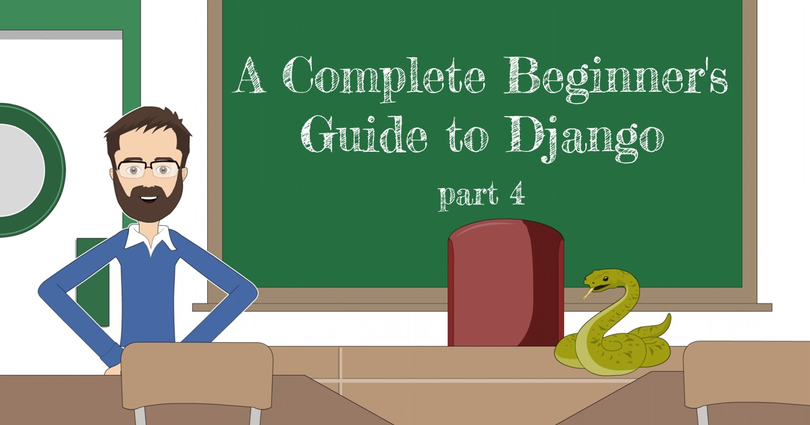
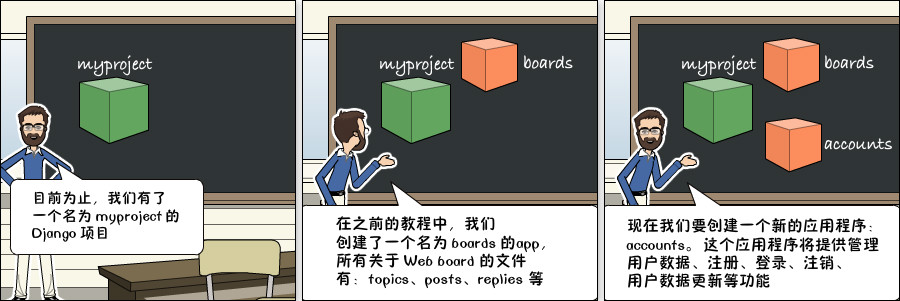
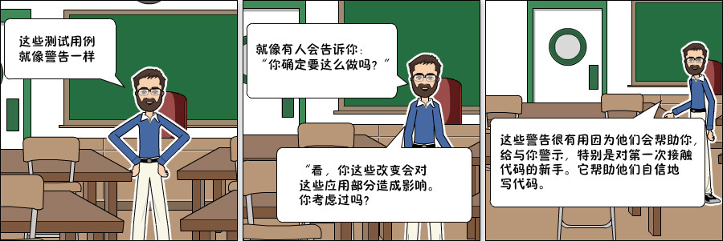
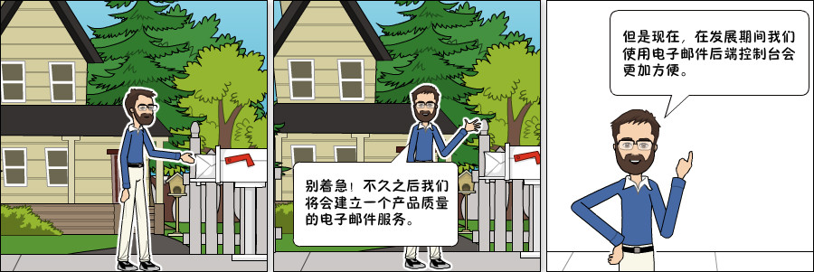

# 一个完整的Django入门指南 - 第4部分

> 译者：wangzhihao
>
> 原文：https://simpleisbetterthancomplex.com/series/2017/09/25/a-complete-beginners-guide-to-django-part-4.html



### 说明

这一章的教程将会全面介绍一下Django的身份验证系统，我们将执行整套流程：注册、登录、注销、密码重置和密码修改。

你也将会知道关于如何保护未授权用户视图以及如何访问登录用户信息的简要介绍。

再下一个小节中，我们将会再教程中放入实现身份验证相关页面的线框图（原型图）。之后，你会发现一个新的Django应用的初始设置。到目前为止，我们一直在研究一个名为boards的应用程序。在认证这个内容中，所有与认证相关的东西都可以存在于不同的应用程序中，以便更好地组织代码。


### 线框图（原型图）

我们必须更新一下应用程序的线框图。首先，我们要添加顶部菜单的新选项。如果用户未通过身份验证，我们应该由两个按钮：注册和登录。

 

​图1: 游客的顶部菜单

如果用户是授权用户，我们应该显示他们的名字以及下拉菜单，并提供三个选项：我的账户，更改密码和注销。


​图2: 注册用户的顶部菜单

在登录页面上面，我们需要一个带有**username**和**password**的表单，一个带有主要操作（登录）的按钮和两个备用路径：注册页面和密码重置页面。


​图3：注册页面

在注册页面上，我们应该有一个包含四个字段的表单：**username，email address, password**和**password confirmation**。用户也应该能够访问登录页面。


​图4：注册页面

在密码重置页面上，我们将有一个只有**email address**的表单。


​图5: 密码重置

之后，在点击特殊的token链接以后，用户将被重定向到一个页面，在那里他们可以设置一个新的密码。


​图6：修改密码

### 初始设置


要管理所有的这些信息，我们可以在另一个应用程序中将其分解。在项目根目录中，在manage.py文件所在的同一目录下，运行以下命令以启动新的应用程序：

```shell
django-admin startapp accounts
```

项目的目录结构应该如下：

```shell
myproject/
 |-- myproject/
 |    |-- accounts/     <-- our new django app!
 |    |-- boards/
 |    |-- myproject/
 |    |-- static/
 |    |-- templates/
 |    |-- db.sqlite3
 |    +-- manage.py
 +-- venv/
```

下一步，在settings.py文件中将账户应用添加到`INSTALLED_APPS`：

```python
INSTALLED_APPS = [
    'django.contrib.admin',
    'django.contrib.auth',
    'django.contrib.contenttypes',
    'django.contrib.sessions',
    'django.contrib.messages',
    'django.contrib.staticfiles',

    'widget_tweaks',

    'accounts',
    'boards',
]
```

现在开始，我们将会在accounts这个应用下操作。

### 注册

我们从创建注册视图开始。首先，在`urls.py` 文件中创建一个新的路径：

**myproject/urls.py**

```shell
from django.conf.urls import url
from django.contrib import admin

from accounts import views as accounts_views
from boards import views

urlpatterns = [
    url(r'^$', views.home, name='home'),
    url(r'^signup/$', accounts_views.signup, name='signup'),
    url(r'^boards/(?P<pk>\d+)/$', views.board_topics, name='board_topics'),
    url(r'^boards/(?P<pk>\d+)/new/$', views.new_topic, name='new_topic'),
    url(r'^admin/', admin.site.urls),
]
```

注意我们如何以不同的方式从`accounts`应用导入`views`模块

`from accounts import views as accounts_views`

我们正在将`views` 命名别名，否则他会与`boards` 的`views` 模块发生冲突。稍后我们可以改进`urls.py` 设计，但现在，让我们关注身份验证功能。

在accounts应用程序中编辑views.py中创建一个名为signup的新视图：

**accounts/views.py**

```shell
from django.shortcuts import render

def signup(request):
    return render(request, 'signup.html')
```

创建一个新的template，取名为**signup.html**：

**templates/signup.html**

```shell



  <h2>Sign up</h2>

```

在浏览器中打开http://127.0.0.1:8000/signup/，看看是否程序运转了起来：


接下来写点测试用例：

**accounts/tests.py**

```
from django.core.urlresolvers import reverse
from django.urls import resolve
from django.test import TestCase
from .views import signup

class SignUpTests(TestCase):
    def test_signup_status_code(self):
        url = reverse('signup')
        response = self.client.get(url)
        self.assertEquals(response.status_code, 200)

    def test_signup_url_resolves_signup_view(self):
        view = resolve('/signup/')
        self.assertEquals(view.func, signup)
```

测试状态码（200=success）以及URL/signup是否返回了正确的视图功能。


`python manage.py test`

```shell
Creating test database for alias 'default'...
System check identified no issues (0 silenced).
..................
----------------------------------------------------------------------
Ran 18 tests in 0.652s

OK
Destroying test database for alias 'default'...
```

对于认证视图（注册、登录、密码重置等），我们不会使用顶部栏和breadcrumb。我们仍然能够使用**base.html** 模板.不过我们需要对它做出一些修改：


**templates/base.html**

```
<!DOCTYPE html>
<html>
  <head>
    <meta charset="utf-8">
    <title>Django Boards</title>
    <link href="https://fonts.googleapis.com/css?family=Peralta" rel="stylesheet">
    <link rel="stylesheet" href="">
    <link rel="stylesheet" href="">
      <!-- HERE -->
  </head>
  <body>
      <!-- HERE -->
      <nav class="navbar navbar-expand-lg navbar-dark bg-dark">
        <div class="container">
          <a class="navbar-brand" href="">Django Boards</a>
        </div>
      </nav>
      <div class="container">
        <ol class="breadcrumb my-4">
          
          
        </ol>
        
        
      </div>
      <!-- AND HERE -->
  </body>
</html>
```

我在base.html模板中标注了新的评论。这块代码`` 将会用户添加用于某些特定页面的额外的CSS。

代码块`` 包装了整个HTML文档。我们能够使用它来利用**base.html**头部的空文档。注意一下我们是如何命名结束部分的代码``.在这种情况下，命名结束标签是一种很好的方法，这样恩家容易确定结束标记的位置。

现在，在**signup.html**模板中，我们使用``代替了 ``

**templates/signup.html**

```shell



  <h2>Sign up</h2>

```


[](./statics/4-12.jpg)

时候创建注册表单了。Django有一个名为UserCreationForm的内置表单，让我们开始使用它吧：

**accounts/views.py**

```
from django.contrib.auth.forms import UserCreationForm
from django.shortcuts import render

def signup(request):
    form = UserCreationForm()
    return render(request, 'signup.html', {'form': form})
```

**templates/signup.html**

```



  <div class="container">
    <h2>Sign up</h2>
    <form method="post" novalidate>
      
      {{ form.as_p }}
      <button type="submit" class="btn btn-primary">Create an account</button>
    </form>
  </div>

```


看起来有一点乱糟糟的是吧，我们可以使用我们的**form.html**模板来使它看起来更好：

**templates/signup.html**

```



  <div class="container">
    <h2>Sign up</h2>
    <form method="post" novalidate>
      
      {{ form.as_p }}
      <button type="submit" class="btn btn-primary">Create an account</button>
    </form>
  </div>

```


看起来有一点乱糟糟的是吧，我们可以使用我们的**form.html**模板来使它看起来更好：

**templates/signup.html**

```



  <div class="container">
    <h2>Sign up</h2>
    <form method="post" novalidate>
      
      
      <button type="submit" class="btn btn-primary">Create an account</button>
    </form>
  </div>

```


目前，我们的**form.html**部分模板正在显示一些原始的HTML。这是一项安全功能。在默认的情况下，Django将所有字符串视为不安全的，会转义所有可能导致问题的特殊字符。但在这种情况下，我们可以信任它。

**templates/includes/form.html**

```



  <div class="form-group">
    {{ field.label_tag }}

    <!-- code suppressed for brevity -->

    
      <small class="form-text text-muted">
        {{ field.help_text|safe }}  <!-- new code here -->
      </small>
    
  </div>

```

基本上，在之前的模板中，我们将选项`safe` 添加到`field.help_text`: `{{ field.help_text|safe }}`.

保存**form.html**文件，然后再次检测注册页面：


现在，让我们在signup视图中实现业务逻辑：

**accounts/views.py**

```
from django.contrib.auth import login as auth_login
from django.contrib.auth.forms import UserCreationForm
from django.shortcuts import render, redirect

def signup(request):
    if request.method == 'POST':
        form = UserCreationForm(request.POST)
        if form.is_valid():
            user = form.save()
            auth_login(request, user)
            return redirect('home')
    else:
        form = UserCreationForm()
    return render(request, 'signup.html', {'form': form})
```

一个基本的表单处理有一个小细节：登录功能（重命名为**auth_login**以避免与内置登录视图冲突）。

（编者注：我重命名了`login` 函数重命名为`auth_login` ，但后来我意识到Django1.11对登录视图LoginView具有基于类的视图，因此不存在与名称冲突的风险。在比较旧的版本中，有一个`auth.login`和`auth.view.login` ，这会导致一些混淆，因为一个是用户登录的功能，另一个是视图。长话短说：如果你愿意，你可以像`login` 一样导入它，这样做不会造成任何问题。）

如果表单是有效的，那么我们通过`user=form.save()`创建一个User实例。然后将创建的用户作为参数传递给`auth_login`函数，手动验证用户。之后，视图将用户重定向到主页，保持应用程序的流程。

让我们来试试吧，首先，提交一些无效数据，无论是空表单，不匹配的字段还是已有的用户名。


现在填写表单并提交，检查用户是否已创建并重定向到主页。


#### 在模板中引用已验证的用户

我们要怎么才能知道上述操作是否有效呢？我们可以编辑**base.html**模板来在顶部栏上添加用户名称：


**templates/base.html**

```

  <nav class="navbar navbar-expand-sm navbar-dark bg-dark">
    <div class="container">
      <a class="navbar-brand" href="">Django Boards</a>
      <button class="navbar-toggler" type="button" data-toggle="collapse" data-target="#mainMenu" aria-controls="mainMenu" aria-expanded="false" aria-label="Toggle navigation">
        <span class="navbar-toggler-icon"></span>
      </button>
      <div class="collapse navbar-collapse" id="mainMenu">
        <ul class="navbar-nav ml-auto">
          <li class="nav-item">
            <a class="nav-link" href="#">{{ user.username }}</a>
          </li>
        </ul>
      </div>
    </div>
  </nav>

  <div class="container">
    <ol class="breadcrumb my-4">
      
      
    </ol>
    
    
  </div>

```


#### 测试注册视图

现在让我们来改进我们的测试用例：

**accounts/tests.py**

```
from django.contrib.auth.forms import UserCreationForm
from django.core.urlresolvers import reverse
from django.urls import resolve
from django.test import TestCase
from .views import signup

class SignUpTests(TestCase):
    def setUp(self):
        url = reverse('signup')
        self.response = self.client.get(url)

    def test_signup_status_code(self):
        self.assertEquals(self.response.status_code, 200)

    def test_signup_url_resolves_signup_view(self):
        view = resolve('/signup/')
        self.assertEquals(view.func, signup)

    def test_csrf(self):
        self.assertContains(self.response, 'csrfmiddlewaretoken')

    def test_contains_form(self):
        form = self.response.context.get('form')
        self.assertIsInstance(form, UserCreationForm)
```

我们稍微改变了SighUpTests类，定义了一个setUp方法，将响应对象移到那里，那么现在我们也在测试响应中是否有表单和CSRF令牌。

现在我们要测试一个成功的注册。这次，让我们来创建一个新类，以便于更好地组织测试。

**accounts/tests.py**

```
from django.contrib.auth.models import User
from django.contrib.auth.forms import UserCreationForm
from django.core.urlresolvers import reverse
from django.urls import resolve
from django.test import TestCase
from .views import signup

class SignUpTests(TestCase):
    # code suppressed...

class SuccessfulSignUpTests(TestCase):
    def setUp(self):
        url = reverse('signup')
        data = {
            'username': 'john',
            'password1': 'abcdef123456',
            'password2': 'abcdef123456'
        }
        self.response = self.client.post(url, data)
        self.home_url = reverse('home')

    def test_redirection(self):
        '''
        A valid form submission should redirect the user to the home page
        '''
        self.assertRedirects(self.response, self.home_url)

    def test_user_creation(self):
        self.assertTrue(User.objects.exists())

    def test_user_authentication(self):
        '''
        Create a new request to an arbitrary page.
        The resulting response should now have a `user` to its context,
        after a successful sign up.
        '''
        response = self.client.get(self.home_url)
        user = response.context.get('user')
        self.assertTrue(user.is_authenticated)
```

运行这个测试用例。

使用类似地策略，现在让我们在数据无效地时候为注册测试用例创建一个新类。

```shell
from django.contrib.auth.models import User
from django.contrib.auth.forms import UserCreationForm
from django.core.urlresolvers import reverse
from django.urls import resolve
from django.test import TestCase
from .views import signup

class SignUpTests(TestCase):
    # code suppressed...

class SuccessfulSignUpTests(TestCase):
    # code suppressed...

class InvalidSignUpTests(TestCase):
    def setUp(self):
        url = reverse('signup')
        self.response = self.client.post(url, {})  # submit an empty dictionary

    def test_signup_status_code(self):
        '''
        An invalid form submission should return to the same page
        '''
        self.assertEquals(self.response.status_code, 200)

    def test_form_errors(self):
        form = self.response.context.get('form')
        self.assertTrue(form.errors)

    def test_dont_create_user(self):
        self.assertFalse(User.objects.exists())
```

#### 将Email字段添加到表单

一切都正常，但是email address字段丢失。那么，UserCreationForm不会提供一个email字段，但是我们可以拓展它。

在**accounts** 文件夹中创建一个名为**forms.py**的文件：

**accounts/forms.py**

```
from django import forms
from django.contrib.auth.forms import UserCreationForm
from django.contrib.auth.models import User

class SignUpForm(UserCreationForm):
    email = forms.CharField(max_length=254, required=True, widget=forms.EmailInput())
    class Meta:
        model = User
        fields = ('username', 'email', 'password1', 'password2')
```

现在，我们不需要在`views.py` 中使用UserCreationForm，而是导入新的表单SignUpForm，然后使用它：

**accounts/views.py**

```
from django.contrib.auth import login as auth_login
from django.shortcuts import render, redirect

from .forms import SignUpForm

def signup(request):
    if request.method == 'POST':
        form = SignUpForm(request.POST)
        if form.is_valid():
            user = form.save()
            auth_login(request, user)
            return redirect('home')
    else:
        form = SignUpForm()
    return render(request, 'signup.html', {'form': form})
```

只用这个小小的改变，我们的SignUp模块就可以运作了：

请记住更改测试用例以使用SignUpForm而不是UserCreationForm：


```
from .forms import SignUpForm

class SignUpTests(TestCase):
    # ...

    def test_contains_form(self):
        form = self.response.context.get('form')
        self.assertIsInstance(form, SignUpForm)

class SuccessfulSignUpTests(TestCase):
    def setUp(self):
        url = reverse('signup')
        data = {
            'username': 'john',
            'email': 'john@doe.com',
            'password1': 'abcdef123456',
            'password2': 'abcdef123456'
        }
        self.response = self.client.post(url, data)
        self.home_url = reverse('home')

    # ...
```

之前的测试用例仍然会通过，因为SignUpForm扩展了UserCreationForm，它是UserCreationForm的一个实例。

现在让我们想想发生了什么。我们添加了一个新的表单：

```
fields = ('username', 'email', 'password1', 'password2')
```

它会自动反应在HTML模板中。这很好吗？这要视情况而定。如果将来会有新的开发人员想要重新使用SignUpForm来做其他事情，并为其添加一些额外的字段。那么这些新的字段也会出现在signup.html中，这可能不是所期望的行为。这种改变可能会被忽略，我们不希望有任何意外。

那么让我们来创建一个新的测试，验证模板中的HTML输入：

**accounts/tests.py**

```python
class SignUpTests(TestCase):
    # ...

    def test_form_inputs(self):
        '''
        The view must contain five inputs: csrf, username, email,
        password1, password2
        '''
        self.assertContains(self.response, '<input', 5)
        self.assertContains(self.response, 'type="text"', 1)
        self.assertContains(self.response, 'type="email"', 1)
        self.assertContains(self.response, 'type="password"', 2)
```

#### 改进测试设计

好的，现在我们正在测试输入和所有的功能，但是我们仍然必须测试表单本身。不要只是继续向`accounts/tests.py` 文件添加测试，我们稍微改进一下项目设计。

在**accounts**文件夹下创建一个名为**tests**的新文件夹。然后在tests文件夹中，创建一个名为`init.py` 的空文件。

现在，将`test.py` 文件移动到**tests**文件夹中，并将其重命名为`test_view_signup.py` 

最终的结果应该如下：

```
myproject/
 |-- myproject/
 |    |-- accounts/
 |    |    |-- migrations/
 |    |    |-- tests/
 |    |    |    |-- __init__.py
 |    |    |    +-- test_view_signup.py
 |    |    |-- __init__.py
 |    |    |-- admin.py
 |    |    |-- apps.py
 |    |    |-- models.py
 |    |    +-- views.py
 |    |-- boards/
 |    |-- myproject/
 |    |-- static/
 |    |-- templates/
 |    |-- db.sqlite3
 |    +-- manage.py
 +-- venv/
```

注意到，因为我们在应用程序的上下文使用了相对导入，所以我们需要在 **test_view_signup.py**中修复导入：

**accounts/tests/test_view_signup.py**

```
from django.contrib.auth.models import User
from django.core.urlresolvers import reverse
from django.urls import resolve
from django.test import TestCase

from ..views import signup
from ..forms import SignUpForm
```

我们在应用程序模块内部使用相对导入，以便我们可以自由地重新命名Django应用程序，而无需修复所有绝对导入。

现在让我们创建一个新的测试文件来测试SignUpForm，添加一个名为**test_form_signup.py**的新测试文件：

**accounts/tests/test_form_signup.py**

**

```
from django.test import TestCase
from ..forms import SignUpForm

class SignUpFormTest(TestCase):
    def test_form_has_fields(self):
        form = SignUpForm()
        expected = ['username', 'email', 'password1', 'password2',]
        actual = list(form.fields)
        self.assertSequenceEqual(expected, actual)
```

它看起来非常严格对吧，例如，如果将来我们必须更改SignUpForm，以包含用户的名字和姓氏，那么即使我们没有破坏任何东西，我们也可能最终不得不修复一些测试用例。

!

这些警报很有用，因为它们有助于提高认识，特别是新手第一次接触代码，它可以帮助他们自信地编码。

#### 改进注册模板

让我们稍微讨论一下，在这里，我们可以使用Bootstrap4组建来使它看起来不错。

访问：https://www.toptal.com/designers/subtlepatterns/ 并找到一个很好地背景图案作为账户页面的背景，下载下来再静态文件夹中创建一个名为img的新文件夹，并将图像放置再那里。

之后，再static/css中创建一个名为accounts.css的新CSS文件。结果应该如下：

```
myproject/
 |-- myproject/
 |    |-- accounts/
 |    |-- boards/
 |    |-- myproject/
 |    |-- static/
 |    |    |-- css/
 |    |    |    |-- accounts.css  <-- here
 |    |    |    |-- app.css
 |    |    |    +-- bootstrap.min.css
 |    |    +-- img/
 |    |    |    +-- shattered.png  <-- here (the name may be different, depending on the patter you downloaded)
 |    |-- templates/
 |    |-- db.sqlite3
 |    +-- manage.py
 +-- venv/
```

现在编辑accounts.css这个文件：

**static/css/accounts.css**

```
body {
  background-image: url(../img/shattered.png);
}

.logo {
  font-family: 'Peralta', cursive;
}

.logo a {
  color: rgba(0,0,0,.9);
}

.logo a:hover,
.logo a:active {
  text-decoration: none;
}
```

在signup.html模板中，我们可以将其改为使用新的CSS，并使用Bootstrap4组件：

**templates/signup.html**

```





  <link rel="stylesheet" href="">



  <div class="container">
    <h1 class="text-center logo my-4">
      <a href="">Django Boards</a>
    </h1>
    <div class="row justify-content-center">
      <div class="col-lg-8 col-md-10 col-sm-12">
        <div class="card">
          <div class="card-body">
            <h3 class="card-title">Sign up</h3>
            <form method="post" novalidate>
              
              
              <button type="submit" class="btn btn-primary btn-block">Create an account</button>
            </form>
          </div>
          <div class="card-footer text-muted text-center">
            Already have an account? <a href="#">Log in</a>
          </div>
        </div>
      </div>
    </div>
  </div>

```

这就是我们现在的注册页面：


### 注销

为了在实现中保持自然流畅，我们添加注销视图，实现，编辑**urls.py**以添加新路线：

**myproject/urls.py**

```
from django.conf.urls import url
from django.contrib import admin
from django.contrib.auth import views as auth_views

from accounts import views as accounts_views
from boards import views

urlpatterns = [
    url(r'^$', views.home, name='home'),
    url(r'^signup/$', accounts_views.signup, name='signup'),
    url(r'^logout/$', auth_views.LogoutView.as_view(), name='logout'),
    url(r'^boards/(?P<pk>\d+)/$', views.board_topics, name='board_topics'),
    url(r'^boards/(?P<pk>\d+)/new/$', views.new_topic, name='new_topic'),
    url(r'^admin/', admin.site.urls),
]

```

我们从Django的contrib模块导入了**views** ，我们将其更名为**auth_views** 以避免与**boards.views**发生冲突。注意这个视图有点不同： `LogoutView.as_view()`。这是一个Django的“基于类”的视图，到目前为止，我们只将类实现为python函数。基于类的视图提供了一种更加灵活的方式来扩展和重用视图。稍后我们将讨论更多这个主题。

打开**settings.py**文件，然后添加`LOGOUT_REDIRECT_URL`变量到文件的底部：

**myproject/settings.py**

```
LOGOUT_REDIRECT_URL = 'home'

```

在这里我们传递了我们希望在注销后重定向用户的URL模式的名称。

在这之后，这次重定向就算完成了。只需要访问URL **127.0.0.1:8000/logout/** 然后您就将被注销。但是再等一下，在你注销之前，让我们为登录用户创建下拉菜单。

------

#### 为登录用户显示菜单

现在我们需要在 **base.html**模板中进行一些调整。我们必须添加一个带注销链接的下拉菜单。

Bootstrap 4 下拉组件需要jQuery才能工作。	 

首先，我们前往 [jquery.com/download/](https://jquery.com/download/)，然后下载压缩的 jQuery 3.2.1版本。


在静态文件夹中，创建一个名为js的新文件夹。将jquery-3.2.1.min.js文件复制到那里。

Bootstrap4还需要一个名为**Popper** 的库才能工作，前往 [popper.js.org](https://popper.js.org/) 下载它的最新版本。

在**popper.js-1.12.5**文件夹中，转到**dist/umd**并将文件**popper.min.js** 复制到我们的**js** 文件夹。这里注意，敲黑板！Bootstrap 4只能与 **umd/popper.min.js**协同工作。所以请确保你正在复制正确的文件。

如果您不再拥有 Bootstrap 4文件，请从[getbootstrap.com](http://getbootstrap.com/).再次下载它。

同样，将 **bootstrap.min.js**文件复制到我们的js文件夹中。最终的结果应该是：

```
myproject/
 |-- myproject/
 |    |-- accounts/
 |    |-- boards/
 |    |-- myproject/
 |    |-- static/
 |    |    |-- css/
 |    |    +-- js/
 |    |         |-- bootstrap.min.js
 |    |         |-- jquery-3.2.1.min.js
 |    |         +-- popper.min.js
 |    |-- templates/
 |    |-- db.sqlite3
 |    +-- manage.py
 +-- venv/

```

在**base.html**文件底部，在后面添加脚本：

**templates/base.html**

```
<!DOCTYPE html>
<html>
  <head>
    <meta charset="utf-8">
    <title>Django Boards</title>
    <link href="https://fonts.googleapis.com/css?family=Peralta" rel="stylesheet">
    <link rel="stylesheet" href="">
    <link rel="stylesheet" href="">
    
  </head>
  <body>
    
    <!-- code suppressed for brevity -->
    
    <script src=""></script>
    <script src=""></script>
    <script src=""></script>
  </body>
</html>

```

如果你发现说明混淆了，只需要直接在链接下载文件

- <https://code.jquery.com/jquery-3.2.1.min.js>
- <https://cdnjs.cloudflare.com/ajax/libs/popper.js/1.11.0/umd/popper.min.js>
- <https://maxcdn.bootstrapcdn.com/bootstrap/4.0.0-beta/js/bootstrap.min.js>

右键单击：保存链接为

现在我们可以添加Bootstrap4下拉菜单了：

**templates/base.html**

```
<nav class="navbar navbar-expand-sm navbar-dark bg-dark">
  <div class="container">
    <a class="navbar-brand" href="">Django Boards</a>
    <button class="navbar-toggler" type="button" data-toggle="collapse" data-target="#mainMenu" aria-controls="mainMenu" aria-expanded="false" aria-label="Toggle navigation">
      <span class="navbar-toggler-icon"></span>
    </button>
    <div class="collapse navbar-collapse" id="mainMenu">
      <ul class="navbar-nav ml-auto">
        <li class="nav-item dropdown">
          <a class="nav-link dropdown-toggle" href="#" id="userMenu" data-toggle="dropdown" aria-haspopup="true" aria-expanded="false">
            {{ user.username }}
          </a>
          <div class="dropdown-menu dropdown-menu-right" aria-labelledby="userMenu">
            <a class="dropdown-item" href="#">My account</a>
            <a class="dropdown-item" href="#">Change password</a>
            <div class="dropdown-divider"></div>
            <a class="dropdown-item" href="">Log out</a>
          </div>
        </li>
      </ul>
    </div>
  </div>
</nav>

```


我们来试试吧，点击注销：


现在已经成功显示出来了，但是无论用户登录与否，下拉菜单都会显示。不同的是在未登录时用户名显示是空的，我们只能看到一个箭头。

我们可以改进一点：

```
<nav class="navbar navbar-expand-sm navbar-dark bg-dark">
  <div class="container">
    <a class="navbar-brand" href="">Django Boards</a>
    <button class="navbar-toggler" type="button" data-toggle="collapse" data-target="#mainMenu" aria-controls="mainMenu" aria-expanded="false" aria-label="Toggle navigation">
      <span class="navbar-toggler-icon"></span>
    </button>
    <div class="collapse navbar-collapse" id="mainMenu">
      
        <ul class="navbar-nav ml-auto">
          <li class="nav-item dropdown">
            <a class="nav-link dropdown-toggle" href="#" id="userMenu" data-toggle="dropdown" aria-haspopup="true" aria-expanded="false">
              {{ user.username }}
            </a>
            <div class="dropdown-menu dropdown-menu-right" aria-labelledby="userMenu">
              <a class="dropdown-item" href="#">My account</a>
              <a class="dropdown-item" href="#">Change password</a>
              <div class="dropdown-divider"></div>
              <a class="dropdown-item" href="">Log out</a>
            </div>
          </li>
        </ul>
      
        <form class="form-inline ml-auto">
          <a href="#" class="btn btn-outline-secondary">Log in</a>
          <a href="" class="btn btn-primary ml-2">Sign up</a>
        </form>
      
    </div>
  </div>
</nav>

```

现在，我们告诉Django程序，要在用户登录时显示下拉菜单，如果没有，则显示登录并注册按钮：


### 登录

首先，添加一个新的URL路径：

**myproject/urls.py**

```
from django.conf.urls import url
from django.contrib import admin
from django.contrib.auth import views as auth_views

from accounts import views as accounts_views
from boards import views

urlpatterns = [
    url(r'^$', views.home, name='home'),
    url(r'^signup/$', accounts_views.signup, name='signup'),
    url(r'^login/$', auth_views.LoginView.as_view(template_name='login.html'), name='login'),
    url(r'^logout/$', auth_views.LogoutView.as_view(), name='logout'),
    url(r'^boards/(?P<pk>\d+)/$', views.board_topics, name='board_topics'),
    url(r'^boards/(?P<pk>\d+)/new/$', views.new_topic, name='new_topic'),
    url(r'^admin/', admin.site.urls),
]

```

在`as_view()`中，我们可以传递一些额外的参数，以覆盖默认值。在这种情况下，我们让**LoginView** 在**login.html**l处寻找模板。

编辑**settings.py**然后添加

**myproject/settings.py**

```
LOGIN_REDIRECT_URL = 'home'

```

这个配置信息告诉Django在成功登录后将用户重定向到哪里。

最后，将登录URL添加到 **base.html**模板中：

**templates/base.html**

```
<a href="" class="btn btn-outline-secondary">Log in</a>

```

我们可以创建一个类似于注册页面的模板。创建一个名为 **login.html**的新文件：

**templates/login.html**

```





  <link rel="stylesheet" href="">



  <div class="container">
    <h1 class="text-center logo my-4">
      <a href="">Django Boards</a>
    </h1>
    <div class="row justify-content-center">
      <div class="col-lg-4 col-md-6 col-sm-8">
        <div class="card">
          <div class="card-body">
            <h3 class="card-title">Log in</h3>
            <form method="post" novalidate>
              
              
              <button type="submit" class="btn btn-primary btn-block">Log in</button>
            </form>
          </div>
          <div class="card-footer text-muted text-center">
            New to Django Boards? <a href="">Sign up</a>
          </div>
        </div>
        <div class="text-center py-2">
          <small>
            <a href="#" class="text-muted">Forgot your password?</a>
          </small>
        </div>
      </div>
    </div>
  </div>


```


我们重复一下HTML模板，让我们重构一下它。

创建一个名为**base_accounts.html**的新模板：

**templates/base_accounts.html**

```





  <link rel="stylesheet" href="">



  <div class="container">
    <h1 class="text-center logo my-4">
      <a href="">Django Boards</a>
    </h1>
    
    
  </div>


```

现在在**signup.html**和**login.html**中使用它：

**templates/login.html**

```


Log in to Django Boards


  <div class="row justify-content-center">
    <div class="col-lg-4 col-md-6 col-sm-8">
      <div class="card">
        <div class="card-body">
          <h3 class="card-title">Log in</h3>
          <form method="post" novalidate>
            
            
            <button type="submit" class="btn btn-primary btn-block">Log in</button>
          </form>
        </div>
        <div class="card-footer text-muted text-center">
          New to Django Boards? <a href="">Sign up</a>
        </div>
      </div>
      <div class="text-center py-2">
        <small>
          <a href="#" class="text-muted">Forgot your password?</a>
        </small>
      </div>
    </div>
  </div>


```

我们仍然有密码重置网址，因此现在让我们将其保留为`#`。

**templates/signup.html**

```


Sign up to Django Boards


  <div class="row justify-content-center">
    <div class="col-lg-8 col-md-10 col-sm-12">
      <div class="card">
        <div class="card-body">
          <h3 class="card-title">Sign up</h3>
          <form method="post" novalidate>
            
            
            <button type="submit" class="btn btn-primary btn-block">Create an account</button>
          </form>
        </div>
        <div class="card-footer text-muted text-center">
          Already have an account? <a href="">Log in</a>
        </div>
      </div>
    </div>
  </div>


```

请注意，我们添加了登录网址： `<a href="">Log in</a>`.

##### 无登录信息错误

如果我们提交空白的登录信息，我们会得到一些友好的错误提示信息：


但是，如果我们提交一个不存在的用户名或一个无效的密码，现在就会发生这种情况：


有点误导，这个区域是绿色的，表明它们是良好运行的，此外，没有其他额外的信息。

这是因为表单有一种特殊类型的错误，成为**non-field errors**（无区域错误）。这是一组与特定字段无关的错误。让我们重构**form.html**部分模板以显示这些错误：

**templates/includes/form.html**

```



  <div class="alert alert-danger" role="alert">
    
      <p class="mb-0">{{ error }}</p>
    
  </div>



  <!-- code suppressed -->


```

``只是一个小事情，因为`p`标签有一个空白的`margin-bottom`.一个表单可能有几个**non-field error**，我们呈现了一个带有错误的`p`标签。然后我要检查它是否是最后一次渲染的错误。如果是这样的，我们就添加一个 Bootstrap 4 CSS类 `mb-0` ，它的作用是代表了“margin bottom = 0”（底部边缘为0）。这样的话警告看起来就不那么奇怪了并且多了一些额外的空间。这只是一个非常小的细节。我这么做的原因只是为了保持间距的一致性。


尽管如此，我们仍然需要处理密码字段。问题在于，Django从不将密码字段的数据返回给客户端。因此，在某些情况下，不要试图做一次自作聪明的事情，我们可以直接忽略`is-valid`和`is-invalid` 的CSS类。但是我们的表单模板看起来十分的复杂，我们可以将一些代码移动到模板标记中去。

##### 创建自定义模板标签

在**boards**应用中，创建一个名为**templatetags**的新文件夹。然后在该文件夹内创建两个名为 **__init__.py** 和 **form_tags.py**的空文件。

文件结构应该如下：

```
myproject/
 |-- myproject/
 |    |-- accounts/
 |    |-- boards/
 |    |    |-- migrations/
 |    |    |-- templatetags/        <-- here
 |    |    |    |-- __init__.py
 |    |    |    +-- form_tags.py
 |    |    |-- __init__.py
 |    |    |-- admin.py
 |    |    |-- apps.py
 |    |    |-- models.py
 |    |    |-- tests.py
 |    |    +-- views.py
 |    |-- myproject/
 |    |-- static/
 |    |-- templates/
 |    |-- db.sqlite3
 |    +-- manage.py
 +-- venv/

```

在 **form_tags.py**文件中，我们创建两个模板标签：

**boards/templatetags/form_tags.py**

```
from django import template

register = template.Library()

@register.filter
def field_type(bound_field):
    return bound_field.field.widget.__class__.__name__

@register.filter
def input_class(bound_field):
    css_class = ''
    if bound_field.form.is_bound:
        if bound_field.errors:
            css_class = 'is-invalid'
        elif field_type(bound_field) != 'PasswordInput':
            css_class = 'is-valid'
    return 'form-control {}'.format(css_class)

```

这些是模板过滤器，他们的工作方式是这样的：

首先，我们将它加载到模板中，就像我们使用 **widget_tweaks** 或**static** 模板标签一样。请注意，在创建这个文件后，你将不得不手动停止开发服务器并重启它，以便Django可以识别新的模板标签。

```


```

之后，我们就可以在模板中使用它们了。

```
{{ form.username|field_type }}

```

返回：

```
'TextInput'

```

或者在 **input_class**的情况下：

```
{{ form.username|input_class }}

<!-- if the form is not bound, it will simply return: -->
'form-control '

<!-- if the form is bound and valid: -->
'form-control is-valid'

<!-- if the form is bound and invalid: -->
'form-control is-invalid'

```

现在更新 **form.html**以使用新的模板标签：

**templates/includes/form.html**

```



  <div class="alert alert-danger" role="alert">
    
      <p class="mb-0">{{ error }}</p>
    
  </div>



  <div class="form-group">
    {{ field.label_tag }}
    
    
      <div class="invalid-feedback">
        {{ error }}
      </div>
    
    
      <small class="form-text text-muted">
        {{ field.help_text|safe }}
      </small>
    
  </div>


```


这样的话就好多了是吧？这样做降低了模板的复杂性，它现在看起来更加清洁。并且它还解决了显示绿色边框的密码字段的问题：


##### 测试模板标签

首先，让我们稍微组织一下**boards**的测试。就像我们对账户应用程序所做的那样，创建一个**accounts**应用程序做的那样。创建一个新的文件夹名为**tests**，添加一个**init.py**，复制**test.py**并且将其重命名为**test_views.py**。

添加一个名为 **test_templatetags.py**的新空文件。

```
myproject/
 |-- myproject/
 |    |-- accounts/
 |    |-- boards/
 |    |    |-- migrations/
 |    |    |-- templatetags/
 |    |    |-- tests/
 |    |    |    |-- __init__.py
 |    |    |    |-- test_templatetags.py  <-- new file, empty for now
 |    |    |    +-- test_views.py  <-- our old file with all the tests
 |    |    |-- __init__.py
 |    |    |-- admin.py
 |    |    |-- apps.py
 |    |    |-- models.py
 |    |    +-- views.py
 |    |-- myproject/
 |    |-- static/
 |    |-- templates/
 |    |-- db.sqlite3
 |    +-- manage.py
 +-- venv/

```

修复**test_views.py**的导入：

**boards/tests/test_views.py**

```
from ..views import home, board_topics, new_topic
from ..models import Board, Topic, Post
from ..forms import NewTopicForm

```

执行测试来确保一切都正常。

**boards/tests/test_templatetags.py**

```
from django import forms
from django.test import TestCase
from ..templatetags.form_tags import field_type, input_class

class ExampleForm(forms.Form):
    name = forms.CharField()
    password = forms.CharField(widget=forms.PasswordInput())
    class Meta:
        fields = ('name', 'password')

class FieldTypeTests(TestCase):
    def test_field_widget_type(self):
        form = ExampleForm()
        self.assertEquals('TextInput', field_type(form['name']))
        self.assertEquals('PasswordInput', field_type(form['password']))

class InputClassTests(TestCase):
    def test_unbound_field_initial_state(self):
        form = ExampleForm()  # unbound form
        self.assertEquals('form-control ', input_class(form['name']))

    def test_valid_bound_field(self):
        form = ExampleForm({'name': 'john', 'password': '123'})  # bound form (field + data)
        self.assertEquals('form-control is-valid', input_class(form['name']))
        self.assertEquals('form-control ', input_class(form['password']))

    def test_invalid_bound_field(self):
        form = ExampleForm({'name': '', 'password': '123'})  # bound form (field + data)
        self.assertEquals('form-control is-invalid', input_class(form['name']))

```

我们创建了一个用于测试的表单类，然后添加了覆盖两个模板标记中可能出现的场景的测试用例。

```
python manage.py test

```

```
Creating test database for alias 'default'...
System check identified no issues (0 silenced).
................................
----------------------------------------------------------------------
Ran 32 tests in 0.846s

OK
Destroying test database for alias 'default'...
```

### 密码重置

密码重置过程中涉及一些令人讨厌的URL模式。但正如我们在前面的教程中讨论的那样，我们并不需要正则表达式的专家。我们只需要了解常见问题和它们的解决办法。

在我们开始之前另一件重要的事情是，对于密码重置过程，我们需要发送电子邮件。一开始有点复杂，因为我们需要外部服务。目前，我们不会配置生产质量的电子邮件服务。实际上，在开发阶段，我们可以使用Django的调试工具检查电子邮件是否正确发送。



#### 控制台电子邮件后端

这个主意产生于项目开发过程中，而不是发送真实的电子邮件，我们只需要记录它们。我们有两种选择：将所有电子邮件写入文本文件或仅将其显示在控制台中。我发现第二个方式更加方便，因为我们已经在使用控制台来运行开发服务器，并且设置更容易一些。

编辑 **settings.py**模块并将`EMAIL_BACKEND`变量添加到文件的末尾。

**myproject/settings.py**

```
EMAIL_BACKEND = 'django.core.mail.backends.console.EmailBackend'

```

#### 配置路由

密码重置过程需要四个视图：

- 带有表单的页面，用于启动重置过程；
- 一个成功的页面，表示该过程已启动，指示用户检查其垃圾邮件文件夹等；
- 检查通过电子邮件发送token的页面
- 一个告诉用户重置是否成功的页面

视图是内置的，我们不需要执行任何操作，我们所需要做的就是将路径添加到 **urls.py**并且创建模板。

**myproject/urls.py** [(view complete file contents)](https://gist.github.com/vitorfs/117e300e00d5685f7186e09260f82736#file-urls-py-L14)

```
url(r'^reset/$',
    auth_views.PasswordResetView.as_view(
        template_name='password_reset.html',
        email_template_name='password_reset_email.html',
        subject_template_name='password_reset_subject.txt'
    ),
    name='password_reset'),
url(r'^reset/done/$',
    auth_views.PasswordResetDoneView.as_view(template_name='password_reset_done.html'),
    name='password_reset_done'),
url(r'^reset/(?P<uidb64>[0-9A-Za-z_\-]+)/(?P<token>[0-9A-Za-z]{1,13}-[0-9A-Za-z]{1,20})/$',
    auth_views.PasswordResetConfirmView.as_view(template_name='password_reset_confirm.html'),
    name='password_reset_confirm'),
url(r'^reset/complete/$',
    auth_views.PasswordResetCompleteView.as_view(template_name='password_reset_complete.html'),
    name='password_reset_complete'),
]

```

在密码重置视图中，`template_name`参数是可选的。但我认为重新定义它是个好主意，因此视图和模板之间的链接比仅使用默认值更加明显。

在 **templates**文件夹红，一下模板文件

- **password_reset.html**
- **password_reset_email.html**:这个模板是发送给用户的电子邮件正文
- **password_reset_subject.txt**:这个模板是电子邮件的主题行，它应该是单行文件
- **password_reset_done.html**
- **password_reset_confirm.html**
- **password_reset_complete.html**

在我们开始实施模板之前，让我们准备一个新的测试文件。

我们可以添加一些基本的测试，因为这些视图和表单已经在Django代码中进行了测试。我们将只测试我们应用程序的细节。

在**accounts/tests** 文件夹中创建一个名为 **test_view_password_reset.py** 的新测试文件。

#### 密码重置视图

**templates/password_reset.html**

```


Reset your password


  <div class="row justify-content-center">
    <div class="col-lg-4 col-md-6 col-sm-8">
      <div class="card">
        <div class="card-body">
          <h3 class="card-title">Reset your password</h3>
          <p>Enter your email address and we will send you a link to reset your password.</p>
          <form method="post" novalidate>
            
            
            <button type="submit" class="btn btn-primary btn-block">Send password reset email</button>
          </form>
        </div>
      </div>
    </div>
  </div>


```


**accounts/tests/test_view_password_reset.py**

```
from django.contrib.auth import views as auth_views
from django.contrib.auth.forms import PasswordResetForm
from django.contrib.auth.models import User
from django.core import mail
from django.core.urlresolvers import reverse
from django.urls import resolve
from django.test import TestCase


class PasswordResetTests(TestCase):
    def setUp(self):
        url = reverse('password_reset')
        self.response = self.client.get(url)

    def test_status_code(self):
        self.assertEquals(self.response.status_code, 200)

    def test_view_function(self):
        view = resolve('/reset/')
        self.assertEquals(view.func.view_class, auth_views.PasswordResetView)

    def test_csrf(self):
        self.assertContains(self.response, 'csrfmiddlewaretoken')

    def test_contains_form(self):
        form = self.response.context.get('form')
        self.assertIsInstance(form, PasswordResetForm)

    def test_form_inputs(self):
        '''
        The view must contain two inputs: csrf and email
        '''
        self.assertContains(self.response, '<input', 2)
        self.assertContains(self.response, 'type="email"', 1)


class SuccessfulPasswordResetTests(TestCase):
    def setUp(self):
        email = 'john@doe.com'
        User.objects.create_user(username='john', email=email, password='123abcdef')
        url = reverse('password_reset')
        self.response = self.client.post(url, {'email': email})

    def test_redirection(self):
        '''
        A valid form submission should redirect the user to `password_reset_done` view
        '''
        url = reverse('password_reset_done')
        self.assertRedirects(self.response, url)

    def test_send_password_reset_email(self):
        self.assertEqual(1, len(mail.outbox))


class InvalidPasswordResetTests(TestCase):
    def setUp(self):
        url = reverse('password_reset')
        self.response = self.client.post(url, {'email': 'donotexist@email.com'})

    def test_redirection(self):
        '''
        Even invalid emails in the database should
        redirect the user to `password_reset_done` view
        '''
        url = reverse('password_reset_done')
        self.assertRedirects(self.response, url)

    def test_no_reset_email_sent(self):
        self.assertEqual(0, len(mail.outbox))

```

**templates/password_reset_subject.txt**

```
[Django Boards] Please reset your password

```

**templates/password_reset_email.html**

```
Hi there,

Someone asked for a password reset for the email address {{ email }}.
Follow the link below:
{{ protocol }}://{{ domain }}

In case you forgot your Django Boards username: {{ user.username }}

If clicking the link above doesn't work, please copy and paste the URL
in a new browser window instead.

If you've received this mail in error, it's likely that another user entered
your email address by mistake while trying to reset a password. If you didn't
initiate the request, you don't need to take any further action and can safely
disregard this email.

Thanks,

The Django Boards Team

```


我们可以创建一个特定的文件来测试电子邮件。在**accounts/tests** 文件夹中创建一个名为**test_mail_password_reset.py**的新文件：

**accounts/tests/test_mail_password_reset.py**

```
from django.core import mail
from django.contrib.auth.models import User
from django.urls import reverse
from django.test import TestCase

class PasswordResetMailTests(TestCase):
    def setUp(self):
        User.objects.create_user(username='john', email='john@doe.com', password='123')
        self.response = self.client.post(reverse('password_reset'), { 'email': 'john@doe.com' })
        self.email = mail.outbox[0]

    def test_email_subject(self):
        self.assertEqual('[Django Boards] Please reset your password', self.email.subject)

    def test_email_body(self):
        context = self.response.context
        token = context.get('token')
        uid = context.get('uid')
        password_reset_token_url = reverse('password_reset_confirm', kwargs={
            'uidb64': uid,
            'token': token
        })
        self.assertIn(password_reset_token_url, self.email.body)
        self.assertIn('john', self.email.body)
        self.assertIn('john@doe.com', self.email.body)

    def test_email_to(self):
        self.assertEqual(['john@doe.com',], self.email.to)

```

此测试用例抓取应用程序发送的电子邮件，并检查主题行，正文内容以及发送给谁。

#### 密码重置完成视图

**templates/password_reset_done.html**

```


Reset your password


  <div class="row justify-content-center">
    <div class="col-lg-4 col-md-6 col-sm-8">
      <div class="card">
        <div class="card-body">
          <h3 class="card-title">Reset your password</h3>
          <p>Check your email for a link to reset your password. If it doesn't appear within a few minutes, check your spam folder.</p>
          <a href="" class="btn btn-secondary btn-block">Return to log in</a>
        </div>
      </div>
    </div>
  </div>


```


**accounts/tests/test_view_password_reset.py**

```
from django.contrib.auth import views as auth_views
from django.core.urlresolvers import reverse
from django.urls import resolve
from django.test import TestCase

class PasswordResetDoneTests(TestCase):
    def setUp(self):
        url = reverse('password_reset_done')
        self.response = self.client.get(url)

    def test_status_code(self):
        self.assertEquals(self.response.status_code, 200)

    def test_view_function(self):
        view = resolve('/reset/done/')
        self.assertEquals(view.func.view_class, auth_views.PasswordResetDoneView)

```

#### 密码重置确认视图

**templates/password_reset_confirm.html**

```



  
    Change password for {{ form.user.username }}
  
    Reset your password
  



  <div class="row justify-content-center">
    <div class="col-lg-6 col-md-8 col-sm-10">
      <div class="card">
        <div class="card-body">
          
            <h3 class="card-title">Change password for @{{ form.user.username }}</h3>
            <form method="post" novalidate>
              
              
              <button type="submit" class="btn btn-success btn-block">Change password</button>
            </form>
          
            <h3 class="card-title">Reset your password</h3>
            <div class="alert alert-danger" role="alert">
              It looks like you clicked on an invalid password reset link. Please try again.
            </div>
            <a href="" class="btn btn-secondary btn-block">Request a new password reset link</a>
          
        </div>
      </div>
    </div>
  </div>


```

这个页面只能通过电子邮件访问，它看起来像这样：http://127.0.0.1:8000/reset/Mw/4po-2b5f2d47c19966e294a1/

在开发阶段，从控制台中的电子邮件获取此链接。

如果链接是有效的：


倘若链接已经被使用：


**accounts/tests/test_view_password_reset.py**

```
from django.contrib.auth.tokens import default_token_generator
from django.utils.encoding import force_bytes
from django.utils.http import urlsafe_base64_encode
from django.contrib.auth import views as auth_views
from django.contrib.auth.forms import SetPasswordForm
from django.contrib.auth.models import User
from django.core.urlresolvers import reverse
from django.urls import resolve
from django.test import TestCase


class PasswordResetConfirmTests(TestCase):
    def setUp(self):
        user = User.objects.create_user(username='john', email='john@doe.com', password='123abcdef')

        '''
        create a valid password reset token
        based on how django creates the token internally:
        https://github.com/django/django/blob/1.11.5/django/contrib/auth/forms.py#L280
        '''
        self.uid = urlsafe_base64_encode(force_bytes(user.pk)).decode()
        self.token = default_token_generator.make_token(user)

        url = reverse('password_reset_confirm', kwargs={'uidb64': self.uid, 'token': self.token})
        self.response = self.client.get(url, follow=True)

    def test_status_code(self):
        self.assertEquals(self.response.status_code, 200)

    def test_view_function(self):
        view = resolve('/reset/{uidb64}/{token}/'.format(uidb64=self.uid, token=self.token))
        self.assertEquals(view.func.view_class, auth_views.PasswordResetConfirmView)

    def test_csrf(self):
        self.assertContains(self.response, 'csrfmiddlewaretoken')

    def test_contains_form(self):
        form = self.response.context.get('form')
        self.assertIsInstance(form, SetPasswordForm)

    def test_form_inputs(self):
        '''
        The view must contain two inputs: csrf and two password fields
        '''
        self.assertContains(self.response, '<input', 3)
        self.assertContains(self.response, 'type="password"', 2)


class InvalidPasswordResetConfirmTests(TestCase):
    def setUp(self):
        user = User.objects.create_user(username='john', email='john@doe.com', password='123abcdef')
        uid = urlsafe_base64_encode(force_bytes(user.pk)).decode()
        token = default_token_generator.make_token(user)

        '''
        invalidate the token by changing the password
        '''
        user.set_password('abcdef123')
        user.save()

        url = reverse('password_reset_confirm', kwargs={'uidb64': uid, 'token': token})
        self.response = self.client.get(url)

    def test_status_code(self):
        self.assertEquals(self.response.status_code, 200)

    def test_html(self):
        password_reset_url = reverse('password_reset')
        self.assertContains(self.response, 'invalid password reset link')
        self.assertContains(self.response, 'href="{0}"'.format(password_reset_url))

```

#### 密码重置完成视图

**templates/password_reset_complete.html**

```


Password changed!


  <div class="row justify-content-center">
    <div class="col-lg-6 col-md-8 col-sm-10">
      <div class="card">
        <div class="card-body">
          <h3 class="card-title">Password changed!</h3>
          <div class="alert alert-success" role="alert">
            You have successfully changed your password! You may now proceed to log in.
          </div>
          <a href="" class="btn btn-secondary btn-block">Return to log in</a>
        </div>
      </div>
    </div>
  </div>


```


**accounts/tests/test_view_password_reset.py** [(view complete file contents)](https://gist.github.com/vitorfs/c9657d39d28c2a0cfb0933e715bfc9cf#file-test_view_password_reset-py-L149)

```
from django.contrib.auth import views as auth_views
from django.core.urlresolvers import reverse
from django.urls import resolve
from django.test import TestCase

class PasswordResetCompleteTests(TestCase):
    def setUp(self):
        url = reverse('password_reset_complete')
        self.response = self.client.get(url)

    def test_status_code(self):
        self.assertEquals(self.response.status_code, 200)

    def test_view_function(self):
        view = resolve('/reset/complete/')
        self.assertEquals(view.func.view_class, auth_views.PasswordResetCompleteView)

```

------

### 密码更改视图

此视图旨在提供给希望更改其密码的登录用户使用。通常，这些表单由三个字段组成：旧密码、新密码、新密码确认。

**myproject/urls.py** [(view complete file contents)](https://gist.github.com/vitorfs/0927898f37831cad0d6a4ec538b8a002#file-urls-py-L31)

```
url(r'^settings/password/$', auth_views.PasswordChangeView.as_view(template_name='password_change.html'),
    name='password_change'),
url(r'^settings/password/done/$', auth_views.PasswordChangeDoneView.as_view(template_name='password_change_done.html'),
    name='password_change_done'),

```

这些视图仅适合登录用户，他们使用名为 `@login_required`的装饰器，此装饰器可防止非授权用户访问此页面。如果用户没有登录，Django会将他们重定向到登录页面。

现在我们必须在**settings.py**中定义我们应用程序的登录URL：

**myproject/settings.py** [(view complete file contents)](https://gist.github.com/vitorfs/2d3a2c45df7deb025b8206c5a9b55e12#file-settings-py-L133)

```
LOGIN_URL = 'login'

```

**templates/password_change.html**

```


Change password


  <li class="breadcrumb-item active">Change password</li>



  <div class="row">
    <div class="col-lg-6 col-md-8 col-sm-10">
      <form method="post" novalidate>
        
        
        <button type="submit" class="btn btn-success">Change password</button>
      </form>
    </div>
  </div>


```


**templates/password_change_done.html**

```


Change password successful


  <li class="breadcrumb-item"><a href="">Change password</a></li>
  <li class="breadcrumb-item active">Success</li>



  <div class="alert alert-success" role="alert">
    <strong>Success!</strong> Your password has been changed!
  </div>
  <a href="" class="btn btn-secondary">Return to home page</a>


```


关于密码更改视图，我们可以执行类似的测试用例，就像我们迄今为止所做的那样。创建一个名为**test_view_password_change.py**的新测试文件。

我将在下面列出新的测试类型。你可以检查我为密码更改视图编写的所有测试，然后单击代码段旁边的查看文正文件内容链接。大部分测试与我们迄今为止所做的相似。我转移到一个外部文件以避免太过于复杂。

**accounts/tests/test_view_password_change.py** [(view complete file contents)](https://gist.github.com/vitorfs/03e2f20a4c1e693c9b22b343503fb461#file-test_view_password_change-py-L40)

```
class LoginRequiredPasswordChangeTests(TestCase):
    def test_redirection(self):
        url = reverse('password_change')
        login_url = reverse('login')
        response = self.client.get(url)
        self.assertRedirects(response, f'{login_url}?next={url}')

```

上面的测试尝试访问**password_change**视图而不登录。预期的行为是将用户重定向到登录页面。

**accounts/tests/test_view_password_change.py** [(view complete file contents)](https://gist.github.com/vitorfs/03e2f20a4c1e693c9b22b343503fb461#file-test_view_password_change-py-L48)

```
class PasswordChangeTestCase(TestCase):
    def setUp(self, data={}):
        self.user = User.objects.create_user(username='john', email='john@doe.com', password='old_password')
        self.url = reverse('password_change')
        self.client.login(username='john', password='old_password')
        self.response = self.client.post(self.url, data)

```

在这里我们定义了一个名为**PasswordChangeTestCase **的新类。它将进行基本的设置，创建用户并向 **password_change**视图发送一个**POST** 请求。在下一组测试用例中，我们将使用这个类而不是 **TestCase**类来测试成功请求和无效请求：

**accounts/tests/test_view_password_change.py** [(view complete file contents)](https://gist.github.com/vitorfs/03e2f20a4c1e693c9b22b343503fb461#file-test_view_password_change-py-L60)

```
class SuccessfulPasswordChangeTests(PasswordChangeTestCase):
    def setUp(self):
        super().setUp({
            'old_password': 'old_password',
            'new_password1': 'new_password',
            'new_password2': 'new_password',
        })

    def test_redirection(self):
        '''
        A valid form submission should redirect the user
        '''
        self.assertRedirects(self.response, reverse('password_change_done'))

    def test_password_changed(self):
        '''
        refresh the user instance from database to get the new password
        hash updated by the change password view.
        '''
        self.user.refresh_from_db()
        self.assertTrue(self.user.check_password('new_password'))

    def test_user_authentication(self):
        '''
        Create a new request to an arbitrary page.
        The resulting response should now have an `user` to its context, after a successful sign up.
        '''
        response = self.client.get(reverse('home'))
        user = response.context.get('user')
        self.assertTrue(user.is_authenticated)


class InvalidPasswordChangeTests(PasswordChangeTestCase):
    def test_status_code(self):
        '''
        An invalid form submission should return to the same page
        '''
        self.assertEquals(self.response.status_code, 200)

    def test_form_errors(self):
        form = self.response.context.get('form')
        self.assertTrue(form.errors)

    def test_didnt_change_password(self):
        '''
        refresh the user instance from the database to make
        sure we have the latest data.
        '''
        self.user.refresh_from_db()
        self.assertTrue(self.user.check_password('old_password'))

```

`refresh_from_db()`方法确保我们拥有最新的数据状态。它强制Django再次查询数据库以更新数据。考虑到**change_password**视图会更新数据库中的密码，我们必须这样做。为了查看测试密码是否真的改变了，我们必须从数据库中获取最新的数据。

------

### 总结

对于大多数Django应用程序，身份验证是一种非常常见的用例。在本教程中，我们实现了所有重要视图：注册、登录、注销、密码重置和更改密码。现在我们有了一种方法来创建用户并进行身份验证，我们将能够继续开发应用程序和其他视图。

我们仍然需要改进很多关于代码设计的问题：模板文件夹开始变得乱七八糟。 **boards** 应用测试仍然是混乱的。此外，我们必须开始重构新的主题视图，因为现在我们可以检索登录的用户。我们很快就将做到这一点。

我希望你喜欢本教程系列的第四部分！第五部分将于2017年10月2日下周发布，如果您希望在第五部分结束的时候收到通过，请您订阅我们的邮件列表。

该项目的源代码在GitHub上面可用，项目的当前状态在发布标签**v0.4-lw**下可以找到。链接如下：

<https://github.com/sibtc/django-beginners-guide/tree/v0.4-lw>


