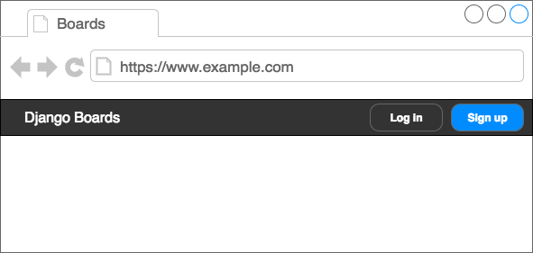
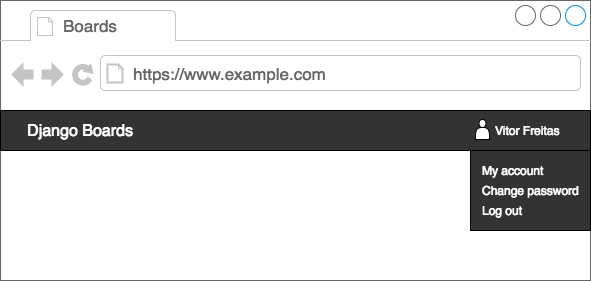
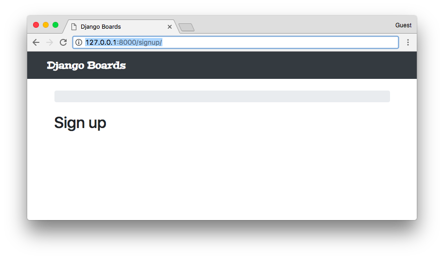
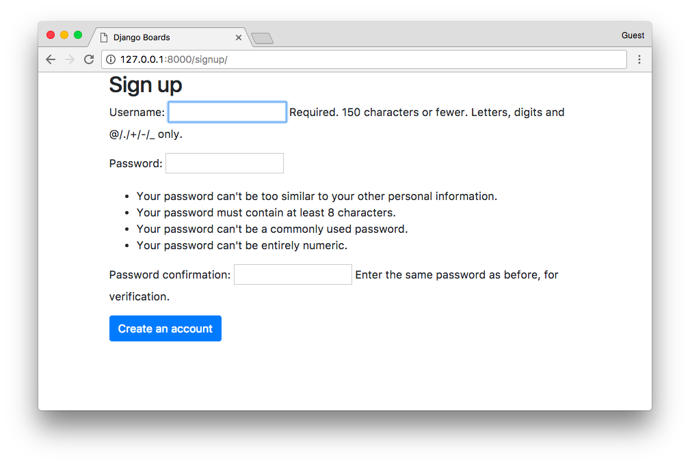
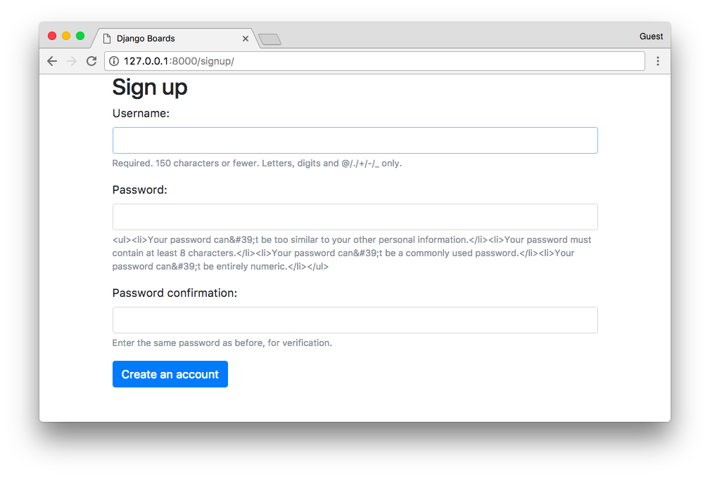
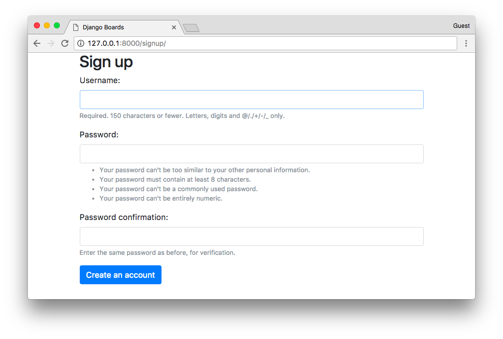
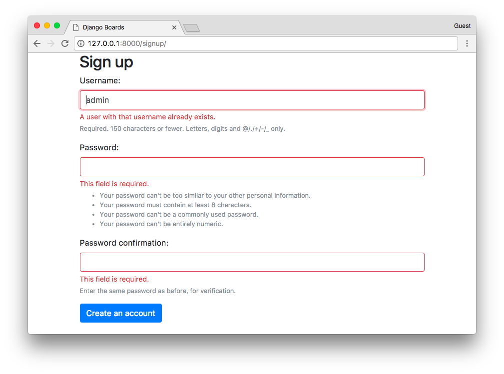
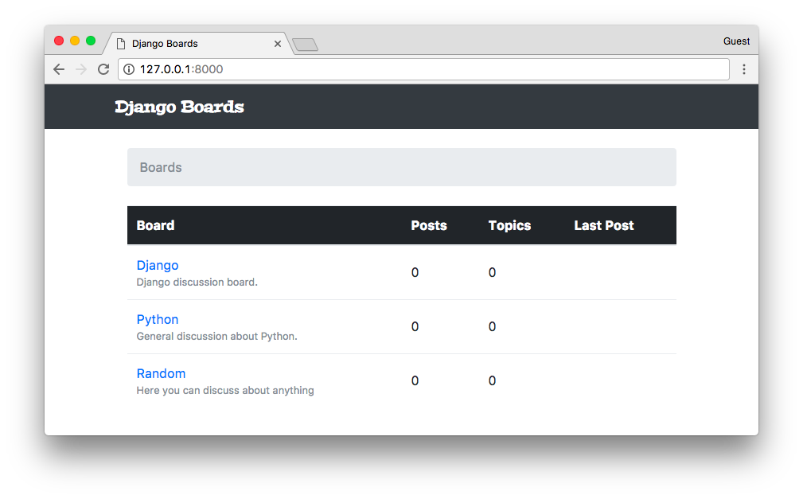
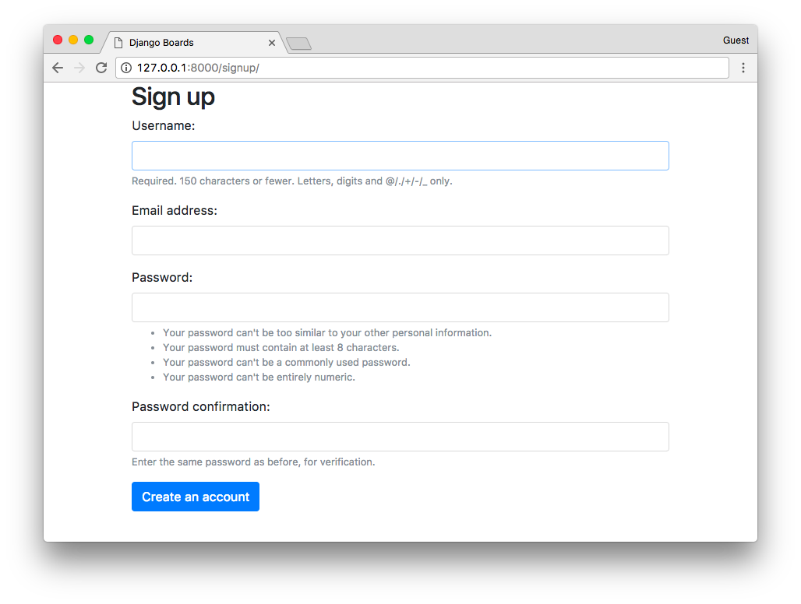

# Django入门与实践-第13章：用户注册


### 前言

这一章节将会全面介绍 Django 的身份认证系统，我们将实现注册、登录、注销、密码重置和密码修改的整套流程。

同时你还会了解到如何保护某些试图以防未授权的用户访问，以及如何访问已登录用户的个人信息。


在接下来的部分，你会看到一些和身份验证有关线框图，将在本教程中实现。之后是一个全新Django 应用的初始化设置。至今为止我们一直在一个名叫 boards 的应用中开发。不过，所有身份认证相关的内容都将在另一个应用中，这样能更良好的组织代码。


### 线框图

我们必须更新一下应用的线框图。首先，我们需要在顶部菜单添加一些新选项，如果用户未通过身份验证，应该有两个按钮：分别是注册和登录按钮。



图1: 未认证用户的菜单顶部

如果用户已经通过身份认证，我们应该显示他们的名字，和带有“我的账户”，“修改密码”，“登出”这三个选项的下拉框



图2: 认证用户的顶部菜单

在登录页面，我们需要一个带有**username**和**password**的表单， 一个登录的按钮和可跳转到注册页面和密码重置页面的链接。


图3：登录页面

在注册页面，我们应该有包含四个字段的表单：**username，email address, password**和**password confirmation**。同时，也应该有一个能够访问登录页面链接。


图4：注册页面

在密码重置页面上，只有**email address**字段的表单。


图5: 密码重置

之后，用户在点击带有特殊token的重置密码链接以后，用户将被重定向到一个页面，在那里他们可以设置新的密码。


图6：修改密码

###  初始设置

要管理这些功能，我们可以在另一个应用（app）中将其拆解。在项目根目录中的 manage.py 文件所在的同一目录下，运行以下命令以创建一个新的app：

```shell
django-admin startapp accounts
```

项目的目录结构应该如下：

```shell
myproject/
 |-- myproject/
 |    |-- accounts/     <-- 新创建的app
 |    |-- boards/
 |    |-- myproject/
 |    |-- static/
 |    |-- templates/
 |    |-- db.sqlite3
 |    +-- manage.py
 +-- venv/
```

下一步，在 settings.py 文件中将 **accounts** app 添加到`INSTALLED_APPS`：

```python
INSTALLED_APPS = [
    'django.contrib.admin',
    'django.contrib.auth',
    'django.contrib.contenttypes',
    'django.contrib.sessions',
    'django.contrib.messages',
    'django.contrib.staticfiles',

    'widget_tweaks',

    'accounts',
    'boards',
]
```

现在开始，我们将会在 **accounts** 这个app下操作。


###  注册

我们从创建注册视图开始。首先，在`urls.py` 文件中创建一个新的路由：

**myproject/urls.py**

```python
from django.conf.urls import url
from django.contrib import admin

from accounts import views as accounts_views
from boards import views

urlpatterns = [
    url(r'^$', views.home, name='home'),
    url(r'^signup/$', accounts_views.signup, name='signup'),
    url(r'^boards/(?P<pk>\d+)/$', views.board_topics, name='board_topics'),
    url(r'^boards/(?P<pk>\d+)/new/$', views.new_topic, name='new_topic'),
    url(r'^admin/', admin.site.urls),
]
```

注意，我们以不同的方式从`accounts` app 导入了`views`模块

```python
from accounts import views as accounts_views
```

我们给 accounts 的 `views` 指定了别名，否则它会与`boards` 的`views` 模块发生冲突。稍后我们可以改进`urls.py` 的设计，但现在，我们只关注身份验证功能。

现在，我们在 accounts app 中编辑 **views.py**，新创建一个名为**signup**的视图函数：

**accounts/views.py**

```shell
from django.shortcuts import render

def signup(request):
    return render(request, 'signup.html')
```

接着创建一个新的模板，取名为**signup.html**：

**templates/signup.html**

```html




  <h2>Sign up</h2>

```

在浏览器中打开 http://127.0.0.1:8000/signup/ ，看看是否程序运行了起来：



接下来写点测试用例：

**accounts/tests.py**

```python
from django.core.urlresolvers import reverse
from django.urls import resolve
from django.test import TestCase
from .views import signup

class SignUpTests(TestCase):
    def test_signup_status_code(self):
        url = reverse('signup')
        response = self.client.get(url)
        self.assertEquals(response.status_code, 200)

    def test_signup_url_resolves_signup_view(self):
        view = resolve('/signup/')
        self.assertEquals(view.func, signup)
```

测试状态码（200=success）以及 URL **/signup/** 是否返回了正确的视图函数。


```shell
python manage.py test
```

```shell
Creating test database for alias 'default'...
System check identified no issues (0 silenced).
..................
----------------------------------------------------------------------
Ran 18 tests in 0.652s

OK
Destroying test database for alias 'default'...
```

对于认证视图（注册、登录、密码重置等），我们不需要顶部条和breadcrumb导航栏，但仍然能够复用**base.html** 模板，不过我们需要对它做出一些修改，只需要微调：


**templates/base.html**

```html

<!DOCTYPE html>
<html>
  <head>
    <meta charset="utf-8">
    <title>Django Boards</title>
    <link href="https://fonts.googleapis.com/css?family=Peralta" rel="stylesheet">
    <link rel="stylesheet" href="">
    <link rel="stylesheet" href="">
      <!-- 这里 -->
  </head>
  <body>
      <!-- 这里 -->
      <nav class="navbar navbar-expand-lg navbar-dark bg-dark">
        <div class="container">
          <a class="navbar-brand" href="">Django Boards</a>
        </div>
      </nav>
      <div class="container">
        <ol class="breadcrumb my-4">
          
          
        </ol>
        
        
      </div>
      <!-- 这里 -->
  </body>
</html>

```


我在 **base.html** 模板中标注了注释，表示新加的代码。块代码`` 表示添加一些额外的CSS，用于某些特定的页面。

代码块`` 包装了整个HTML文档。我们可以只有一个空的文档结构，以充分利用**base.html**头部。注意，还有一个结束的代码块``，在这种情况下，命名结束标签是一种很好的实践方法，这样更容易确定结束标记的位置。

现在，在**signup.html**模板中，我们使用``代替了 ``

**templates/signup.html**

```shell



  <h2>Sign up</h2>

```


是时候创建注册表单了。Django有一个名为 **UserCreationForm**的内置表单，我们就使用它吧：

**accounts/views.py**

```python
from django.contrib.auth.forms import UserCreationForm
from django.shortcuts import render

def signup(request):
    form = UserCreationForm()
    return render(request, 'signup.html', {'form': form})
```

**templates/signup.html**

```html




  <div class="container">
    <h2>Sign up</h2>
    <form method="post" novalidate>
      
      {{ form.as_p }}
      <button type="submit" class="btn btn-primary">Create an account</button>
    </form>
  </div>

```



看起来有一点乱糟糟,是吧？我们可以使用**form.html**模板使它看起来更好：

**templates/signup.html**

```html




  <div class="container">
    <h2>Sign up</h2>
    <form method="post" novalidate>
      
      
      <button type="submit" class="btn btn-primary">Create an account</button>
    </form>
  </div>

```



哈？非常接近目标了，目前，我们的**form.html**部分模板显示了一些原生的HTML代码。这是django出于安全考虑的特性。在默认的情况下，Django将所有字符串视为不安全的，会转义所有可能导致问题的特殊字符。但在这种情况下，我们可以信任它。

**templates/includes/form.html**

```html




  <div class="form-group">
    {{ field.label_tag }}

    <!-- code suppressed for brevity -->

    
      <small class="form-text text-muted">
        {{ field.help_text|safe }}  <!-- 新的代码 -->
      </small>
    
  </div>

```

我们主要在之前的模板中，将选项`safe` 添加到`field.help_text`: `{{ field.help_text|safe }}`.

保存**form.html**文件，然后再次检测注册页面：



现在，让我们在**signup**视图中实现业务逻辑：

**accounts/views.py**

```python
from django.contrib.auth import login as auth_login
from django.contrib.auth.forms import UserCreationForm
from django.shortcuts import render, redirect

def signup(request):
    if request.method == 'POST':
        form = UserCreationForm(request.POST)
        if form.is_valid():
            user = form.save()
            auth_login(request, user)
            return redirect('home')
    else:
        form = UserCreationForm()
    return render(request, 'signup.html', {'form': form})
```

表单处理有一个小细节：**login**函数重命名为**auth_login**以避免与内置login视图冲突）。

>（编者注：我重命名了`login` 函数重命名为`auth_login` ，但后来我意识到Django1.11对登录视图LoginView具有基于类的视图，因此不存在与名称冲突的风险。在比较旧的版本中，有一个`auth.login`和`auth.view.login` ，这会导致一些混淆，因为一个是用户登录的功能，另一个是视图。

>简单来说：如果你愿意，你可以像`login` 一样导入它，这样做不会造成任何问题。）

如果表单是有效的，那么我们通过`user=form.save()`创建一个User实例。然后将创建的用户作为参数传递给`auth_login`函数，手动验证用户。之后，视图将用户重定向到主页，保持应用程序的流程。

让我们来试试吧，首先，提交一些无效数据，无论是空表单，不匹配的字段还是已有的用户名。



现在填写表单并提交，检查用户是否已创建并重定向到主页。



### 在模板中引用已认证的用户

我们要怎么才能知道上述操作是否有效呢？我们可以编辑**base.html**模板来在顶部栏上添加用户名称：


**templates/base.html**

```html


  <nav class="navbar navbar-expand-sm navbar-dark bg-dark">
    <div class="container">
      <a class="navbar-brand" href="">Django Boards</a>
      <button class="navbar-toggler" type="button" data-toggle="collapse" data-target="#mainMenu" aria-controls="mainMenu" aria-expanded="false" aria-label="Toggle navigation">
        <span class="navbar-toggler-icon"></span>
      </button>
      <div class="collapse navbar-collapse" id="mainMenu">
        <ul class="navbar-nav ml-auto">
          <li class="nav-item">
            <a class="nav-link" href="#">{{ user.username }}</a>
          </li>
        </ul>
      </div>
    </div>
  </nav>

  <div class="container">
    <ol class="breadcrumb my-4">
      
      
    </ol>
    
    
  </div>

```


###  测试注册视图

我们来改进测试用例：

**accounts/tests.py**

```python
from django.contrib.auth.forms import UserCreationForm
from django.core.urlresolvers import reverse
from django.urls import resolve
from django.test import TestCase
from .views import signup

class SignUpTests(TestCase):
    def setUp(self):
        url = reverse('signup')
        self.response = self.client.get(url)

    def test_signup_status_code(self):
        self.assertEquals(self.response.status_code, 200)

    def test_signup_url_resolves_signup_view(self):
        view = resolve('/signup/')
        self.assertEquals(view.func, signup)

    def test_csrf(self):
        self.assertContains(self.response, 'csrfmiddlewaretoken')

    def test_contains_form(self):
        form = self.response.context.get('form')
        self.assertIsInstance(form, UserCreationForm)
```

我们稍微改变了**SighUpTests**类，定义了一个**setUp**方法，将response对象移到那里，现在我们测试响应中是否有表单和CSRF token。

现在我们要测试一个成功的注册功能。这次，让我们来创建一个新类，以便于更好地组织测试。

**accounts/tests.py**

```python
from django.contrib.auth.models import User
from django.contrib.auth.forms import UserCreationForm
from django.core.urlresolvers import reverse
from django.urls import resolve
from django.test import TestCase
from .views import signup

class SignUpTests(TestCase):
    # code suppressed...

class SuccessfulSignUpTests(TestCase):
    def setUp(self):
        url = reverse('signup')
        data = {
            'username': 'john',
            'password1': 'abcdef123456',
            'password2': 'abcdef123456'
        }
        self.response = self.client.post(url, data)
        self.home_url = reverse('home')

    def test_redirection(self):
        '''
        A valid form submission should redirect the user to the home page
        '''
        self.assertRedirects(self.response, self.home_url)

    def test_user_creation(self):
        self.assertTrue(User.objects.exists())

    def test_user_authentication(self):
        '''
        Create a new request to an arbitrary page.
        The resulting response should now have a `user` to its context,
        after a successful sign up.
        '''
        response = self.client.get(self.home_url)
        user = response.context.get('user')
        self.assertTrue(user.is_authenticated)
```

运行这个测试用例。

使用类似地策略，创建一个新的类，用于数据无效的注册用例


```python
from django.contrib.auth.models import User
from django.contrib.auth.forms import UserCreationForm
from django.core.urlresolvers import reverse
from django.urls import resolve
from django.test import TestCase
from .views import signup

class SignUpTests(TestCase):
    # code suppressed...

class SuccessfulSignUpTests(TestCase):
    # code suppressed...

class InvalidSignUpTests(TestCase):
    def setUp(self):
        url = reverse('signup')
        self.response = self.client.post(url, {})  # submit an empty dictionary

    def test_signup_status_code(self):
        '''
        An invalid form submission should return to the same page
        '''
        self.assertEquals(self.response.status_code, 200)

    def test_form_errors(self):
        form = self.response.context.get('form')
        self.assertTrue(form.errors)

    def test_dont_create_user(self):
        self.assertFalse(User.objects.exists())
```

###  将Email字段添加到表单

一切都正常，但还缺失 **email address**字段。**UserCreationForm**不提供 email 字段，但是我们可以对它进行扩展。

在**accounts** 文件夹中创建一个名为**forms.py**的文件：

**accounts/forms.py**

```python
from django import forms
from django.contrib.auth.forms import UserCreationForm
from django.contrib.auth.models import User

class SignUpForm(UserCreationForm):
    email = forms.CharField(max_length=254, required=True, widget=forms.EmailInput())
    class Meta:
        model = User
        fields = ('username', 'email', 'password1', 'password2')
```

现在，我们不需要在`views.py` 中使用UserCreationForm，而是导入新的表单**SignUpForm**，然后使用它：

**accounts/views.py**

```python
from django.contrib.auth import login as auth_login
from django.shortcuts import render, redirect

from .forms import SignUpForm

def signup(request):
    if request.method == 'POST':
        form = SignUpForm(request.POST)
        if form.is_valid():
            user = form.save()
            auth_login(request, user)
            return redirect('home')
    else:
        form = SignUpForm()
    return render(request, 'signup.html', {'form': form})
```

只用这个小小的改变，可以运作了：



请记住更改测试用例以使用SignUpForm而不是UserCreationForm：


```python
from .forms import SignUpForm

class SignUpTests(TestCase):
    # ...

    def test_contains_form(self):
        form = self.response.context.get('form')
        self.assertIsInstance(form, SignUpForm)

class SuccessfulSignUpTests(TestCase):
    def setUp(self):
        url = reverse('signup')
        data = {
            'username': 'john',
            'email': 'john@doe.com',
            'password1': 'abcdef123456',
            'password2': 'abcdef123456'
        }
        self.response = self.client.post(url, data)
        self.home_url = reverse('home')

    # ...
```

之前的测试用例仍然会通过，因为SignUpForm扩展了UserCreationForm，它是UserCreationForm的一个实例。

添加了新的表单后，让我们想想发生了什么：

```
fields = ('username', 'email', 'password1', 'password2')
```

它会自动映射到HTML模板中。这很好吗？这要视情况而定。如果将来会有新的开发人员想要重新使用SignUpForm来做其他事情，并为其添加一些额外的字段。那么这些新的字段也会出现在signup.html中，这可能不是所期望的行为。这种改变可能会被忽略，我们不希望有任何意外。

那么让我们来创建一个新的测试，验证模板中的HTML输入：

**accounts/tests.py**

```python
class SignUpTests(TestCase):
    # ...

    def test_form_inputs(self):
        '''
        The view must contain five inputs: csrf, username, email,
        password1, password2
        '''
        self.assertContains(self.response, '<input', 5)
        self.assertContains(self.response, 'type="text"', 1)
        self.assertContains(self.response, 'type="email"', 1)
        self.assertContains(self.response, 'type="password"', 2)
```

###  改进测试代码的组织结构

好的，现在我们正在测试输入和所有的功能，但是我们仍然必须测试表单本身。不要只是继续向`accounts/tests.py` 文件添加测试，我们稍微改进一下项目设计。

在**accounts**文件夹下创建一个名为**tests**的新文件夹。然后在tests文件夹中，创建一个名为`init.py` 的空文件。

现在，将`test.py` 文件移动到**tests**文件夹中，并将其重命名为`test_view_signup.py` 

最终的结果应该如下：

```shell
myproject/
 |-- myproject/
 |    |-- accounts/
 |    |    |-- migrations/
 |    |    |-- tests/
 |    |    |    |-- __init__.py
 |    |    |    +-- test_view_signup.py
 |    |    |-- __init__.py
 |    |    |-- admin.py
 |    |    |-- apps.py
 |    |    |-- models.py
 |    |    +-- views.py
 |    |-- boards/
 |    |-- myproject/
 |    |-- static/
 |    |-- templates/
 |    |-- db.sqlite3
 |    +-- manage.py
 +-- venv/
```

注意到，因为我们在应用程序的上下文使用了相对导入，所以我们需要在 **test_view_signup.py**中修复导入：

**accounts/tests/test_view_signup.py**

```python
from django.contrib.auth.models import User
from django.core.urlresolvers import reverse
from django.urls import resolve
from django.test import TestCase

from ..views import signup
from ..forms import SignUpForm
```

我们在应用程序模块内部使用相对导入，以便我们可以自由地重新命名Django应用程序，而无需修复所有绝对导入。

现在让我们创建一个新的测试文件来测试SignUpForm，添加一个名为**test_form_signup.py**的新测试文件：

**accounts/tests/test_form_signup.py**


```python
from django.test import TestCase
from ..forms import SignUpForm

class SignUpFormTest(TestCase):
    def test_form_has_fields(self):
        form = SignUpForm()
        expected = ['username', 'email', 'password1', 'password2',]
        actual = list(form.fields)
        self.assertSequenceEqual(expected, actual)
```

它看起来非常严格对吧，例如，如果将来我们必须更改SignUpForm，以包含用户的名字和姓氏，那么即使我们没有破坏任何东西，我们也可能最终不得不修复一些测试用例。

!

这些警报很有用，因为它们有助于提高认识，特别是新手第一次接触代码，它可以帮助他们自信地编码。

#### 改进注册模板

让我们稍微讨论一下，在这里，我们可以使用Bootstrap4 组件来使它看起来不错。

访问：https://www.toptal.com/designers/subtlepatterns/ 并找到一个很好地背景图案作为账户页面的背景，下载下来再静态文件夹中创建一个名为img的新文件夹，并将图像放置再那里。

之后，再static/css中创建一个名为accounts.css的新CSS文件。结果应该如下：

```shell
myproject/
 |-- myproject/
 |    |-- accounts/
 |    |-- boards/
 |    |-- myproject/
 |    |-- static/
 |    |    |-- css/
 |    |    |    |-- accounts.css  <-- here
 |    |    |    |-- app.css
 |    |    |    +-- bootstrap.min.css
 |    |    +-- img/
 |    |    |    +-- shattered.png  <-- here (the name may be different, depending on the patter you downloaded)
 |    |-- templates/
 |    |-- db.sqlite3
 |    +-- manage.py
 +-- venv/
```

现在编辑accounts.css这个文件：

**static/css/accounts.css**

```css
body {
  background-image: url(../img/shattered.png);
}

.logo {
  font-family: 'Peralta', cursive;
}

.logo a {
  color: rgba(0,0,0,.9);
}

.logo a:hover,
.logo a:active {
  text-decoration: none;
}
```

在signup.html模板中，我们可以将其改为使用新的CSS，并使用Bootstrap4组件：

**templates/signup.html**

```html






  <link rel="stylesheet" href="">



  <div class="container">
    <h1 class="text-center logo my-4">
      <a href="">Django Boards</a>
    </h1>
    <div class="row justify-content-center">
      <div class="col-lg-8 col-md-10 col-sm-12">
        <div class="card">
          <div class="card-body">
            <h3 class="card-title">Sign up</h3>
            <form method="post" novalidate>
              
              
              <button type="submit" class="btn btn-primary btn-block">Create an account</button>
            </form>
          </div>
          <div class="card-footer text-muted text-center">
            Already have an account? <a href="#">Log in</a>
          </div>
        </div>
      </div>
    </div>
  </div>

```

这就是我们现在的注册页面：

