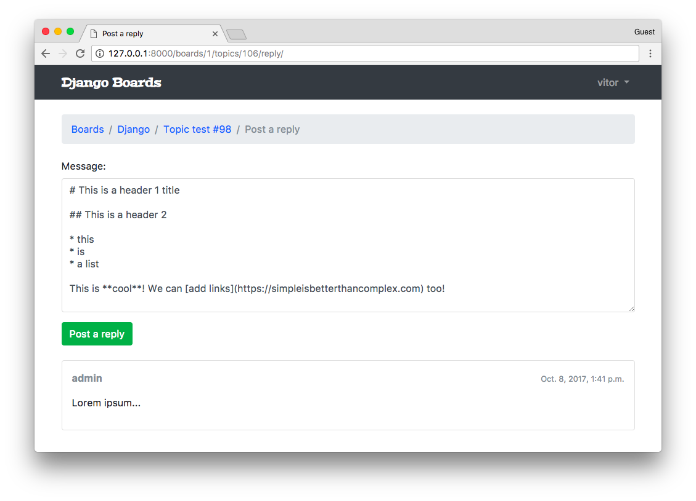
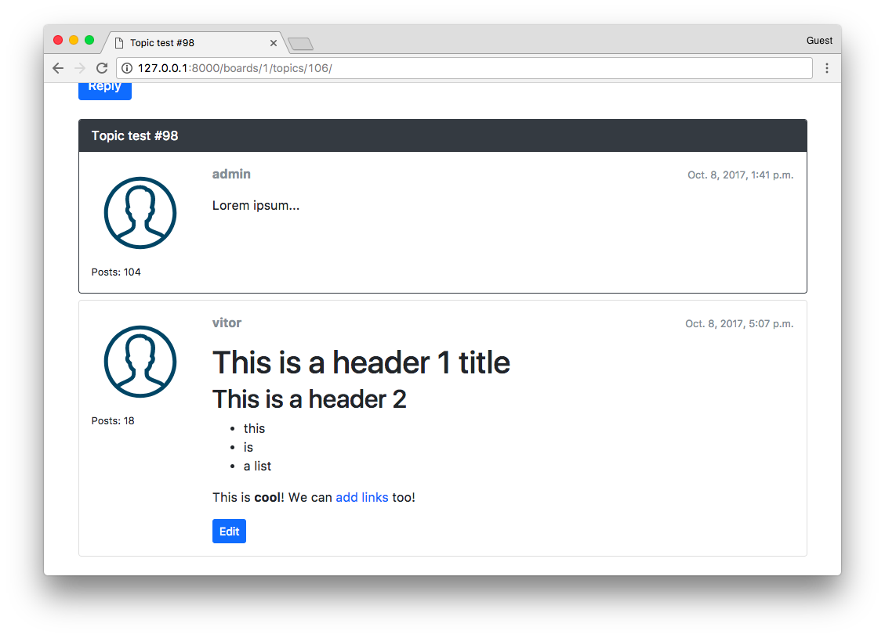
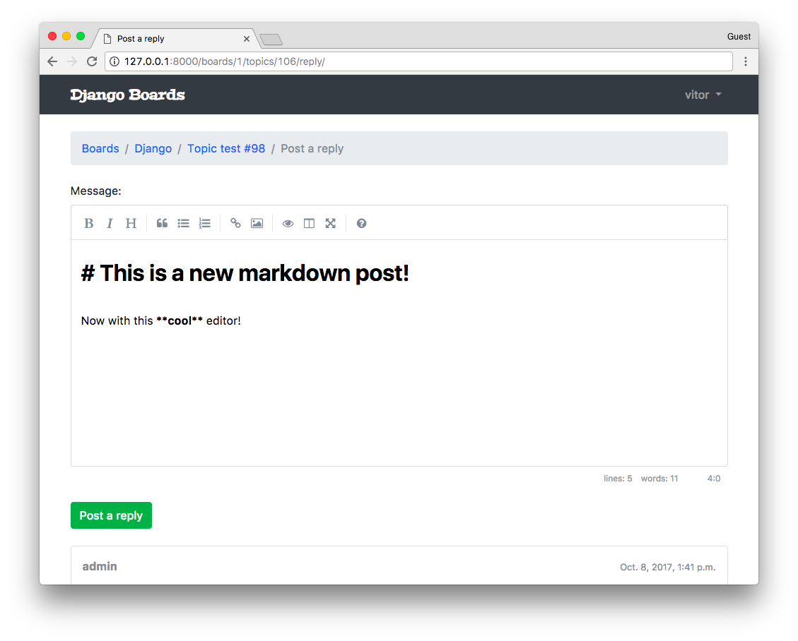

# 一个完整的 Django 入门指南 - 第6部分

> 译者：[vimiix](https://github.com/vimiix)
> 
> 原文地址：[https://simpleisbetterthancomplex.com/series/2017/10/09/a-complete-beginners-guide-to-django-part-6.html](https://simpleisbetterthancomplex.com/series/2017/10/09/a-complete-beginners-guide-to-django-part-6.html)


## 前言

欢迎来到系列教程的第六部分！在这篇教程中，我们将详细探讨基于类的视图（简称CBV）。我们也将重构一些现有的视图，以便利用内置的**通用的基于类的视图**。

这篇教程我们还将讨论许多其他主题，例如如何使用分页，如何使用markdown以及如何添加简单的编辑器。我们还将探索一个名为 **Humanize** 的内置软件包，用于对数据进行“人为操作”。

好了，伙计们！让我们来实现一些代码。今天我们还有很多工作要做！

## 视图策略

到头来，所有的Django视图其实都是*函数*。即便是CBV。在类的底层，它完成了所有的功能并最终返回一个视图函数。

引入了基于类的视图，使开发人员可以更轻松地重新使用和扩展视图。使用它们有很多好处，例如可扩展性，多重继承之类的面向对象技术的运用，http方法的处理是在单独的方法中完成的，而不是使用条件分支，并且还有通用的基于类的视图（简称GCBV）。

在我们继续教程之前，让我们清楚这三个术语的含义：

* 基于函数的视图（FBV）
* 基于类的视图（CBV）
* 通用的基于类的视图（GCBV）

FBV是Django视图中最简单的表示：它就是一个接收 **HttpRequest** 对象并返回一个 **HttpResponse** 的函数。

CBV是每个Django视图都被定义为一个扩展 `django.views.generic.view` 抽象类后的 Python 类。

GCBV是可以解决一些具体问题的内置的CBV集合，比如列表视图，创建，更新和删除视图等。

下面我们将探讨一些不同实现方式的例子。

### 基于函数的视图 (FBV)

**views.py**

```python
def new_post(request):
    if request.method == 'POST':
        form = PostForm(request.POST)
        if form.is_valid():
            form.save()
            return redirect('post_list')
    else:
        form = PostForm()
    return render(request, 'new_post.html', {'form': form})
```

**urls.py**

```python
urlpatterns = [
    url(r'^new_post/$', views.new_post, name='new_post'),
]
```

### 基于类的视图 (CBV)

CBV是**View**类的集成类。这里的主要区别在于请求是以HTTP方法命名的类方法内处理的，例如**GET** ，**POST** ，**PUT** ，**HEAD** 等。

所以，在这里，我们不需要做一个条件来判断请求是一个 **POST** 还是它是一个 **GET** 。代码会直接跳转到正确的方法中。在 **View** 类中内部处理了这个逻辑。

**views.py**

```python
from django.views.generic import View

class NewPostView(View):
    def post(self, request):
        form = PostForm(request.POST)
        if form.is_valid():
            form.save()
            return redirect('post_list')
        return render(request, 'new_post.html', {'form': form})

    def get(self, request):
        form = PostForm()
        return render(request, 'new_post.html', {'form': form})
```

我们在 **urls.py** 模块中引用CBV的方式也会有点不同：

**urls.py**

```python
urlpatterns = [
    url(r'^new_post/$', views.NewPostView.as_view(), name='new_post'),
]
```

在这里，我们需要调用 `as_view()` 这个类方法，它将返回一个符合url模式视图函数。在某些情况下，我们也可以将一些关键字参数传递给 `as_view()`，以便自定义CBV的行为，就像我们用一些身份验证视图来定制模板一样。

总之，关于CBV的好处是我们可以在类里面添加更多的方法，也许可以这样做：

```python
from django.views.generic import View

class NewPostView(View):
    def render(self, request):
        return render(request, 'new_post.html', {'form': self.form})

    def post(self, request):
        self.form = PostForm(request.POST)
        if self.form.is_valid():
            self.form.save()
            return redirect('post_list')
        return self.render(request)

    def get(self, request):
        self.form = PostForm()
        return self.render(request)
```

还可以创建一些通用视图来完成一些任务，以便我们可以在整个项目中重复利用它。

你需要知道的关于CBV的基本就是这些。就这么简单。

### 通用的基于类的视图（GCBV）

接下来关于GCBV。这是一个不同的情况。正如我前面提到的，GCBV是内置CBV的常见用例。它们的实现往往会大量使用多重继承（混合继承）和其他面向对象的策略。

他们非常灵活，可以节省很多的工作量。但是一开始可能相对比较难上手。

当我第一次开始使用Django时，我发现GCBV很难使用。起初，很难说出发生了什么，因为代码执行流程看起来并不明显，因为在父类中隐藏了大量代码。官方文档也有一定的难度，主要是因为属性和方法有时分布在八个父类中。使用GCBV时，最好打开 [ccbv.co.uk](https://ccbv.co.uk/) *(需科学上网)* 以便快速参考。不用担心，我们将一起探索它。

现在我们来看一个GCBV的例子。

**views.py**

```python
from django.views.generic import CreateView

class NewPostView(CreateView):
    model = Post
    form_class = PostForm
    success_url = reverse_lazy('post_list')
    template_name = 'new_post.html'
```

这里我们使用了一个用于创建模型对象的通用视图。它会处理所有表单处理并在表单有效时保存对象。

因为它是一个CBV，所以我们在 **urls.py** 中以与其他CBV相同的方式来引用它：

**urls.py**

```python
urlpatterns = [
    url(r'^new_post/$', views.NewPostView.as_view(), name='new_post'),
]
```

GCBV 中的其他例子还有：**detailview**，**deleteview**，**formview**，**updateview**，**listview**。


## 更新视图

让我们回到我们项目的实现。这次我们将使用 GCBV 来实现**编辑帖子**的视图：


**boards/views.py** [(查看文件全部内容)](https://gist.github.com/vitorfs/376657085570a3dedf7e5f6e6fffc5e3#file-views-py-L66)

```python
from django.shortcuts import redirect
from django.views.generic import UpdateView
from django.utils import timezone

class PostUpdateView(UpdateView):
    model = Post
    fields = ('message', )
    template_name = 'edit_post.html'
    pk_url_kwarg = 'post_pk'
    context_object_name = 'post'

    def form_valid(self, form):
        post = form.save(commit=False)
        post.updated_by = self.request.user
        post.updated_at = timezone.now()
        post.save()
        return redirect('topic_posts', pk=post.topic.board.pk, topic_pk=post.topic.pk)
```

使用 **UPDATEVIEW** 和 **CREATEVIEW** ，我们可以选择定义 **form_class** 或 **fields** 属性。在上面的例子中，我们使用 **fields** 属性来即时创建模型表单。在内部，Django 将使用模型表单工厂函数来组成 **POST** 模型的一种形式。因为它只是一个非常简单的表单，只有 **message** 字段，所以在这里我们可以这么做。但对于复杂的表单定义，最好从外部定义模型表单然后在这里引用它。

系统将使用 **pk\_url\_kwarg** 来标识用于检索 **Post** 对象的关键字参数的名称。就像我们在 **urls.py** 中定义一样。

如果我们没有设置 **context_object_name** 属性，**Post** 对象将作为“Object”在模板中可用。所以，在这里我们使用 **context_object_name** 来重命名它来发布。你会看到我们在下面的模板中如何使用它。

在这个特定的例子中，我们不得不重写 `form_valid()` 方法来设置一些额外的字段，例如**updated_by** 和 **updated_at** 。你可以在这里看到 `form_valid()` 方法原本的样子：[updateview＃form_valid](https://ccbv.co.uk/projects/Django/1.11/django.views.generic.edit/UpdateView/#form_valid)。

**myproject/urls.py** [(查看文件全部内容)](https://gist.github.com/vitorfs/376657085570a3dedf7e5f6e6fffc5e3#file-urls-py-L40)

```python
from django.conf.urls import url
from boards import views

urlpatterns = [
    # ...
    url(r'^boards/(?P<pk>\d+)/topics/(?P<topic_pk>\d+)/posts/(?P<post_pk>\d+)/edit/$',
        views.PostUpdateView.as_view(), name='edit_post'),
]
```

现在我们可以将链接添加到编辑页面：

**templates/topic_posts.html** [(查看文件全部内容)](https://gist.github.com/vitorfs/589d31af9d06c5b21ec9b1623be0c357#file-topic_posts-html-L40)

```html

  <div class="mt-3">
    <a href=""
       class="btn btn-primary btn-sm"
       role="button">Edit</a>
  </div>

```

**templates/edit_post.html** [(查看文件全部内容)](https://gist.github.com/vitorfs/376657085570a3dedf7e5f6e6fffc5e3#file-edit_post-html)

```html


Edit post


  <li class="breadcrumb-item"><a href="">Boards</a></li>
  <li class="breadcrumb-item"><a href="">{{ post.topic.board.name }}</a></li>
  <li class="breadcrumb-item"><a href="">{{ post.topic.subject }}</a></li>
  <li class="breadcrumb-item active">Edit post</li>



  <form method="post" class="mb-4" novalidate>
    
    
    <button type="submit" class="btn btn-success">Save changes</button>
    <a href="" class="btn btn-outline-secondary" role="button">Cancel</a>
  </form>

```

现在观察我们如何引导到 post 对象：post.topic.board.pk。如果我们没有设置**context_object_name** 来**发布**，它将可以被用作：object.topic.board.pk。明白了吗？


### 测试更新视图

在 **boards/tests** 文件夹内创建一个名为 **test_view_edit_post.py** 的新测试文件。点击下面的链接，你会看到很多常用测试，就像我们在本教程中做的一样。我会在这里重点介绍一下新的内容：

**boards/tests/test_view_edit_post.py** [（查看完整文件）](https://gist.github.com/vitorfs/286917ce31687732eba4e545fc3cbdea)

```python
from django.contrib.auth.models import User
from django.test import TestCase
from django.urls import reverse
from ..models import Board, Post, Topic
from ..views import PostUpdateView

class PostUpdateViewTestCase(TestCase):
    '''
    Base test case to be used in all `PostUpdateView` view tests
    '''
    def setUp(self):
        self.board = Board.objects.create(name='Django', description='Django board.')
        self.username = 'john'
        self.password = '123'
        user = User.objects.create_user(username=self.username, email='john@doe.com', password=self.password)
        self.topic = Topic.objects.create(subject='Hello, world', board=self.board, starter=user)
        self.post = Post.objects.create(message='Lorem ipsum dolor sit amet', topic=self.topic, created_by=user)
        self.url = reverse('edit_post', kwargs={
            'pk': self.board.pk,
            'topic_pk': self.topic.pk,
            'post_pk': self.post.pk
        })

class LoginRequiredPostUpdateViewTests(PostUpdateViewTestCase):
    def test_redirection(self):
        '''
        Test if only logged in users can edit the posts
        '''
        login_url = reverse('login')
        response = self.client.get(self.url)
        self.assertRedirects(response, '{login_url}?next={url}'.format(login_url=login_url, url=self.url))

class UnauthorizedPostUpdateViewTests(PostUpdateViewTestCase):
    def setUp(self):
        '''
        Create a new user different from the one who posted
        '''
        super().setUp()
        username = 'jane'
        password = '321'
        user = User.objects.create_user(username=username, email='jane@doe.com', password=password)
        self.client.login(username=username, password=password)
        self.response = self.client.get(self.url)

    def test_status_code(self):
        '''
        A topic should be edited only by the owner.
        Unauthorized users should get a 404 response (Page Not Found)
        '''
        self.assertEquals(self.response.status_code, 404)


class PostUpdateViewTests(PostUpdateViewTestCase):
    # ...

class SuccessfulPostUpdateViewTests(PostUpdateViewTestCase):
    # ...

class InvalidPostUpdateViewTests(PostUpdateViewTestCase):
    # ...
```

这里，重要的部分是：**PostUpdateViewTestCase**是我们定义的类，它可以在其他测试用例中复用。它只包含基本的设置，创建user，topic，boards等等。

**LoginRequiredPostUpdateViewTests** 这个类将测试检查该视图是否使用了`@login_required`装饰器。即只有经过身份验证的用户才能访问编辑页面。

**UnauthorizedPostUpdateViewTests** 这个类是创建一个新用户，与发布并尝试访问编辑页面的用户不同。本应用程序应该只能授权该文章的所有者进行编辑。

我们来运行一下这些测试：

```bash
python manage.py test boards.tests.test_view_edit_post
```

```bash
Creating test database for alias 'default'...
System check identified no issues (0 silenced).
..F.......F
======================================================================
FAIL: test_redirection (boards.tests.test_view_edit_post.LoginRequiredPostUpdateViewTests)
----------------------------------------------------------------------
...
AssertionError: 200 != 302 : Response didn't redirect as expected: Response code was 200 (expected 302)

======================================================================
FAIL: test_status_code (boards.tests.test_view_edit_post.UnauthorizedPostUpdateViewTests)
----------------------------------------------------------------------
...
AssertionError: 200 != 404

----------------------------------------------------------------------
Ran 11 tests in 1.360s

FAILED (failures=2)
Destroying test database for alias 'default'...
```

首先，我们修复`@login_required`装饰器的问题。在 CBV 上使用视图装饰器的方式有一些不同。我们需要额外的导入：

**boards/views.py** [(查看文章文件)](https://gist.github.com/vitorfs/826a6d421ebbeb80a0aee8e1b9b70398#file-views-py-L67)

```python
from django.contrib.auth.decorators import login_required
from django.shortcuts import redirect
from django.views.generic import UpdateView
from django.utils import timezone
from django.utils.decorators import method_decorator
from .models import Post

@method_decorator(login_required, name='dispatch')
class PostUpdateView(UpdateView):
    model = Post
    fields = ('message', )
    template_name = 'edit_post.html'
    pk_url_kwarg = 'post_pk'
    context_object_name = 'post'

    def form_valid(self, form):
        post = form.save(commit=False)
        post.updated_by = self.request.user
        post.updated_at = timezone.now()
        post.save()
        return redirect('topic_posts', pk=post.topic.board.pk, topic_pk=post.topic.pk)
```

我们不能用 `@login_required` 装饰器直接装饰类。我们必须使用一个工具`@method_decorator`，并传递一个装饰器（或一个装饰器列表）并告诉应该装饰哪个类。在 CBV 中，装饰**调度类**是很常见的。它是一个Django内部使用的方法（在**View**类中定义）。所有的请求都会经过这个类，所以装饰它会相对安全。

再次运行一下测试：

```bash
python manage.py test boards.tests.test_view_edit_post
```

```bash
Creating test database for alias 'default'...
System check identified no issues (0 silenced).
..........F
======================================================================
FAIL: test_status_code (boards.tests.test_view_edit_post.UnauthorizedPostUpdateViewTests)
----------------------------------------------------------------------
...
AssertionError: 200 != 404

----------------------------------------------------------------------
Ran 11 tests in 1.353s

FAILED (failures=1)
Destroying test database for alias 'default'...
```

好的，我们解决了 `@login_required` 的问题，现在我们必须处理其他用户可以编辑所有帖子的问题。

解决这个问题最简单的方法是重写**UpdateView**的 `get_queryset` 方法。你可以在这里看到原始方法的源码--- [UpdateView#get_queryset.](https://ccbv.co.uk/projects/Django/1.11/django.views.generic.edit/UpdateView/#get_queryset)。

**boards/views.py** [查看完整文件](https://gist.github.com/vitorfs/667d8439ecf05e58f14fcc74672e48da)

```python
@method_decorator(login_required, name='dispatch')
class PostUpdateView(UpdateView):
    model = Post
    fields = ('message', )
    template_name = 'edit_post.html'
    pk_url_kwarg = 'post_pk'
    context_object_name = 'post'

    def get_queryset(self):
        queryset = super().get_queryset()
        return queryset.filter(created_by=self.request.user)

    def form_valid(self, form):
        post = form.save(commit=False)
        post.updated_by = self.request.user
        post.updated_at = timezone.now()
        post.save()
        return redirect('topic_posts', pk=post.topic.board.pk, topic_pk=post.topic.pk)
```

通过这一行 `queryset = super().get_queryset()`, 我们实现了重用父类，即，**UpateView** 类的 `get_queryset` 方法。然后，我们通过给 `queryset` 添加一个额外的过滤条件，该过滤条件是通过请求中获取登录的用户来过滤内容。

再次测试：

```bash
python manage.py test boards.tests.test_view_edit_post
```

```bash
Creating test database for alias 'default'...
System check identified no issues (0 silenced).
...........
----------------------------------------------------------------------
Ran 11 tests in 1.321s

OK
Destroying test database for alias 'default'...
```

一切顺利！
 
## 列表视图

我们现在可以利用 **CBV** 的功能来重构一些现有的视图。以主页为例，我们就先从数据库中抓取所有的 **boards** 并将其罗列在HTML中：

**boards/views.py**

```python
from django.shortcuts import render
from .models import Board

def home(request):
    boards = Board.objects.all()
    return render(request, 'home.html', {'boards': boards})
```

下面是我们如何使用 GCBV 为模型列表来重写它：

**boards/views.py** [查看完整文件](https://gist.github.com/vitorfs/5e248d9a4499e2a796c6ffee9cbb1125#file-views-py-L12)

```python
from django.views.generic import ListView
from .models import Board

class BoardListView(ListView):
    model = Board
    context_object_name = 'boards'
    template_name = 'home.html'
```

那么我们得修改一下 **urls.py** 模块中的引用：

**myproject/urls.py** [查看完整文件](https://gist.github.com/vitorfs/a0a826233d95a4cc53a75afc441db1e9#file-urls-py-L10)

```python
from django.conf.urls import url
from boards import views

urlpatterns = [
    url(r'^$', views.BoardListView.as_view(), name='home'),
    # ...
]
```

如果检查一下主页，我们会看到没有什么变化，一切都按预期的运行。但是我们必须稍微调整我们的测试，因为现在我们现在的视图是 CBV 类型了。

**boards/tests/test_view_home.py** [查看完整文件](https://gist.github.com/vitorfs/e17216ce3d92110cf7e005ce3288c587)

```python
from django.test import TestCase
from django.urls import resolve
from ..views import BoardListView

class HomeTests(TestCase):
    # ...
    def test_home_url_resolves_home_view(self):
        view = resolve('/')
        self.assertEquals(view.func.view_class, BoardListView)
```

### 分页

我们可以非常容易地使用 CBV 来实现分页功能。但首先我想手工分页，这样就更有助于我们理解背后的机制，这样它就不那么神秘了。

实际上对 boards 列表视图分页并没有意义，因为我们不期望有很多 boards。但无疑对于主题列表和帖子列表来说是需要一些分页的。

从现在起，我们将在 **board_topics** 这个视图中来操作。

首先，我们添加一些帖子。我们可以直接使用应用程序的用户界面来添加几个帖子，或者打开 python shell 编写一个小脚本来为我们完成：

```bash
python manage.py shell
```

```python
from django.contrib.auth.models import User
from boards.models import Board, Topic, Post

user = User.objects.first()

board = Board.objects.get(name='Django')

for i in range(100):
    subject = 'Topic test #{}'.format(i)
    topic = Topic.objects.create(subject=subject, board=board, starter=user)
    Post.objects.create(message='Lorem ipsum...', topic=topic, created_by=user)
```


很好，现在我们有一些数据可以玩了。

在我们返回去写代码之前，让我们用 python shell 来做一些更多的实验：

```bash
python manage.py shell
```

```python
from boards.models import Topic

# All the topics in the app
Topic.objects.count()
107

# Just the topics in the Django board
Topic.objects.filter(board__name='Django').count()
104

# Let's save this queryset into a variable to paginate it
queryset = Topic.objects.filter(board__name='Django').order_by('-last_updated')
```

定义一个你要分页的查询集(**QuerySet**)的排序是很重要的。否则，会返回给你错误的结果。

现在让我们导入 **Paginator** 工具：

```python
from django.core.paginator import Paginator

paginator = Paginator(queryset, 20)
```

这里我们告诉Django将查询集按照每页20个元素分页。现在让我们来研究一些 paginator 的属性：

```python
# count the number of elements in the paginator
paginator.count
104

# total number of pages
# 104 elements, paginating 20 per page gives you 6 pages
# where the last page will have only 4 elements
paginator.num_pages
6

# range of pages that can be used to iterate and create the
# links to the pages in the template
paginator.page_range
range(1, 7)

# returns a Page instance
paginator.page(2)
<Page 2 of 6>

page = paginator.page(2)

type(page)
django.core.paginator.Page

type(paginator)
django.core.paginator.Paginator
```

这里我们必须注意，因为如果我们试图找到一个不存在的页面，分页器会抛出一个异常:

```bash
paginator.page(7)
EmptyPage: That page contains no results
```

或者如果我们随意传递进去一个不是页码数字的参数，也会报错：

```bash
paginator.page('abc')
PageNotAnInteger: That page number is not an integer
```

我们必须在设计用户界面时牢记这些细节。

我们来简单看一下 **Page** 类提供的属性和方法：

```python
page = paginator.page(1)

# Check if there is another page after this one
page.has_next()
True

# If there is no previous page, that means this one is the first page
page.has_previous()
False

page.has_other_pages()
True

page.next_page_number()
2

# Take care here, since there is no previous page,
# if we call the method `previous_page_number() we will get an exception:
page.previous_page_number()
EmptyPage: That page number is less than 1
```

### FBV 分页

这里是我们如何使用 FBV 来实现分页：

**boards/views.py** [查看完整文件](https://gist.github.com/vitorfs/16f0ac257439245fa6645af259d8846f#file-views-py-L19)

```python
from django.db.models import Count
from django.core.paginator import Paginator, EmptyPage, PageNotAnInteger
from django.shortcuts import get_object_or_404, render
from django.views.generic import ListView
from .models import Board

def board_topics(request, pk):
    board = get_object_or_404(Board, pk=pk)
    queryset = board.topics.order_by('-last_updated').annotate(replies=Count('posts') - 1)
    page = request.GET.get('page', 1)

    paginator = Paginator(queryset, 20)

    try:
        topics = paginator.page(page)
    except PageNotAnInteger:
        # fallback to the first page
        topics = paginator.page(1)
    except EmptyPage:
        # probably the user tried to add a page number
        # in the url, so we fallback to the last page
        topics = paginator.page(paginator.num_pages)

    return render(request, 'topics.html', {'board': board, 'topics': topics})
```

这部分的实现是使用了 Bootstrap 的四个分页组件来正确的渲染页面。你需要花时间阅读代码，看看它是否适合你。我们在这里使用的是我们之前用过的方法。在这种情况下，`topics` 不再是一个查询集（`QuerySet`），而是一个 `paginator.page` 的实例。

在 topics HTML列表的基础上，我们可以渲染分页组件：

**templates/topics.html** [查看完整文件](https://gist.github.com/vitorfs/3101a1bd72125aeb45829659a5532bc6)

```html

  <nav aria-label="Topics pagination" class="mb-4">
    <ul class="pagination">
      
        <li class="page-item">
          <a class="page-link" href="?page={{ topics.previous_page_number }}">Previous</a>
        </li>
      
        <li class="page-item disabled">
          <span class="page-link">Previous</span>
        </li>
      

      
        
          <li class="page-item active">
            <span class="page-link">
              {{ page_num }}
              <span class="sr-only">(current)</span>
            </span>
          </li>
        
          <li class="page-item">
            <a class="page-link" href="?page={{ page_num }}">{{ page_num }}</a>
          </li>
        
      

      
        <li class="page-item">
          <a class="page-link" href="?page={{ topics.next_page_number }}">Next</a>
        </li>
      
        <li class="page-item disabled">
          <span class="page-link">Next</span>
        </li>
      
    </ul>
  </nav>

```


### GCBV 分页

下面，相同的实现，但这次使用**ListView**。

**boards/views.py** [查看完整文件](https://gist.github.com/vitorfs/323173bc56dec48fd83caf983d459421#file-views-py-L19)

```python
class TopicListView(ListView):
    model = Topic
    context_object_name = 'topics'
    template_name = 'topics.html'
    paginate_by = 20

    def get_context_data(self, **kwargs):
        kwargs['board'] = self.board
        return super().get_context_data(**kwargs)

    def get_queryset(self):
        self.board = get_object_or_404(Board, pk=self.kwargs.get('pk'))
        queryset = self.board.topics.order_by('-last_updated').annotate(replies=Count('posts') - 1)
        return queryset
```

在使用基于类的视图分页时，我们与模板中paginator进行交互的方式有点不同。它会在模板中提供以下变量:**paginator**,**page_obj**,**is_paginated**,**object_list**,还有一个我们在 **context_object_name** 中定义名字的变量。在我们的例子中，这个额外的变量将被命名为 **topics** ，并且它将等同于 **object_list**。

关于这个 **get\_context\_data** ，其实，它就是我们在扩展 **GCBV** 时向请求上下文添加内容的方式。

但这里的主要是 **paginate_by** 属性。一般情况下，只需添加它就足够了。

要记得更新 **urls.py** 哦：

**myproject/urls.py** [查看完整文件](https://gist.github.com/vitorfs/61f5345b7cf8b006b2901a61b8f8e348#file-urls-py-L37)

```python
from django.conf.urls import url
from boards import views

urlpatterns = [
    # ...
    url(r'^boards/(?P<pk>\d+)/$', views.TopicListView.as_view(), name='board_topics'),
]
```

现在我们来修改一下模板：

**templates/topics.html** [查看完整文件](https://gist.github.com/vitorfs/65095aa3eda78bafd22d5e2f94086d40#file-topics-html-L40)

```html

  <div class="mb-4">
    <a href="" class="btn btn-primary">New topic</a>
  </div>

  <table class="table mb-4">
    <!-- table content suppressed -->
  </table>

  
    <nav aria-label="Topics pagination" class="mb-4">
      <ul class="pagination">
        
          <li class="page-item">
            <a class="page-link" href="?page={{ page_obj.previous_page_number }}">Previous</a>
          </li>
        
          <li class="page-item disabled">
            <span class="page-link">Previous</span>
          </li>
        

        
          
            <li class="page-item active">
              <span class="page-link">
                {{ page_num }}
                <span class="sr-only">(current)</span>
              </span>
            </li>
          
            <li class="page-item">
              <a class="page-link" href="?page={{ page_num }}">{{ page_num }}</a>
            </li>
          
        

        
          <li class="page-item">
            <a class="page-link" href="?page={{ page_obj.next_page_number }}">Next</a>
          </li>
        
          <li class="page-item disabled">
            <span class="page-link">Next</span>
          </li>
        
      </ul>
    </nav>
  


```

现在花点时间运行一下测试代码，如果有需要调整的地方就修一下。

**boards/tests/test_view_board_topics.py**
 
```python
from django.test import TestCase
from django.urls import resolve
from ..views import TopicListView

class BoardTopicsTests(TestCase):
    # ...
    def test_board_topics_url_resolves_board_topics_view(self):
        view = resolve('/boards/1/')
        self.assertEquals(view.func.view_class, TopicListView)
```

### 可复用的分页模板

就像我们在 **form.html** 中封装模板时做的一样，我们也可以为分页的HTML代码片创建类似的东西。

我们来对主题帖子页面进行分页，进而找到一种复用分页组件的方法。

**boards/views.py** [查看完整文件](https://gist.github.com/vitorfs/53139ca0fd7c01b8459c2ff62828f963)

```python
class PostListView(ListView):
    model = Post
    context_object_name = 'posts'
    template_name = 'topic_posts.html'
    paginate_by = 2

    def get_context_data(self, **kwargs):
        self.topic.views += 1
        self.topic.save()
        kwargs['topic'] = self.topic
        return super().get_context_data(**kwargs)

    def get_queryset(self):
        self.topic = get_object_or_404(Topic, board__pk=self.kwargs.get('pk'), pk=self.kwargs.get('topic_pk'))
        queryset = self.topic.posts.order_by('created_at')
        return queryset
```

更新一下 **url.py** [[查看完整文件]](https://gist.github.com/vitorfs/428d58dbb61f9c2601bb7434150ea37f)

```python
from django.conf.urls import url
from boards import views

urlpatterns = [
    # ...
    url(r'^boards/(?P<pk>\d+)/topics/(?P<topic_pk>\d+)/$', views.PostListView.as_view(), name='topic_posts'),
]
```

现在，我们从**topics.html**模板中获取分页部分的html代码片，并在 **templates/includes** 文件夹下面创建一个名为 **pagination.html** 的新文件，和 **forms.html** 同级目录:

```bash
myproject/
 |-- myproject/
 |    |-- accounts/
 |    |-- boards/
 |    |-- myproject/
 |    |-- static/
 |    |-- templates/
 |    |    |-- includes/
 |    |    |    |-- form.html
 |    |    |    +-- pagination.html  <-- here!
 |    |    +-- ...
 |    |-- db.sqlite3
 |    +-- manage.py
 +-- venv/
```

**templates/includes/pagination.html**

```html

  <nav aria-label="Topics pagination" class="mb-4">
    <ul class="pagination">
      
        <li class="page-item">
          <a class="page-link" href="?page={{ page_obj.previous_page_number }}">Previous</a>
        </li>
      
        <li class="page-item disabled">
          <span class="page-link">Previous</span>
        </li>
      

      
        
          <li class="page-item active">
            <span class="page-link">
              {{ page_num }}
              <span class="sr-only">(current)</span>
            </span>
          </li>
        
          <li class="page-item">
            <a class="page-link" href="?page={{ page_num }}">{{ page_num }}</a>
          </li>
        
      

      
        <li class="page-item">
          <a class="page-link" href="?page={{ page_obj.next_page_number }}">Next</a>
        </li>
      
        <li class="page-item disabled">
          <span class="page-link">Next</span>
        </li>
      
    </ul>
  </nav>

```

现在，我们在 **topic_posts.html** 文件中来使用它：

**templates/topic_posts.html** [查看完整文件](https://gist.github.com/vitorfs/df5b16bb16c1134ba4e03218dce250d7)

```html


  <div class="mb-4">
    <a href="" class="btn btn-primary" role="button">Reply</a>
  </div>

  
    <div class="card mb-4mb-2 border-dark">
      
        <div class="card-header text-white bg-dark py-2 px-3">{{ topic.subject }}</div>
      
      <div class="card-body p-3">
        <div class="row">
          <div class="col-2">
            
            <small>Posts: {{ post.created_by.posts.count }}</small>
          </div>
          <div class="col-10">
            <div class="row mb-3">
              <div class="col-6">
                <strong class="text-muted">{{ post.created_by.username }}</strong>
              </div>
              <div class="col-6 text-right">
                <small class="text-muted">{{ post.created_at }}</small>
              </div>
            </div>
            {{ post.message }}
            
              <div class="mt-3">
                <a href=""
                   class="btn btn-primary btn-sm"
                   role="button">Edit</a>
              </div>
            
          </div>
        </div>
      </div>
    </div>
  

  


```

别忘了修改主循环为 ``。

我们同样也可以更新一下先前的模板，**topics.html** 模板同样也可以这个封装的分页模板。

**templates/topics.html** [查看完整文件](https://gist.github.com/vitorfs/9198ad8f91cd889f315ade7e4eb62710#file-topics-html-L40)

```html

  <div class="mb-4">
    <a href="" class="btn btn-primary">New topic</a>
  </div>

  <table class="table mb-4">
    <!-- table code suppressed -->
  </table>

  


```

为了测试目的，你需要添加一些帖子（或者通过 python shell 去创建），然后修改代码中的 ** paginate_by** 到一个较小的数字，比如 **2** ，然后看看页面会发生什么变化。


[（查看完整文件）](https://gist.github.com/vitorfs/6b3cd0769f805ab38626f5bd97b4e5e3)

更新一下测试用例：

**boards/tests/test_view_topic_posts.py**

```python
from django.test import TestCase
from django.urls import resolve
from ..views import PostListView

class TopicPostsTests(TestCase):
    # ...
    def test_view_function(self):
        view = resolve('/boards/1/topics/1/')
        self.assertEquals(view.func.view_class, PostListView)
```

## 我的账户视图

好的，那么，这部分将是我们最后的一个视图。之后，我们将专心来改进现有功能。

**accounts/views.py** [查看完整文件](https://gist.github.com/vitorfs/ea62417b7a450050f2feeeb69b775996)

```python
from django.contrib.auth.decorators import login_required
from django.contrib.auth.models import User
from django.urls import reverse_lazy
from django.utils.decorators import method_decorator
from django.views.generic import UpdateView

@method_decorator(login_required, name='dispatch')
class UserUpdateView(UpdateView):
    model = User
    fields = ('first_name', 'last_name', 'email', )
    template_name = 'my_account.html'
    success_url = reverse_lazy('my_account')

    def get_object(self):
        return self.request.user
```

**myproject/urls.py** [查看完整文件](https://gist.github.com/vitorfs/27d87452e7584cb8c489625f507ed7aa#file-urls-py-L32)

```python
from django.conf.urls import url
from accounts import views as accounts_views

urlpatterns = [
    # ...
    url(r'^settings/account/$', accounts_views.UserUpdateView.as_view(), name='my_account'),
]
```

**templates/my_account.html** 

```html


My account


  <li class="breadcrumb-item active">My account</li>



  <div class="row">
    <div class="col-lg-6 col-md-8 col-sm-10">
      <form method="post" novalidate>
        
        
        <button type="submit" class="btn btn-success">Save changes</button>
      </form>
    </div>
  </div>

```


## 添加 Markdown 支持

让我们在文本区域添加 Markdown 支持来改善用户体验。你会看到要实现这个功能非常简单。

首先，我们安装一个名为 **Python-Markdown** 的库：

```bash
pip install markdown
```

我们可以在 **Post** 视图的 model 中添加一个新的方法:

**boards/models.py** [查看完整文件](https://gist.github.com/vitorfs/caa24fcf2b66903617ebbb41337d3d3d#file-models-py-L46)

```python
from django.db import models
from django.utils.html import mark_safe
from markdown import markdown

class Post(models.Model):
    # ...

    def get_message_as_markdown(self):
        return mark_safe(markdown(self.message, safe_mode='escape'))
```

这里我们正在处理用户的输入，所以我们需要小心一点。当使用 Mardown 功能时，我们需要先让它转义一下特殊字符，然后再解析出 Markdown 标签。这样做之后，输出字符串可以安全的在模板中使用。

现在，我们只需要在模板 **topic_posts.html** 和 **reply_topic.html** 中修改一下 form。

```
{{ post.message }}
```

修改为：

```
{{ post.get_message_as_markdown }}
```

从现在起，用户就可以在帖子中使用 Mardown 语法来编辑了。





### Markdown 编辑器

我们还可以添加一个名为 **[SimpleMD](****)** 的非常酷的 Markdown 编辑器。

可以下载 JavaScript 库，后者使用他们的CDN：

```html
<link rel="stylesheet" href="https://cdn.jsdelivr.net/simplemde/latest/simplemde.min.css">
<script src="https://cdn.jsdelivr.net/simplemde/latest/simplemde.min.js"></script>
```

现在来编辑一下 **base.html** ，为这些额外的Javascripts声明一个block (*译者注：方便其他模板继承*):

**templates/base.html** [查看完整文件](https://gist.github.com/vitorfs/5a7ad8e7eae88d64f62fec82d037b168#file-base-html-L57)

```html
<script src=""></script>
    <script src=""></script>
    <script src=""></script>
      <!-- Add this empty block here! -->
```

首先来编辑 **reply_topic.html**	 模板：

**templates/reply_topic.html** [查看完整文件](https://gist.github.com/vitorfs/fb63bb7530690d62787c3ed8b7e15241)

```html




Post a reply


  <link rel="stylesheet" href="">



  <script src=""></script>
  <script>
    var simplemde = new SimpleMDE();
  </script>

```

默认情况下，这个插件会将它找到的第一个文本区域转换为 markdown 编辑器。所以这点代码应该就足够了：



接下来在 **edit_post.html** 模板中做同样的操作：

**templates/edit_post.html** [查看完整文件](https://gist.github.com/vitorfs/ee9d8c91888b0bc60013b8f037bae7bb)

```html




Edit post


  <link rel="stylesheet" href="">



  <script src=""></script>
  <script>
    var simplemde = new SimpleMDE();
  </script>

```


## 人性化

我觉得只添加内置的人性化(**humanize**)包就会很不错。它包含一组为数据添加“人性化（human touch）”的工具集。

例如，我们可以使用它来更自然地显示日期和时间字段。我们可以简单地显示：“2分钟前”，而不是显示整个日期。

我们来实践一下！首先，添加 `django.contrib.humanize` 到配置文件的 `INSTALLED_APPS` 中。

**myproject/settings.py**

```python
INSTALLED_APPS = [
    'django.contrib.admin',
    'django.contrib.auth',
    'django.contrib.contenttypes',
    'django.contrib.sessions',
    'django.contrib.messages',
    'django.contrib.staticfiles',
    'django.contrib.humanize',  # <- 这里

    'widget_tweaks',

    'accounts',
    'boards',
]
```

现在我们就可以在模板中使用它了。首先来编辑 **topics.html** 模板:

**templates/topics.html** [查看完整文件](https://gist.github.com/vitorfs/45521a289677a1a406b4fb743e8141ee)

```html





  <!-- 代码被压缩 -->

  <td>{{ topic.last_updated|naturaltime }}</td>

  <!-- 代码被压缩 -->

```

我们所要做的就是在模板中加载 `{％load humanize％}` 这个模板标签，然后在模板中使用过滤器： `{{ topic.last_updated|naturaltime }}`


你当然可以将它添加到其他你需要的地方。

## Gravatar(添加头像用的库)

给用户个人信息添加图片的一种非常简单的方法就是使用 **[Gravatar](https://gravatar.com/)**。

在 **boards/templatetags** 文件夹内，创建一个名为 **gravatar.py** 的新文件：

**boards/templatetags/gravatar.py**

```python
import hashlib
from urllib.parse import urlencode

from django import template
from django.conf import settings

register = template.Library()


@register.filter
def gravatar(user):
    email = user.email.lower().encode('utf-8')
    default = 'mm'
    size = 256
    url = 'https://www.gravatar.com/avatar/{md5}?{params}'.format(
        md5=hashlib.md5(email).hexdigest(),
        params=urlencode({'d': default, 's': str(size)})
    )
    return url
```

基本上我们可以使用[官方提供的代码片段](https://fi.gravatar.com/site/implement/images/python/)。我只是做了一下适配，使得它可以在python 3环境中运行。

很好，现在我们可以将它加载到我们的模板中，就像之前我们使用人性化模板过滤器一样：

**templates/topic_posts.html** [查看完整文件](https://gist.github.com/vitorfs/23d5c5bc9e6c7ac94506a2660a61012c)

```html





  <!-- code suppressed -->

  

  <!-- code suppressed -->

```


## 最后调整

也许你已经注意到了，如果有人回复帖子时有一个小问题。我们没有更新 `last_update` 字段，因此主题的排序被打乱顺序了。

我们来修一下：

**boards/views.py**

```python
@login_required
def reply_topic(request, pk, topic_pk):
    topic = get_object_or_404(Topic, board__pk=pk, pk=topic_pk)
    if request.method == 'POST':
        form = PostForm(request.POST)
        if form.is_valid():
            post = form.save(commit=False)
            post.topic = topic
            post.created_by = request.user
            post.save()

            topic.last_updated = timezone.now()  # <- 这里
            topic.save()                         # <- 这里

            return redirect('topic_posts', pk=pk, topic_pk=topic_pk)
    else:
        form = PostForm()
    return render(request, 'reply_topic.html', {'topic': topic, 'form': form})
```

接下来我们要做的事是需要控制一下页面访问统计系统。我们不希望相同的用户再次刷新页面的时候被统计为多次访问。为此，我们可以使用会话(sessions)：

**boards/views.py**

```python
class PostListView(ListView):
    model = Post
    context_object_name = 'posts'
    template_name = 'topic_posts.html'
    paginate_by = 20

    def get_context_data(self, **kwargs):

        session_key = 'viewed_topic_{}'.format(self.topic.pk)  # <--这里
        if not self.request.session.get(session_key, False):
            self.topic.views += 1
            self.topic.save()
            self.request.session[session_key] = True           # <--直到这里

        kwargs['topic'] = self.topic
        return super().get_context_data(**kwargs)

    def get_queryset(self):
        self.topic = get_object_or_404(Topic, board__pk=self.kwargs.get('pk'), pk=self.kwargs.get('topic_pk'))
        queryset = self.topic.posts.order_by('created_at')
        return queryset
```

现在我们可以在主题列表中提供一个更好一点的导航。目前唯一的选择是用户点击主题标题并转到第一页。我们可以实践一下这么做：

**boards/models.py**

```python
import math
from django.db import models

class Topic(models.Model):
    # ...

    def __str__(self):
        return self.subject

    def get_page_count(self):
        count = self.posts.count()
        pages = count / 20
        return math.ceil(pages)

    def has_many_pages(self, count=None):
        if count is None:
            count = self.get_page_count()
        return count > 6

    def get_page_range(self):
        count = self.get_page_count()
        if self.has_many_pages(count):
            return range(1, 5)
        return range(1, count + 1)
```

然后，在 **topics.html** 模板中，我们可以这样实现：

**templates/topics.html**

```html
<table class="table table-striped mb-4">
    <thead class="thead-inverse">
      <tr>
        <th>Topic</th>
        <th>Starter</th>
        <th>Replies</th>
        <th>Views</th>
        <th>Last Update</th>
      </tr>
    </thead>
    <tbody>
      
        
        <tr>
          <td>
            <p class="mb-0">
              <a href="{{ topic_url }}">{{ topic.subject }}</a>
            </p>
            <small class="text-muted">
              Pages:
              
                <a href="{{ topic_url }}?page={{ i }}">{{ i }}</a>
              
              
              ... <a href="{{ topic_url }}?page={{ topic.get_page_count }}">Last Page</a>
              
            </small>
          </td>
          <td class="align-middle">{{ topic.starter.username }}</td>
          <td class="align-middle">{{ topic.replies }}</td>
          <td class="align-middle">{{ topic.views }}</td>
          <td class="align-middle">{{ topic.last_updated|naturaltime }}</td>
        </tr>
      
    </tbody>
  </table>
```

就像每个主题的小分页一样。请注意，我在 table 标签里还添加了 `table-striped` 类，使得表格有一个更好的样式。


在回复页面中，我们现在是列出了所有的回复。我们可以将它限制在最近的十个回复。

**boards/models.py**

```python
class Topic(models.Model):
    # ...

    def get_last_ten_posts(self):
        return self.posts.order_by('-created_at')[:10]
```	

**templates/reply_topic.html**

```html


  <form method="post" class="mb-4" novalidate>
    
    
    <button type="submit" class="btn btn-success">Post a reply</button>
  </form>

    <!-- here! -->
    <div class="card mb-2">
      <!-- code suppressed -->
    </div>
  


```


另一件事是，当用户回复帖子时，我们现在是会再次将用户重定向到第一页。我们可以通过将用户送回到最后一页来改善这个问题。

我们可以在帖子上添加一个ID：

**templates/topic_posts.html**

```html


  <div class="mb-4">
    <a href="" class="btn btn-primary" role="button">Reply</a>
  </div>

  
    <div id="{{ post.pk }}" class="card mb-4mb-2 border-dark">
      <!-- code suppressed -->
    </div>
  

  


```

这里的重要点是 `<div id="{{ post.pk }}" ...>`。

然后我们可以在视图中像这样使用它：

**boards/views.py**

```python
@login_required
def reply_topic(request, pk, topic_pk):
    topic = get_object_or_404(Topic, board__pk=pk, pk=topic_pk)
    if request.method == 'POST':
        form = PostForm(request.POST)
        if form.is_valid():
            post = form.save(commit=False)
            post.topic = topic
            post.created_by = request.user
            post.save()

            topic.last_updated = timezone.now()
            topic.save()

            topic_url = reverse('topic_posts', kwargs={'pk': pk, 'topic_pk': topic_pk})
            topic_post_url = '{url}?page={page}#{id}'.format(
                url=topic_url,
                id=post.pk,
                page=topic.get_page_count()
            )

            return redirect(topic_post_url)
    else:
        form = PostForm()
    return render(request, 'reply_topic.html', {'topic': topic, 'form': form})
```

在 **topic_post_url** 中，我们使用最后一页来构建一个url，添加一个锚点id等于帖子id的元素。

有了这个，这要求我们需要更新下面的这些测试用例：

**boards/tests/test_view_reply_topic.py**

```python
class SuccessfulReplyTopicTests(ReplyTopicTestCase):
    # ...

    def test_redirection(self):
        '''
        A valid form submission should redirect the user
        '''
        url = reverse('topic_posts', kwargs={'pk': self.board.pk, 'topic_pk': self.topic.pk})
        topic_posts_url = '{url}?page=1#2'.format(url=url)
        self.assertRedirects(self.response, topic_posts_url)
```


下一个问题，正如你在前面的截图中看到的，要解决分页时页数太多的问题。

最简单的方法是调整 **pagination.html** 模板：

**templates/includes/pagination.html**

```html

  <nav aria-label="Topics pagination" class="mb-4">
    <ul class="pagination">
      
        <li class="page-item">
          <a class="page-link" href="?page=1">First</a>
        </li>
      
        <li class="page-item disabled">
          <span class="page-link">First</span>
        </li>
      

      
        <li class="page-item">
          <a class="page-link" href="?page={{ page_obj.previous_page_number }}">Previous</a>
        </li>
      
        <li class="page-item disabled">
          <span class="page-link">Previous</span>
        </li>
      

      
        
          <li class="page-item active">
            <span class="page-link">
              {{ page_num }}
              <span class="sr-only">(current)</span>
            </span>
          </li>
        
          <li class="page-item">
            <a class="page-link" href="?page={{ page_num }}">{{ page_num }}</a>
          </li>
        
      

      
        <li class="page-item">
          <a class="page-link" href="?page={{ page_obj.next_page_number }}">Next</a>
        </li>
      
        <li class="page-item disabled">
          <span class="page-link">Next</span>
        </li>
      

      
        <li class="page-item">
          <a class="page-link" href="?page={{ paginator.num_pages }}">Last</a>
        </li>
      
        <li class="page-item disabled">
          <span class="page-link">Last</span>
        </li>
      
    </ul>
  </nav>

```


## 总结

在本教程中，我们完成了**Django board**项目应用的实现。我可能会发布一个后续的实现教程来改进代码。我们可以一起研究很多事情。例如数据库优化，改进用户界面，文件上传操作，创建审核系统等等。

下一篇教程将着重于部署。它将是关于如何将你的代码投入到生产中以及需要关注的一些重要细节的完整指南。

我希望你会喜欢本系列教程的第六部分！最后一部分将于下周2017年10月16日发布。如果你希望在最后一部分发布时收到通知，可以订阅我们的[邮件列表](http://eepurl.com/b0gR51)。

该项目的源代码在github上找到。当前状态的该项目的可以在发布标签 **v0.6-lw** 下找到。或者直接点击下面的链接：

[https://github.com/sibtc/django-beginners-guide/tree/v0.6-lw](https://github.com/sibtc/django-beginners-guide/tree/v0.6-lw)