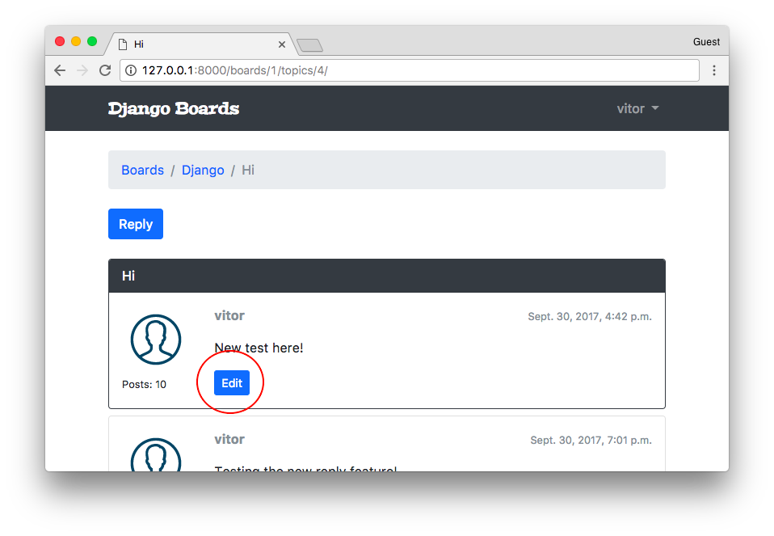
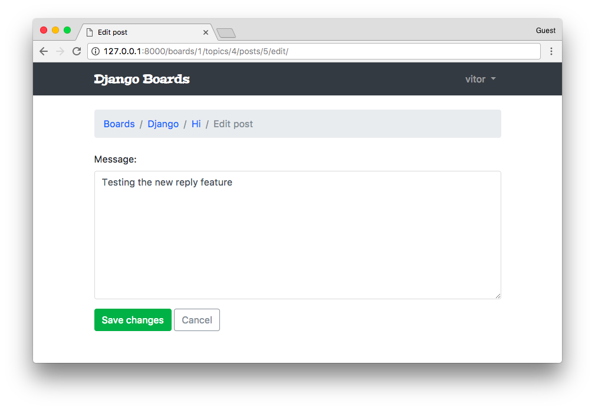

# 一个完整的 Django 入门指南 - 第6部分

> 译者：[vimiix](https://github.com/vimiix)
> 
> 原文地址：[https://simpleisbetterthancomplex.com/series/2017/10/09/a-complete-beginners-guide-to-django-part-6.html](https://simpleisbetterthancomplex.com/series/2017/10/09/a-complete-beginners-guide-to-django-part-6.html)


## 前言

欢迎来到系列教程的第六部分！在这篇教程中，我们将详细探讨基于类的视图（简称CBV）。我们也将重构一些现有的视图，以便利用内置的**基于类的通用视图**（Generic Class-Based Views）。

这篇教程我们还将讨论许多其他主题，例如如何使用分页，如何使用markdown以及如何添加简单的编辑器。我们还将探索一个名为 **Humanize** 的内置软件包，用于对数据进行“人为操作”。

好了，伙计们！让我们来实现一些代码。今天我们还有很多工作要做！

## 视图策略

到头来，所有的Django视图其实都是*函数*。即便是CBV。在类的底层，它完成了所有的功能并最终返回一个视图函数。

引入了基于类的视图，使开发人员可以更轻松地重新使用和扩展视图。使用它们有很多好处，例如可扩展性，多重继承之类的面向对象技术的运用，HTTP 方法的处理是在单独的方法中完成的，而不是使用条件分支，并且还有通用的基于类的视图（简称GCBV）。

在我们继续教程之前，让我们清楚这三个术语的含义：

* 基于函数的视图（FBV）
* 基于类的视图（CBV）
* 基于类的通用视图（GCBV）

FBV是Django视图中最简单的表示：它就是一个接收 **HttpRequest** 对象并返回一个 **HttpResponse** 的函数。

CBV是每个Django视图都被定义为一个扩展 `django.views.generic.view` 抽象类后的 Python 类。

GCBV是可以解决一些具体问题的内置的CBV集合，比如列表视图，创建，更新和删除视图等。

下面我们将探讨一些不同实现方式的例子。

### 基于函数的视图 (FBV)

**views.py**

```python
def new_post(request):
    if request.method == 'POST':
        form = PostForm(request.POST)
        if form.is_valid():
            form.save()
            return redirect('post_list')
    else:
        form = PostForm()
    return render(request, 'new_post.html', {'form': form})
```

**urls.py**

```python
urlpatterns = [
    url(r'^new_post/$', views.new_post, name='new_post'),
]
```

### 基于类的视图 (CBV)

CBV是**View**类的集成类。这里的主要区别在于请求是以HTTP方法命名的类方法内处理的，例如**GET** ，**POST** ，**PUT** ，**HEAD** 等。

所以，在这里，我们不需要做一个条件来判断请求是一个 **POST** 还是它是一个 **GET** 。代码会直接跳转到正确的方法中。在 **View** 类中内部处理了这个逻辑。

**views.py**

```python
from django.views.generic import View

class NewPostView(View):
    def post(self, request):
        form = PostForm(request.POST)
        if form.is_valid():
            form.save()
            return redirect('post_list')
        return render(request, 'new_post.html', {'form': form})

    def get(self, request):
        form = PostForm()
        return render(request, 'new_post.html', {'form': form})
```

我们在 **urls.py** 模块中引用CBV的方式也会有点不同：

**urls.py**

```python
urlpatterns = [
    url(r'^new_post/$', views.NewPostView.as_view(), name='new_post'),
]
```

在这里，我们需要调用 `as_view()` 这个类方法，它将返回一个符合url模式视图函数。在某些情况下，我们也可以将一些关键字参数传递给 `as_view()`，以便自定义CBV的行为，就像我们用一些身份验证视图来定制模板一样。

总之，关于CBV的好处是我们可以在类里面添加更多的方法，也许可以这样做：

```python
from django.views.generic import View

class NewPostView(View):
    def render(self, request):
        return render(request, 'new_post.html', {'form': self.form})

    def post(self, request):
        self.form = PostForm(request.POST)
        if self.form.is_valid():
            self.form.save()
            return redirect('post_list')
        return self.render(request)

    def get(self, request):
        self.form = PostForm()
        return self.render(request)
```

还可以创建一些通用视图来完成一些任务，以便我们可以在整个项目中重复利用它。

你需要知道的关于CBV的基本就是这些。就这么简单。

### 基于类的通过视图（GCBV）

接下来关于GCBV。这是一个不同的情况。正如我前面提到的，GCBV是内置CBV的常见用例。它们的实现往往会大量使用多重继承（混合继承）和其他面向对象的策略。

他们非常灵活，可以节省很多的工作量。但是一开始可能相对比较难上手。

当我第一次开始使用Django时，我发现GCBV很难使用。起初，很难说出发生了什么，因为代码执行流程看起来并不明显，因为在父类中隐藏了大量代码。官方文档也有一定的难度，主要是因为属性和方法有时分布在八个父类中。使用GCBV时，最好打开 [ccbv.co.uk](https://ccbv.co.uk/) *(需科学上网)* 以便快速参考。不用担心，我们将一起探索它。

现在我们来看一个GCBV的例子。

**views.py**

```python
from django.views.generic import CreateView

class NewPostView(CreateView):
    model = Post
    form_class = PostForm
    success_url = reverse_lazy('post_list')
    template_name = 'new_post.html'
```

这里我们使用了一个用于创建模型对象的通用视图。它会处理所有表单处理并在表单有效时保存对象。

因为它是一个CBV，所以我们在 **urls.py** 中以与其他CBV相同的方式来引用它：

**urls.py**

```python
urlpatterns = [
    url(r'^new_post/$', views.NewPostView.as_view(), name='new_post'),
]
```

GCBV 中的其他例子还有：**detailview**，**deleteview**，**formview**，**updateview**，**listview**。


## 更新视图

让我们回到我们项目的实现。这次我们将使用 GCBV 来实现**编辑帖子**的视图：



**boards/views.py** [(查看文件全部内容)](https://gist.github.com/vitorfs/376657085570a3dedf7e5f6e6fffc5e3#file-views-py-L66)

```python
from django.shortcuts import redirect
from django.views.generic import UpdateView
from django.utils import timezone

class PostUpdateView(UpdateView):
    model = Post
    fields = ('message', )
    template_name = 'edit_post.html'
    pk_url_kwarg = 'post_pk'
    context_object_name = 'post'

    def form_valid(self, form):
        post = form.save(commit=False)
        post.updated_by = self.request.user
        post.updated_at = timezone.now()
        post.save()
        return redirect('topic_posts', pk=post.topic.board.pk, topic_pk=post.topic.pk)
```

使用 **UPDATEVIEW** 和 **CREATEVIEW** ，我们可以选择定义 **form_class** 或 **fields** 属性。在上面的例子中，我们使用 **fields** 属性来即时创建模型表单。在内部，Django 将使用模型表单工厂函数来组成 **POST** 模型的一种形式。因为它只是一个非常简单的表单，只有 **message** 字段，所以在这里我们可以这么做。但对于复杂的表单定义，最好从外部定义模型表单然后在这里引用它。

系统将使用 **pk\_url\_kwarg** 来标识用于检索 **Post** 对象的关键字参数的名称。就像我们在 **urls.py** 中定义一样。

如果我们没有设置 **context_object_name** 属性，**Post** 对象将作为“Object”在模板中可用。所以，在这里我们使用 **context_object_name** 来重命名它来发布。你会看到我们在下面的模板中如何使用它。

在这个特定的例子中，我们不得不重写 `form_valid()` 方法来设置一些额外的字段，例如**updated_by** 和 **updated_at** 。你可以在这里看到 `form_valid()` 方法原本的样子：[updateview＃form_valid](https://ccbv.co.uk/projects/Django/1.11/django.views.generic.edit/UpdateView/#form_valid)。

**myproject/urls.py** [(查看文件全部内容)](https://gist.github.com/vitorfs/376657085570a3dedf7e5f6e6fffc5e3#file-urls-py-L40)

```python
from django.conf.urls import url
from boards import views

urlpatterns = [
    # ...
    url(r'^boards/(?P<pk>\d+)/topics/(?P<topic_pk>\d+)/posts/(?P<post_pk>\d+)/edit/$',
        views.PostUpdateView.as_view(), name='edit_post'),
]
```

现在我们可以将链接添加到编辑页面：

**templates/topic_posts.html** [(查看文件全部内容)](https://gist.github.com/vitorfs/589d31af9d06c5b21ec9b1623be0c357#file-topic_posts-html-L40)

```html

  <div class="mt-3">
    <a href=""
       class="btn btn-primary btn-sm"
       role="button">Edit</a>
  </div>

```

**templates/edit_post.html** [(查看文件全部内容)](https://gist.github.com/vitorfs/376657085570a3dedf7e5f6e6fffc5e3#file-edit_post-html)

```html


Edit post


  <li class="breadcrumb-item"><a href="">Boards</a></li>
  <li class="breadcrumb-item"><a href="">{{ post.topic.board.name }}</a></li>
  <li class="breadcrumb-item"><a href="">{{ post.topic.subject }}</a></li>
  <li class="breadcrumb-item active">Edit post</li>



  <form method="post" class="mb-4" novalidate>
    
    
    <button type="submit" class="btn btn-success">Save changes</button>
    <a href="" class="btn btn-outline-secondary" role="button">Cancel</a>
  </form>

```

现在观察我们如何引导到 post 对象：post.topic.board.pk。如果我们没有设置**context_object_name** 来**发布**，它将可以被用作：object.topic.board.pk。明白了吗？



### 测试更新视图

在 **boards/tests** 文件夹内创建一个名为 **test_view_edit_post.py** 的新测试文件。点击下面的链接，你会看到很多常用测试，就像我们在本教程中做的一样。我会在这里重点介绍一下新的内容：

**boards/tests/test_view_edit_post.py** [（查看完整文件）](https://gist.github.com/vitorfs/286917ce31687732eba4e545fc3cbdea)

```python
from django.contrib.auth.models import User
from django.test import TestCase
from django.urls import reverse
from ..models import Board, Post, Topic
from ..views import PostUpdateView

class PostUpdateViewTestCase(TestCase):
    '''
    Base test case to be used in all `PostUpdateView` view tests
    '''
    def setUp(self):
        self.board = Board.objects.create(name='Django', description='Django board.')
        self.username = 'john'
        self.password = '123'
        user = User.objects.create_user(username=self.username, email='john@doe.com', password=self.password)
        self.topic = Topic.objects.create(subject='Hello, world', board=self.board, starter=user)
        self.post = Post.objects.create(message='Lorem ipsum dolor sit amet', topic=self.topic, created_by=user)
        self.url = reverse('edit_post', kwargs={
            'pk': self.board.pk,
            'topic_pk': self.topic.pk,
            'post_pk': self.post.pk
        })

class LoginRequiredPostUpdateViewTests(PostUpdateViewTestCase):
    def test_redirection(self):
        '''
        Test if only logged in users can edit the posts
        '''
        login_url = reverse('login')
        response = self.client.get(self.url)
        self.assertRedirects(response, '{login_url}?next={url}'.format(login_url=login_url, url=self.url))

class UnauthorizedPostUpdateViewTests(PostUpdateViewTestCase):
    def setUp(self):
        '''
        Create a new user different from the one who posted
        '''
        super().setUp()
        username = 'jane'
        password = '321'
        user = User.objects.create_user(username=username, email='jane@doe.com', password=password)
        self.client.login(username=username, password=password)
        self.response = self.client.get(self.url)

    def test_status_code(self):
        '''
        A topic should be edited only by the owner.
        Unauthorized users should get a 404 response (Page Not Found)
        '''
        self.assertEquals(self.response.status_code, 404)


class PostUpdateViewTests(PostUpdateViewTestCase):
    # ...

class SuccessfulPostUpdateViewTests(PostUpdateViewTestCase):
    # ...

class InvalidPostUpdateViewTests(PostUpdateViewTestCase):
    # ...
```

这里，重要的部分是：**PostUpdateViewTestCase**是我们定义的类，它可以在其他测试用例中复用。它只包含基本的设置，创建user，topic，boards等等。

**LoginRequiredPostUpdateViewTests** 这个类将测试检查该视图是否使用了`@login_required`装饰器。即只有经过身份验证的用户才能访问编辑页面。

**UnauthorizedPostUpdateViewTests** 这个类是创建一个新用户，与发布并尝试访问编辑页面的用户不同。本应用程序应该只能授权该文章的所有者进行编辑。

我们来运行一下这些测试：

```bash
python manage.py test boards.tests.test_view_edit_post
```

```bash
Creating test database for alias 'default'...
System check identified no issues (0 silenced).
..F.......F
======================================================================
FAIL: test_redirection (boards.tests.test_view_edit_post.LoginRequiredPostUpdateViewTests)
----------------------------------------------------------------------
...
AssertionError: 200 != 302 : Response didn't redirect as expected: Response code was 200 (expected 302)

======================================================================
FAIL: test_status_code (boards.tests.test_view_edit_post.UnauthorizedPostUpdateViewTests)
----------------------------------------------------------------------
...
AssertionError: 200 != 404

----------------------------------------------------------------------
Ran 11 tests in 1.360s

FAILED (failures=2)
Destroying test database for alias 'default'...
```

首先，我们修复`@login_required`装饰器的问题。在 CBV 上使用视图装饰器的方式有一些不同。我们需要额外的导入：

**boards/views.py** [(查看文章文件)](https://gist.github.com/vitorfs/826a6d421ebbeb80a0aee8e1b9b70398#file-views-py-L67)

```python
from django.contrib.auth.decorators import login_required
from django.shortcuts import redirect
from django.views.generic import UpdateView
from django.utils import timezone
from django.utils.decorators import method_decorator
from .models import Post

@method_decorator(login_required, name='dispatch')
class PostUpdateView(UpdateView):
    model = Post
    fields = ('message', )
    template_name = 'edit_post.html'
    pk_url_kwarg = 'post_pk'
    context_object_name = 'post'

    def form_valid(self, form):
        post = form.save(commit=False)
        post.updated_by = self.request.user
        post.updated_at = timezone.now()
        post.save()
        return redirect('topic_posts', pk=post.topic.board.pk, topic_pk=post.topic.pk)
```

我们不能用 `@login_required` 装饰器直接装饰类。我们必须使用一个工具`@method_decorator`，并传递一个装饰器（或一个装饰器列表）并告诉应该装饰哪个类。在 CBV 中，装饰**调度类**是很常见的。它是一个Django内部使用的方法（在**View**类中定义）。所有的请求都会经过这个类，所以装饰它会相对安全。

再次运行一下测试：

```bash
python manage.py test boards.tests.test_view_edit_post
```

```bash
Creating test database for alias 'default'...
System check identified no issues (0 silenced).
..........F
======================================================================
FAIL: test_status_code (boards.tests.test_view_edit_post.UnauthorizedPostUpdateViewTests)
----------------------------------------------------------------------
...
AssertionError: 200 != 404

----------------------------------------------------------------------
Ran 11 tests in 1.353s

FAILED (failures=1)
Destroying test database for alias 'default'...
```

好的，我们解决了 `@login_required` 的问题，现在我们必须处理其他用户可以编辑所有帖子的问题。

解决这个问题最简单的方法是重写**UpdateView**的 `get_queryset` 方法。你可以在这里看到原始方法的源码--- [UpdateView#get_queryset.](https://ccbv.co.uk/projects/Django/1.11/django.views.generic.edit/UpdateView/#get_queryset)。

**boards/views.py** [查看完整文件](https://gist.github.com/vitorfs/667d8439ecf05e58f14fcc74672e48da)

```python
@method_decorator(login_required, name='dispatch')
class PostUpdateView(UpdateView):
    model = Post
    fields = ('message', )
    template_name = 'edit_post.html'
    pk_url_kwarg = 'post_pk'
    context_object_name = 'post'

    def get_queryset(self):
        queryset = super().get_queryset()
        return queryset.filter(created_by=self.request.user)

    def form_valid(self, form):
        post = form.save(commit=False)
        post.updated_by = self.request.user
        post.updated_at = timezone.now()
        post.save()
        return redirect('topic_posts', pk=post.topic.board.pk, topic_pk=post.topic.pk)
```

通过这一行 `queryset = super().get_queryset()`, 我们实现了重用父类，即，**UpateView** 类的 `get_queryset` 方法。然后，我们通过给 `queryset` 添加一个额外的过滤条件，该过滤条件是通过请求中获取登录的用户来过滤内容。

再次测试：

```bash
python manage.py test boards.tests.test_view_edit_post
```

```bash
Creating test database for alias 'default'...
System check identified no issues (0 silenced).
...........
----------------------------------------------------------------------
Ran 11 tests in 1.321s

OK
Destroying test database for alias 'default'...
```

一切顺利！
 
## 列表视图

我们现在可以利用 **CBV** 的功能来重构一些现有的视图。以主页为例，我们就先从数据库中抓取所有的 **boards** 并将其罗列在HTML中：

**boards/views.py**

```python
from django.shortcuts import render
from .models import Board

def home(request):
    boards = Board.objects.all()
    return render(request, 'home.html', {'boards': boards})
```

下面是我们如何使用 GCBV 为模型列表来重写它：

**boards/views.py** [查看完整文件](https://gist.github.com/vitorfs/5e248d9a4499e2a796c6ffee9cbb1125#file-views-py-L12)

```python
from django.views.generic import ListView
from .models import Board

class BoardListView(ListView):
    model = Board
    context_object_name = 'boards'
    template_name = 'home.html'
```

那么我们得修改一下 **urls.py** 模块中的引用：

**myproject/urls.py** [查看完整文件](https://gist.github.com/vitorfs/a0a826233d95a4cc53a75afc441db1e9#file-urls-py-L10)

```python
from django.conf.urls import url
from boards import views

urlpatterns = [
    url(r'^$', views.BoardListView.as_view(), name='home'),
    # ...
]
```

如果检查一下主页，我们会看到没有什么变化，一切都按预期的运行。但是我们必须稍微调整我们的测试，因为现在我们现在的视图是 CBV 类型了。

**boards/tests/test_view_home.py** [查看完整文件](https://gist.github.com/vitorfs/e17216ce3d92110cf7e005ce3288c587)

```python
from django.test import TestCase
from django.urls import resolve
from ..views import BoardListView

class HomeTests(TestCase):
    # ...
    def test_home_url_resolves_home_view(self):
        view = resolve('/')
        self.assertEquals(view.func.view_class, BoardListView)
```