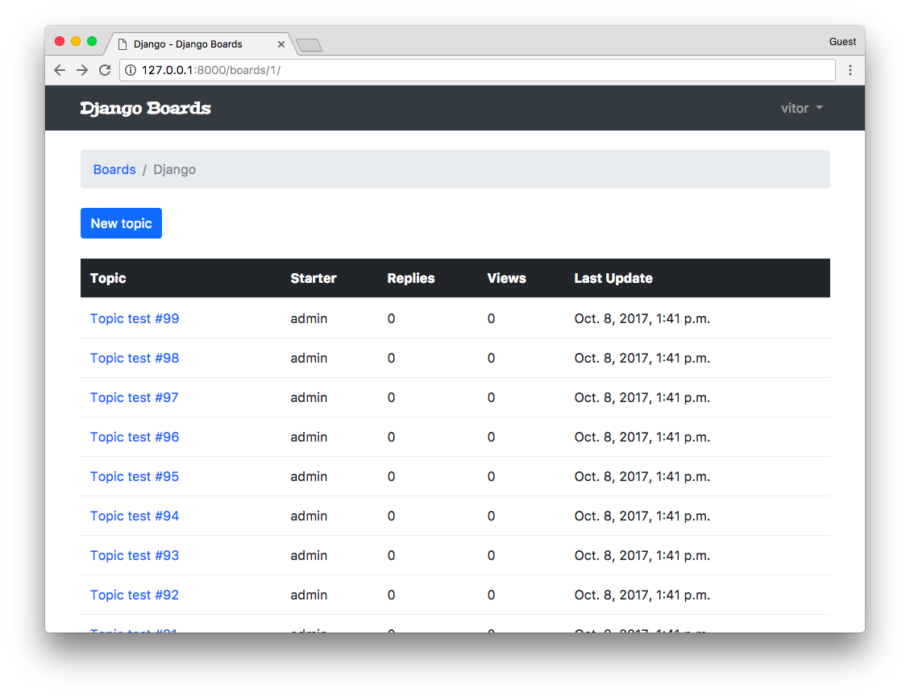
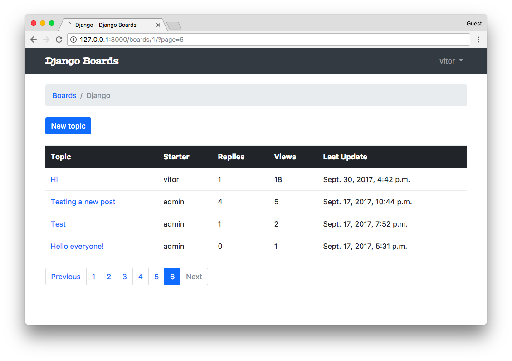
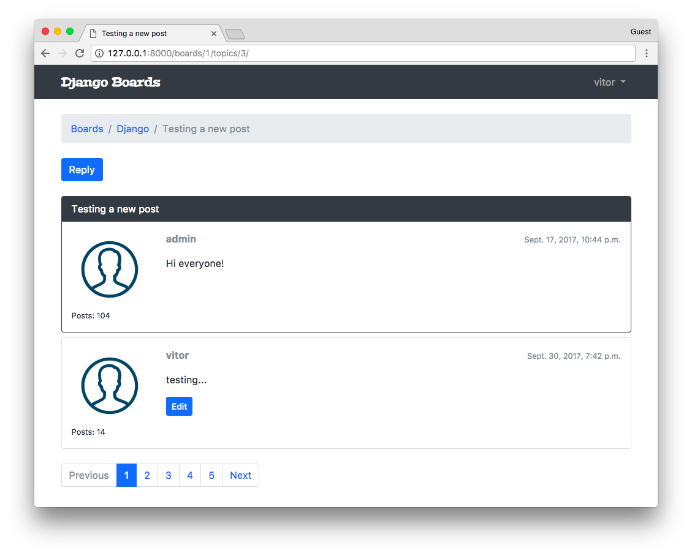

## 分页

我们可以非常容易地使用 CBV 来实现分页功能。但首先我想手工分页，这样就更有助于我们理解背后的机制，这样它就不那么神秘了。

实际上对 boards 列表视图分页并没有意义，因为我们不期望有很多 boards。但无疑对于主题列表和帖子列表来说是需要一些分页的。

从现在起，我们将在 **board_topics** 这个视图中来操作。

首先，我们添加一些帖子。我们可以直接使用应用程序的用户界面来添加几个帖子，或者打开 python shell 编写一个小脚本来为我们完成：

```bash
python manage.py shell
```

```python
from django.contrib.auth.models import User
from boards.models import Board, Topic, Post

user = User.objects.first()

board = Board.objects.get(name='Django')

for i in range(100):
    subject = 'Topic test #{}'.format(i)
    topic = Topic.objects.create(subject=subject, board=board, starter=user)
    Post.objects.create(message='Lorem ipsum...', topic=topic, created_by=user)
```



很好，现在我们有一些数据可以玩了。

在我们返回去写代码之前，让我们用 python shell 来做一些更多的实验：

```bash
python manage.py shell
```

```python
from boards.models import Topic

# All the topics in the app
Topic.objects.count()
107

# Just the topics in the Django board
Topic.objects.filter(board__name='Django').count()
104

# Let's save this queryset into a variable to paginate it
queryset = Topic.objects.filter(board__name='Django').order_by('-last_updated')
```

定义一个你要分页的查询集(**QuerySet**)的排序是很重要的。否则，会返回给你错误的结果。

现在让我们导入 **Paginator** 工具：

```python
from django.core.paginator import Paginator

paginator = Paginator(queryset, 20)
```

这里我们告诉Django将查询集按照每页20个元素分页。现在让我们来研究一些 paginator 的属性：

```python
# count the number of elements in the paginator
paginator.count
104

# total number of pages
# 104 elements, paginating 20 per page gives you 6 pages
# where the last page will have only 4 elements
paginator.num_pages
6

# range of pages that can be used to iterate and create the
# links to the pages in the template
paginator.page_range
range(1, 7)

# returns a Page instance
paginator.page(2)
<Page 2 of 6>

page = paginator.page(2)

type(page)
django.core.paginator.Page

type(paginator)
django.core.paginator.Paginator
```

这里我们必须注意，因为如果我们试图找到一个不存在的页面，分页器会抛出一个异常:

```bash
paginator.page(7)
EmptyPage: That page contains no results
```

或者如果我们随意传递进去一个不是页码数字的参数，也会报错：

```bash
paginator.page('abc')
PageNotAnInteger: That page number is not an integer
```

我们必须在设计用户界面时牢记这些细节。

我们来简单看一下 **Page** 类提供的属性和方法：

```python
page = paginator.page(1)

# Check if there is another page after this one
page.has_next()
True

# If there is no previous page, that means this one is the first page
page.has_previous()
False

page.has_other_pages()
True

page.next_page_number()
2

# Take care here, since there is no previous page,
# if we call the method `previous_page_number() we will get an exception:
page.previous_page_number()
EmptyPage: That page number is less than 1
```

### FBV 分页

这里是我们如何使用 FBV 来实现分页：

**boards/views.py** [查看完整文件](https://gist.github.com/vitorfs/16f0ac257439245fa6645af259d8846f#file-views-py-L19)

```python
from django.db.models import Count
from django.core.paginator import Paginator, EmptyPage, PageNotAnInteger
from django.shortcuts import get_object_or_404, render
from django.views.generic import ListView
from .models import Board

def board_topics(request, pk):
    board = get_object_or_404(Board, pk=pk)
    queryset = board.topics.order_by('-last_updated').annotate(replies=Count('posts') - 1)
    page = request.GET.get('page', 1)

    paginator = Paginator(queryset, 20)

    try:
        topics = paginator.page(page)
    except PageNotAnInteger:
        # fallback to the first page
        topics = paginator.page(1)
    except EmptyPage:
        # probably the user tried to add a page number
        # in the url, so we fallback to the last page
        topics = paginator.page(paginator.num_pages)

    return render(request, 'topics.html', {'board': board, 'topics': topics})
```

这部分的实现是使用了 Bootstrap 的四个分页组件来正确的渲染页面。你需要花时间阅读代码，看看它是否适合你。我们在这里使用的是我们之前用过的方法。在这种情况下，`topics` 不再是一个查询集（`QuerySet`），而是一个 `paginator.page` 的实例。

在 topics HTML列表的基础上，我们可以渲染分页组件：

**templates/topics.html** [查看完整文件](https://gist.github.com/vitorfs/3101a1bd72125aeb45829659a5532bc6)

```html

  <nav aria-label="Topics pagination" class="mb-4">
    <ul class="pagination">
      
        <li class="page-item">
          <a class="page-link" href="?page={{ topics.previous_page_number }}">Previous</a>
        </li>
      
        <li class="page-item disabled">
          <span class="page-link">Previous</span>
        </li>
      

      
        
          <li class="page-item active">
            <span class="page-link">
              {{ page_num }}
              <span class="sr-only">(current)</span>
            </span>
          </li>
        
          <li class="page-item">
            <a class="page-link" href="?page={{ page_num }}">{{ page_num }}</a>
          </li>
        
      

      
        <li class="page-item">
          <a class="page-link" href="?page={{ topics.next_page_number }}">Next</a>
        </li>
      
        <li class="page-item disabled">
          <span class="page-link">Next</span>
        </li>
      
    </ul>
  </nav>

```



### GCBV 分页

下面，相同的实现，但这次使用**ListView**。

**boards/views.py** [查看完整文件](https://gist.github.com/vitorfs/323173bc56dec48fd83caf983d459421#file-views-py-L19)

```python
class TopicListView(ListView):
    model = Topic
    context_object_name = 'topics'
    template_name = 'topics.html'
    paginate_by = 20

    def get_context_data(self, **kwargs):
        kwargs['board'] = self.board
        return super().get_context_data(**kwargs)

    def get_queryset(self):
        self.board = get_object_or_404(Board, pk=self.kwargs.get('pk'))
        queryset = self.board.topics.order_by('-last_updated').annotate(replies=Count('posts') - 1)
        return queryset
```

在使用基于类的视图分页时，我们与模板中paginator进行交互的方式有点不同。它会在模板中提供以下变量:**paginator**,**page_obj**,**is_paginated**,**object_list**,还有一个我们在 **context_object_name** 中定义名字的变量。在我们的例子中，这个额外的变量将被命名为 **topics** ，并且它将等同于 **object_list**。

关于这个 **get\_context\_data** ，其实，它就是我们在扩展 **GCBV** 时向请求上下文添加内容的方式。

但这里的主要是 **paginate_by** 属性。一般情况下，只需添加它就足够了。

要记得更新 **urls.py** 哦：

**myproject/urls.py** [查看完整文件](https://gist.github.com/vitorfs/61f5345b7cf8b006b2901a61b8f8e348#file-urls-py-L37)

```python
from django.conf.urls import url
from boards import views

urlpatterns = [
    # ...
    url(r'^boards/(?P<pk>\d+)/$', views.TopicListView.as_view(), name='board_topics'),
]
```

现在我们来修改一下模板：

**templates/topics.html** [查看完整文件](https://gist.github.com/vitorfs/65095aa3eda78bafd22d5e2f94086d40#file-topics-html-L40)

```html

  <div class="mb-4">
    <a href="" class="btn btn-primary">New topic</a>
  </div>

  <table class="table mb-4">
    <!-- table content suppressed -->
  </table>

  
    <nav aria-label="Topics pagination" class="mb-4">
      <ul class="pagination">
        
          <li class="page-item">
            <a class="page-link" href="?page={{ page_obj.previous_page_number }}">Previous</a>
          </li>
        
          <li class="page-item disabled">
            <span class="page-link">Previous</span>
          </li>
        

        
          
            <li class="page-item active">
              <span class="page-link">
                {{ page_num }}
                <span class="sr-only">(current)</span>
              </span>
            </li>
          
            <li class="page-item">
              <a class="page-link" href="?page={{ page_num }}">{{ page_num }}</a>
            </li>
          
        

        
          <li class="page-item">
            <a class="page-link" href="?page={{ page_obj.next_page_number }}">Next</a>
          </li>
        
          <li class="page-item disabled">
            <span class="page-link">Next</span>
          </li>
        
      </ul>
    </nav>
  


```

现在花点时间运行一下测试代码，如果有需要调整的地方就修一下。

**boards/tests/test_view_board_topics.py**
 
```python
from django.test import TestCase
from django.urls import resolve
from ..views import TopicListView

class BoardTopicsTests(TestCase):
    # ...
    def test_board_topics_url_resolves_board_topics_view(self):
        view = resolve('/boards/1/')
        self.assertEquals(view.func.view_class, TopicListView)
```

### 可复用的分页模板

就像我们在 **form.html** 中封装模板时做的一样，我们也可以为分页的HTML代码片创建类似的东西。

我们来对主题帖子页面进行分页，进而找到一种复用分页组件的方法。

**boards/views.py** [查看完整文件](https://gist.github.com/vitorfs/53139ca0fd7c01b8459c2ff62828f963)

```python
class PostListView(ListView):
    model = Post
    context_object_name = 'posts'
    template_name = 'topic_posts.html'
    paginate_by = 2

    def get_context_data(self, **kwargs):
        self.topic.views += 1
        self.topic.save()
        kwargs['topic'] = self.topic
        return super().get_context_data(**kwargs)

    def get_queryset(self):
        self.topic = get_object_or_404(Topic, board__pk=self.kwargs.get('pk'), pk=self.kwargs.get('topic_pk'))
        queryset = self.topic.posts.order_by('created_at')
        return queryset
```

更新一下 **url.py** [[查看完整文件]](https://gist.github.com/vitorfs/428d58dbb61f9c2601bb7434150ea37f)

```python
from django.conf.urls import url
from boards import views

urlpatterns = [
    # ...
    url(r'^boards/(?P<pk>\d+)/topics/(?P<topic_pk>\d+)/$', views.PostListView.as_view(), name='topic_posts'),
]
```

现在，我们从**topics.html**模板中获取分页部分的html代码片，并在 **templates/includes** 文件夹下面创建一个名为 **pagination.html** 的新文件，和 **forms.html** 同级目录:

```bash
myproject/
 |-- myproject/
 |    |-- accounts/
 |    |-- boards/
 |    |-- myproject/
 |    |-- static/
 |    |-- templates/
 |    |    |-- includes/
 |    |    |    |-- form.html
 |    |    |    +-- pagination.html  <-- here!
 |    |    +-- ...
 |    |-- db.sqlite3
 |    +-- manage.py
 +-- venv/
```

**templates/includes/pagination.html**

```html

  <nav aria-label="Topics pagination" class="mb-4">
    <ul class="pagination">
      
        <li class="page-item">
          <a class="page-link" href="?page={{ page_obj.previous_page_number }}">Previous</a>
        </li>
      
        <li class="page-item disabled">
          <span class="page-link">Previous</span>
        </li>
      

      
        
          <li class="page-item active">
            <span class="page-link">
              {{ page_num }}
              <span class="sr-only">(current)</span>
            </span>
          </li>
        
          <li class="page-item">
            <a class="page-link" href="?page={{ page_num }}">{{ page_num }}</a>
          </li>
        
      

      
        <li class="page-item">
          <a class="page-link" href="?page={{ page_obj.next_page_number }}">Next</a>
        </li>
      
        <li class="page-item disabled">
          <span class="page-link">Next</span>
        </li>
      
    </ul>
  </nav>

```

现在，我们在 **topic_posts.html** 文件中来使用它：

**templates/topic_posts.html** [查看完整文件](https://gist.github.com/vitorfs/df5b16bb16c1134ba4e03218dce250d7)

```html


  <div class="mb-4">
    <a href="" class="btn btn-primary" role="button">Reply</a>
  </div>

  
    <div class="card mb-4mb-2 border-dark">
      
        <div class="card-header text-white bg-dark py-2 px-3">{{ topic.subject }}</div>
      
      <div class="card-body p-3">
        <div class="row">
          <div class="col-2">
            
            <small>Posts: {{ post.created_by.posts.count }}</small>
          </div>
          <div class="col-10">
            <div class="row mb-3">
              <div class="col-6">
                <strong class="text-muted">{{ post.created_by.username }}</strong>
              </div>
              <div class="col-6 text-right">
                <small class="text-muted">{{ post.created_at }}</small>
              </div>
            </div>
            {{ post.message }}
            
              <div class="mt-3">
                <a href=""
                   class="btn btn-primary btn-sm"
                   role="button">Edit</a>
              </div>
            
          </div>
        </div>
      </div>
    </div>
  

  


```

别忘了修改主循环为 ``。

我们同样也可以更新一下先前的模板，**topics.html** 模板同样也可以这个封装的分页模板。

**templates/topics.html** [查看完整文件](https://gist.github.com/vitorfs/9198ad8f91cd889f315ade7e4eb62710#file-topics-html-L40)

```html

  <div class="mb-4">
    <a href="" class="btn btn-primary">New topic</a>
  </div>

  <table class="table mb-4">
    <!-- table code suppressed -->
  </table>

  


```

为了测试目的，你需要添加一些帖子（或者通过 python shell 去创建），然后修改代码中的 ** paginate_by** 到一个较小的数字，比如 **2** ，然后看看页面会发生什么变化。



[（查看完整文件）](https://gist.github.com/vitorfs/6b3cd0769f805ab38626f5bd97b4e5e3)

更新一下测试用例：

**boards/tests/test_view_topic_posts.py**

```python
from django.test import TestCase
from django.urls import resolve
from ..views import PostListView

class TopicPostsTests(TestCase):
    # ...
    def test_view_function(self):
        view = resolve('/boards/1/topics/1/')
        self.assertEquals(view.func.view_class, PostListView)
```