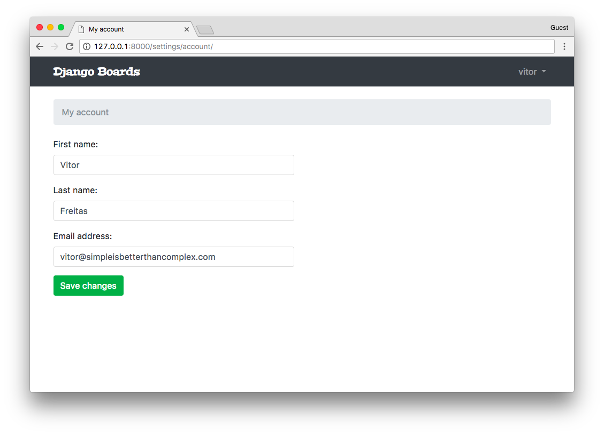

# # Django入门与实践-第23章：我的账户视图

好的，那么，这部分将是我们最后的一个视图。之后，我们将专心来改进现有功能。

**accounts/views.py** [查看完整文件](https://gist.github.com/vitorfs/ea62417b7a450050f2feeeb69b775996)

```python
from django.contrib.auth.decorators import login_required
from django.contrib.auth.models import User
from django.urls import reverse_lazy
from django.utils.decorators import method_decorator
from django.views.generic import UpdateView

@method_decorator(login_required, name='dispatch')
class UserUpdateView(UpdateView):
    model = User
    fields = ('first_name', 'last_name', 'email', )
    template_name = 'my_account.html'
    success_url = reverse_lazy('my_account')

    def get_object(self):
        return self.request.user
```

**myproject/urls.py** [查看完整文件](https://gist.github.com/vitorfs/27d87452e7584cb8c489625f507ed7aa#file-urls-py-L32)

```python
from django.conf.urls import url
from accounts import views as accounts_views

urlpatterns = [
    # ...
    url(r'^settings/account/$', accounts_views.UserUpdateView.as_view(), name='my_account'),
]
```

**templates/my_account.html** 

```html



My account


  <li class="breadcrumb-item active">My account</li>



  <div class="row">
    <div class="col-lg-6 col-md-8 col-sm-10">
      <form method="post" novalidate>
        
        
        <button type="submit" class="btn btn-success">Save changes</button>
      </form>
    </div>
  </div>

```

