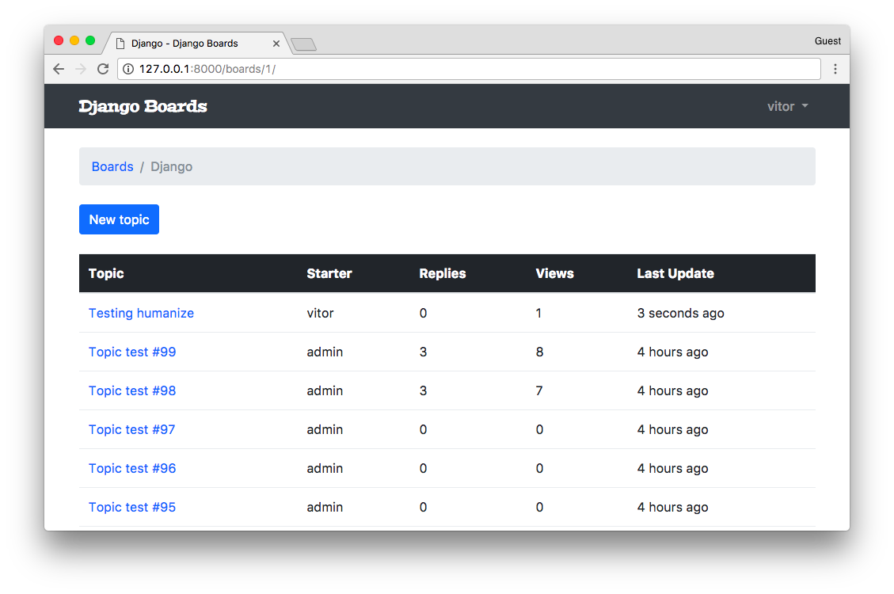
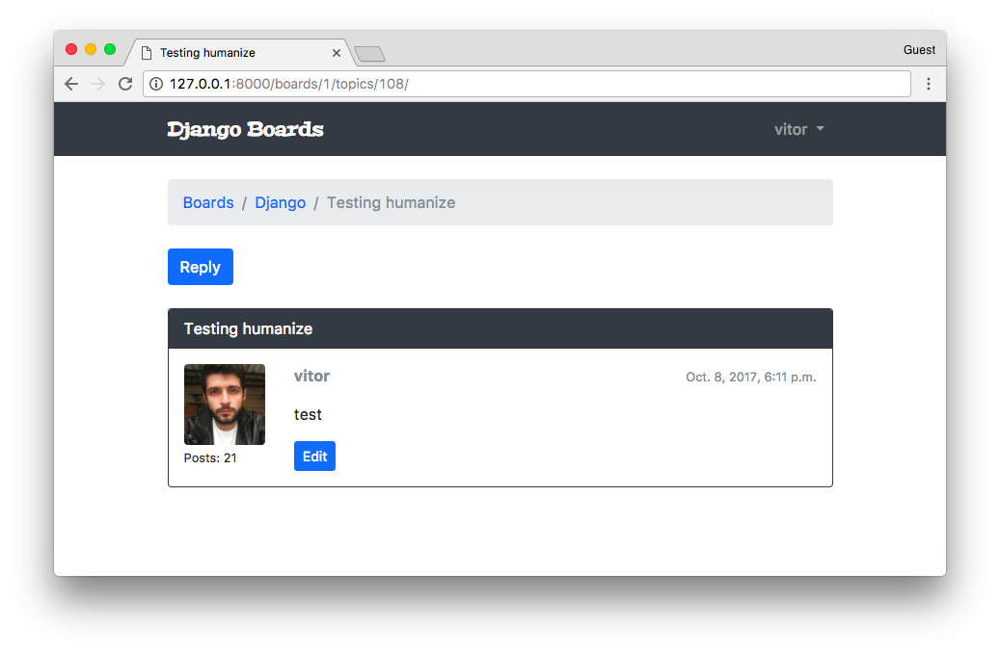
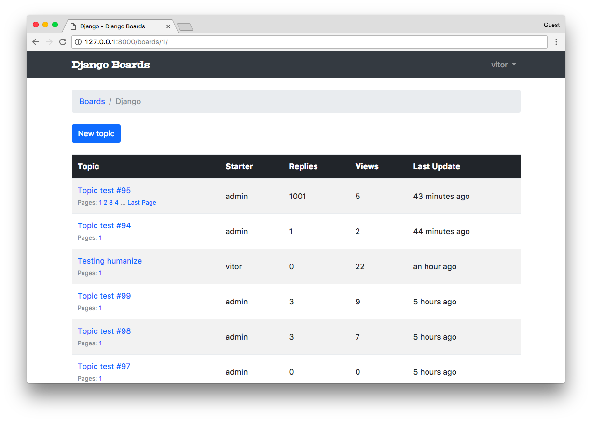
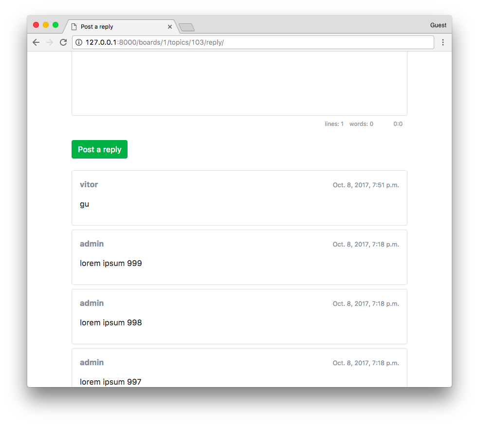
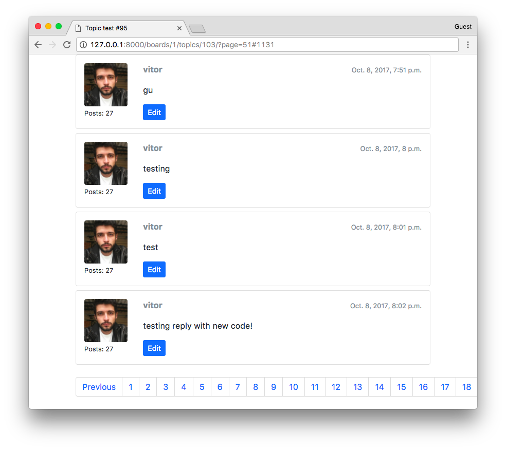
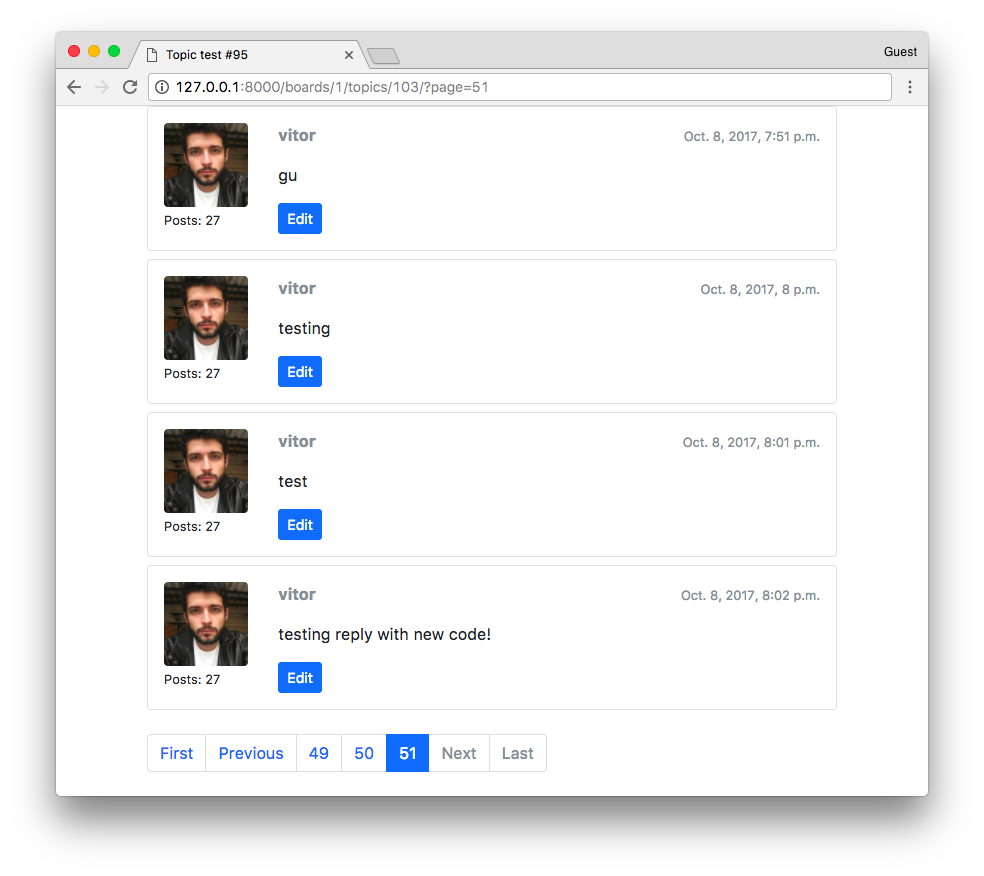

# Django入门与实践-第26章：个性化工具

我觉得只添加内置的人性化(**humanize**)包就会很不错。它包含一组为数据添加“人性化（human touch）”的工具集。

例如，我们可以使用它来更自然地显示日期和时间字段。我们可以简单地显示：“2分钟前”，而不是显示整个日期。

我们来实践一下！首先，添加 `django.contrib.humanize` 到配置文件的 `INSTALLED_APPS` 中。

**myproject/settings.py**

```python
INSTALLED_APPS = [
    'django.contrib.admin',
    'django.contrib.auth',
    'django.contrib.contenttypes',
    'django.contrib.sessions',
    'django.contrib.messages',
    'django.contrib.staticfiles',
    'django.contrib.humanize',  # <- 这里

    'widget_tweaks',

    'accounts',
    'boards',
]
```

现在我们就可以在模板中使用它了。首先来编辑 **topics.html** 模板:

**templates/topics.html** [查看完整文件](https://gist.github.com/vitorfs/45521a289677a1a406b4fb743e8141ee)

```html






  <!-- 代码被压缩 -->

  <td>{{ topic.last_updated|naturaltime }}</td>

  <!-- 代码被压缩 -->

```

我们所要做的就是在模板中加载 `{％load humanize％}` 这个模板标签，然后在模板中使用过滤器： `{{ topic.last_updated|naturaltime }}`



你当然可以将它添加到其他你需要的地方。

###  Gravatar(添加头像用的库)

给用户个人信息添加图片的一种非常简单的方法就是使用 **[Gravatar](https://gravatar.com/)**。

在 **boards/templatetags** 文件夹内，创建一个名为 **gravatar.py** 的新文件：

**boards/templatetags/gravatar.py**

```python
import hashlib
from urllib.parse import urlencode

from django import template
from django.conf import settings

register = template.Library()


@register.filter
def gravatar(user):
    email = user.email.lower().encode('utf-8')
    default = 'mm'
    size = 256
    url = 'https://www.gravatar.com/avatar/{md5}?{params}'.format(
        md5=hashlib.md5(email).hexdigest(),
        params=urlencode({'d': default, 's': str(size)})
    )
    return url
```

基本上我们可以使用[官方提供的代码片段](https://fi.gravatar.com/site/implement/images/python/)。我只是做了一下适配，使得它可以在python 3环境中运行。

很好，现在我们可以将它加载到我们的模板中，就像之前我们使用人性化模板过滤器一样：

**templates/topic_posts.html** [查看完整文件](https://gist.github.com/vitorfs/23d5c5bc9e6c7ac94506a2660a61012c)

```html






  <!-- code suppressed -->

  

  <!-- code suppressed -->

```




###  最后调整

也许你已经注意到了，如果有人回复帖子时有一个小问题。我们没有更新 `last_update` 字段，因此主题的排序被打乱顺序了。

我们来修一下：

**boards/views.py**

```python
@login_required
def reply_topic(request, pk, topic_pk):
    topic = get_object_or_404(Topic, board__pk=pk, pk=topic_pk)
    if request.method == 'POST':
        form = PostForm(request.POST)
        if form.is_valid():
            post = form.save(commit=False)
            post.topic = topic
            post.created_by = request.user
            post.save()

            topic.last_updated = timezone.now()  # <- 这里
            topic.save()                         # <- 这里

            return redirect('topic_posts', pk=pk, topic_pk=topic_pk)
    else:
        form = PostForm()
    return render(request, 'reply_topic.html', {'topic': topic, 'form': form})
```

接下来我们要做的事是需要控制一下页面访问统计系统。我们不希望相同的用户再次刷新页面的时候被统计为多次访问。为此，我们可以使用会话(sessions)：

**boards/views.py**

```python
class PostListView(ListView):
    model = Post
    context_object_name = 'posts'
    template_name = 'topic_posts.html'
    paginate_by = 20

    def get_context_data(self, **kwargs):

        session_key = 'viewed_topic_{}'.format(self.topic.pk)  # <--这里
        if not self.request.session.get(session_key, False):
            self.topic.views += 1
            self.topic.save()
            self.request.session[session_key] = True           # <--直到这里

        kwargs['topic'] = self.topic
        return super().get_context_data(**kwargs)

    def get_queryset(self):
        self.topic = get_object_or_404(Topic, board__pk=self.kwargs.get('pk'), pk=self.kwargs.get('topic_pk'))
        queryset = self.topic.posts.order_by('created_at')
        return queryset
```

现在我们可以在主题列表中提供一个更好一点的导航。目前唯一的选择是用户点击主题标题并转到第一页。我们可以实践一下这么做：

**boards/models.py**

```python
import math
from django.db import models

class Topic(models.Model):
    # ...

    def __str__(self):
        return self.subject

    def get_page_count(self):
        count = self.posts.count()
        pages = count / 20
        return math.ceil(pages)

    def has_many_pages(self, count=None):
        if count is None:
            count = self.get_page_count()
        return count > 6

    def get_page_range(self):
        count = self.get_page_count()
        if self.has_many_pages(count):
            return range(1, 5)
        return range(1, count + 1)
```

然后，在 **topics.html** 模板中，我们可以这样实现：

**templates/topics.html**

```html

<table class="table table-striped mb-4">
    <thead class="thead-inverse">
      <tr>
        <th>Topic</th>
        <th>Starter</th>
        <th>Replies</th>
        <th>Views</th>
        <th>Last Update</th>
      </tr>
    </thead>
    <tbody>
      
        
        <tr>
          <td>
            <p class="mb-0">
              <a href="{{ topic_url }}">{{ topic.subject }}</a>
            </p>
            <small class="text-muted">
              Pages:
              
                <a href="{{ topic_url }}?page={{ i }}">{{ i }}</a>
              
              
              ... <a href="{{ topic_url }}?page={{ topic.get_page_count }}">Last Page</a>
              
            </small>
          </td>
          <td class="align-middle">{{ topic.starter.username }}</td>
          <td class="align-middle">{{ topic.replies }}</td>
          <td class="align-middle">{{ topic.views }}</td>
          <td class="align-middle">{{ topic.last_updated|naturaltime }}</td>
        </tr>
      
    </tbody>
  </table>
```

就像每个主题的小分页一样。请注意，我在 table 标签里还添加了 `table-striped` 类，使得表格有一个更好的样式。



在回复页面中，我们现在是列出了所有的回复。我们可以将它限制在最近的十个回复。

**boards/models.py**

```python
class Topic(models.Model):
    # ...

    def get_last_ten_posts(self):
        return self.posts.order_by('-created_at')[:10]
```	

**templates/reply_topic.html**

```html



  <form method="post" class="mb-4" novalidate>
    
    
    <button type="submit" class="btn btn-success">Post a reply</button>
  </form>

    <!-- here! -->
    <div class="card mb-2">
      <!-- code suppressed -->
    </div>
  


```



另一件事是，当用户回复帖子时，我们现在是会再次将用户重定向到第一页。我们可以通过将用户送回到最后一页来改善这个问题。

我们可以在帖子上添加一个ID：

**templates/topic_posts.html**

```html



  <div class="mb-4">
    <a href="" class="btn btn-primary" role="button">Reply</a>
  </div>

  
    <div id="{{ post.pk }}" class="card mb-4mb-2 border-dark">
      <!-- code suppressed -->
    </div>
  

  


```

这里的重要点是 `<div id="{{ post.pk }}" ...>`。

然后我们可以在视图中像这样使用它：

**boards/views.py**

```python
@login_required
def reply_topic(request, pk, topic_pk):
    topic = get_object_or_404(Topic, board__pk=pk, pk=topic_pk)
    if request.method == 'POST':
        form = PostForm(request.POST)
        if form.is_valid():
            post = form.save(commit=False)
            post.topic = topic
            post.created_by = request.user
            post.save()

            topic.last_updated = timezone.now()
            topic.save()

            topic_url = reverse('topic_posts', kwargs={'pk': pk, 'topic_pk': topic_pk})
            topic_post_url = '{url}?page={page}#{id}'.format(
                url=topic_url,
                id=post.pk,
                page=topic.get_page_count()
            )

            return redirect(topic_post_url)
    else:
        form = PostForm()
    return render(request, 'reply_topic.html', {'topic': topic, 'form': form})
```

在 **topic_post_url** 中，我们使用最后一页来构建一个url，添加一个锚点id等于帖子id的元素。

有了这个，这要求我们需要更新下面的这些测试用例：

**boards/tests/test_view_reply_topic.py**

```python
class SuccessfulReplyTopicTests(ReplyTopicTestCase):
    # ...

    def test_redirection(self):
        '''
        A valid form submission should redirect the user
        '''
        url = reverse('topic_posts', kwargs={'pk': self.board.pk, 'topic_pk': self.topic.pk})
        topic_posts_url = '{url}?page=1#2'.format(url=url)
        self.assertRedirects(self.response, topic_posts_url)
```



下一个问题，正如你在前面的截图中看到的，要解决分页时页数太多的问题。

最简单的方法是调整 **pagination.html** 模板：

**templates/includes/pagination.html**

```html


  <nav aria-label="Topics pagination" class="mb-4">
    <ul class="pagination">
      
        <li class="page-item">
          <a class="page-link" href="?page=1">First</a>
        </li>
      
        <li class="page-item disabled">
          <span class="page-link">First</span>
        </li>
      

      
        <li class="page-item">
          <a class="page-link" href="?page={{ page_obj.previous_page_number }}">Previous</a>
        </li>
      
        <li class="page-item disabled">
          <span class="page-link">Previous</span>
        </li>
      

      
        
          <li class="page-item active">
            <span class="page-link">
              {{ page_num }}
              <span class="sr-only">(current)</span>
            </span>
          </li>
        
          <li class="page-item">
            <a class="page-link" href="?page={{ page_num }}">{{ page_num }}</a>
          </li>
        
      

      
        <li class="page-item">
          <a class="page-link" href="?page={{ page_obj.next_page_number }}">Next</a>
        </li>
      
        <li class="page-item disabled">
          <span class="page-link">Next</span>
        </li>
      

      
        <li class="page-item">
          <a class="page-link" href="?page={{ paginator.num_pages }}">Last</a>
        </li>
      
        <li class="page-item disabled">
          <span class="page-link">Last</span>
        </li>
      
    </ul>
  </nav>

```



###  总结

在本教程中，我们完成了**Django board**项目应用的实现。我可能会发布一个后续的实现教程来改进代码。我们可以一起研究很多事情。例如数据库优化，改进用户界面，文件上传操作，创建审核系统等等。

下一篇教程将着重于部署。它将是关于如何将你的代码投入到生产中以及需要关注的一些重要细节的完整指南。

我希望你会喜欢本系列教程的第六部分！最后一部分将于下周2017年10月16日发布。如果你希望在最后一部分发布时收到通知，可以订阅我们的[邮件列表](http://eepurl.com/b0gR51)。

该项目的源代码在github上找到。当前状态的该项目的可以在发布标签 **v0.6-lw** 下找到。或者直接点击下面的链接：

[https://github.com/sibtc/django-beginners-guide/tree/v0.6-lw](https://github.com/sibtc/django-beginners-guide/tree/v0.6-lw)