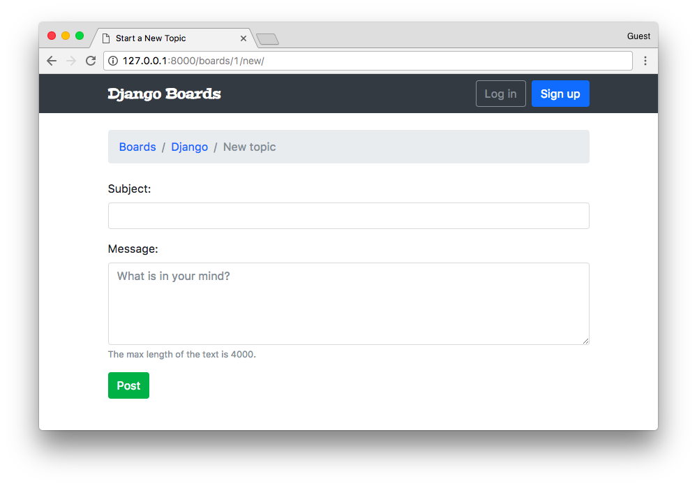
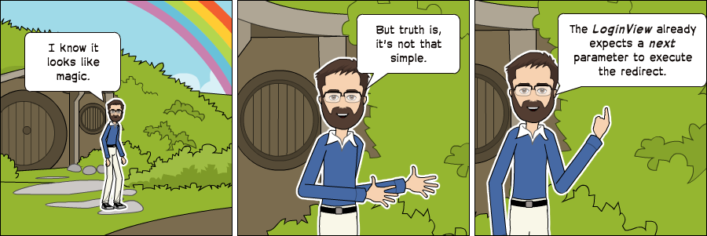

# 一个完整的Django入门指南 - 第5部分

> 译者：刘志军  
> 原文：https://simpleisbetterthancomplex.com/series/2017/10/02/a-complete-beginners-guide-to-django-part-5.html


## 前言

欢迎来到本系列教程的第5部分，在这节课，我们将学习如何保护视图防止未登录的用户访问，以及在视图和表单中访问已经登录的用户，我们还将实现主题列表和回复列表视图，最后，将探索 Django ORM 的一些特性和数据迁移的简单介绍。


## 保护视图

我们必须保护视图防止那些未认证（登录）的用户访问，下面是发起一个新话题的页面



在上图中，用户还没有登录，尽管他们可以看到页面和表单。Django 有一个内置的 *视图装饰器* 来避免它被未登录的用户访问：

**boards/views.py**（[完整代码](https://gist.github.com/vitorfs/4d3334a0daa9e7a872653a22ff39320a#file-models-py-L19)）

```python
from django.contrib.auth.decorators import login_required

@login_required
def new_topic(request, pk):
    # ...
```

现在如果用户没有登录，将被重定向到登录页面：


注意查询字符串 **?next=/boards/1/new/** ，我们可以改进登录模板以便利用 **next** 变量来改进我们的用户体验，（译注：实际上这步操作不加也没问题）

### 配置登录后的重定向地址

**templates/login.html** ([查看完整内容](https://gist.github.com/vitorfs/1ab597fe18e2dc56028f7aa8c3b588b3#file-login-html-L13))

```python
<form method="post" novalidate>
  
  <input type="hidden" name="next" value="{{ next }}">
  
  <button type="submit" class="btn btn-primary btn-block">Log in</button>
</form>
```


现在尝试登录，登录成功后，应用程序会跳转到原来所在的位置。



**next** 参数是内置功能的一部分（译注：详情请参考Django[官方文档](https://docs.djangoproject.com/en/2.0/topics/auth/default/#the-login-required-decorator)）

### 测试

现在添加一个测试用例确保主题发布视图被 `@login_required`装饰器保护了，不过，我们还是先来重构一下 **boards/tests/test_views.py** 文件。

把**test_views.py**拆分成3个文件：


* **test_view_home.py** 包含 HomeTests 类 （[完整代码](https://gist.github.com/vitorfs/6ac3aad244c856d418f18890efcb4a7e#file-test_view_home-py)）
* **test_view_board_topics.py** 包含 BoardTopicsTests 类（[完整代码](https://gist.github.com/vitorfs/6ac3aad244c856d418f18890efcb4a7e#file-test_view_board_topics-py)）
* **test_view_new_topic.py** 包含 NewTopicTests 类（[完整代码](https://gist.github.com/vitorfs/6ac3aad244c856d418f18890efcb4a7e#file-test_view_new_topic-py)）


```shell
myproject/
 |-- myproject/
 |    |-- accounts/
 |    |-- boards/
 |    |    |-- migrations/
 |    |    |-- templatetags/
 |    |    |-- tests/
 |    |    |    |-- __init__.py
 |    |    |    |-- test_templatetags.py
 |    |    |    |-- test_view_home.py          <-- here
 |    |    |    |-- test_view_board_topics.py  <-- here
 |    |    |    +-- test_view_new_topic.py     <-- and here
 |    |    |-- __init__.py
 |    |    |-- admin.py
 |    |    |-- apps.py
 |    |    |-- models.py
 |    |    +-- views.py
 |    |-- myproject/
 |    |-- static/
 |    |-- templates/
 |    |-- db.sqlite3
 |    +-- manage.py
 +-- venv/
 ```

 重新运行测试，确保一切正常。

 现在在 **test_view_new_topic.py** 中添加一个新测试用例，用来检查试图是否被`@login_required`保护：

 **boards/tests/test_view_new_topic.py** （[完成代码](https://gist.github.com/itorfs/13e75451396d76354b476edaefadbdab#file-test_view_new_topic-py-L84)）


 ```python
 from django.test import TestCase
from django.urls import reverse
from ..models import Board

class LoginRequiredNewTopicTests(TestCase):
    def setUp(self):
        Board.objects.create(name='Django', description='Django board.')
        self.url = reverse('new_topic', kwargs={'pk': 1})
        self.response = self.client.get(self.url)

    def test_redirection(self):
        login_url = reverse('login')
        self.assertRedirects(self.response, '{login_url}?next={url}'.format(login_url=login_url, url=self.url))

```


在测试用例中，我们尝试在没有登录的情况下发送请求给 **new topic** 视图，期待的结果是请求重定向到登录页面。
