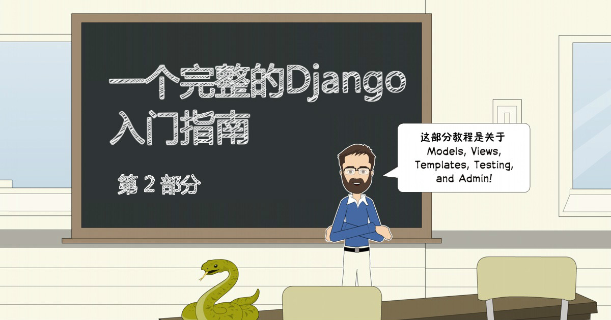
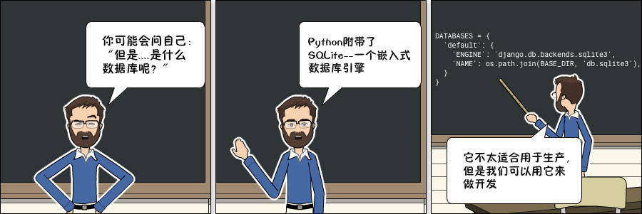

# 一个完整的 Django 入门指南 - 第2部分

>译者：liuzhijun  
>原文：
https://simpleisbetterthancomplex.com/series/2017/09/11/a-complete-beginners-guide-to-django-part-2.html



### 模型


这些模型基本上代表了应用程序的数据库设计。我们在本节中要做的是创建 Django 所表示的类，这些类就是在上一节中建模的类：Board，Topic和Post。User 模型被命名为内置应用叫 **auth**，它以命名空间 django.contrib.auth 的形式出现在 `INSTALLED_APPS` 配置中。

我们要做的工作都在 boards/models.py 文件中。以下是我们在Django应用程序中如何表示类图的代码：


```python
from django.db import models
from django.contrib.auth.models import User


class Board(models.Model):
    name = models.CharField(max_length=30, unique=True)
    description = models.CharField(max_length=100)


class Topic(models.Model):
    subject = models.CharField(max_length=255)
    last_updated = models.DateTimeField(auto_now_add=True)
    board = models.ForeignKey(Board, related_name='topics')
    starter = models.ForeignKey(User, related_name='topics')


class Post(models.Model):
    message = models.TextField(max_length=4000)
    topic = models.ForeignKey(Topic, related_name='posts')
    created_at = models.DateTimeField(auto_now_add=True)
    updated_at = models.DateTimeField(null=True)
    created_by = models.ForeignKey(User, related_name='posts')
    updated_by = models.ForeignKey(User, null=True, related_name='+')
```

所有模型都是**django.db.models.Model**类的子类。每个类将被转换为数据库表。每个字段由 **django.db.models.Field**子类（内置在Django core）的实例表示，它们并将被转换为数据库的列。

字段 CharField，DateTimeField等等，都是 **django.db.models.Field** 的子类，包含在Django的核心里面-随时可以使用。

在这里，我们仅使用 CharField，TextField，DateTimeField，和ForeignKey 字段来定义我们的模型。不过在Django提供了更广泛的选择来代表不同类型的数据，例如 IntegerField，BooleanField， DecimalField和其它一些字段。我们会在需要的时候提及它们。

有些字段需要参数，例如CharField。我们应该始终设定一个 `max_length`。这些信息将用于创建数据库列。Django需要知道数据库列需要多大。该 `max_length`参数也将被Django Forms API用来验证用户输入。

在`Board`模型定义中，更具体地说，在`name`字段中，我们设置了参数 `unique=True`，顾名思义，它将强制数据库级别字段的唯一性。

在`Post`模型中，`created_at`字段有一个可选参数，`auto_now_add`设置为`True`。这将告诉Django创建`Post`对象时为当前日期和时间。

模型之间的关系使用`ForeignKey`字段。它将在模型之间创建一个连接，并在数据库级别创建适当的关系（译注：外键关联）。该`ForeignKey`字段需要一个位置参数`related_name`，用于引用它关联的模型。（译注：例如 created_by 是外键字段，关联的User模型，表明这个帖子是谁创建的，related_name=posts 表示在 User 那边可以使用 user.posts 来查看这个用户创建的帖子列表）。

例如，在`Topic`模型中，`board`字段是`Board`模型的`ForeignKey`。它告诉Django，一个`Topic`实例只涉及一个Board实例。`related_name`参数将用于创建反向关系，`Board`实例通过属性`topics`访问属于这个版块下的`Topic`列表。

Django自动创建这种反向关系，`related_name`是可选项。但是，如果我们不为它设置一个名称，Django会自动生成它：`(class_name)_set`。例如，在`Board`模型中，所有`Topic`列表将用`topic_set`属性表示。而这里我们将其重新命名为了`topics`，以使其感觉更自然。

在django2.0中，`ForeignKey` 还有一个必选参数是 `on_delete`，表示当外键对应的对象删除时，该对象进行的操作，它的可选值有：

* CASCADE：级联删除
* PROTECT：不允许删除
* SET_NULL：设置为空值
* SET_DEFAULT：设置为默认值
* DO_NOTHING：什么也不做

例如，在 `Topic`模型中，当它关联的 `board` 删除了，topic 采取的操作取决于 `on_delete`的值，如果是 **CASCADE**，那么该boad下面所有的主题都将被删除，而PROTECT表示不允许这样操作，必选先将关联的主题全部删除之后，才能把 board 删除。


在`Post`模型中，该`updated_by`字段设置`related_name='+'`。这指示Django我们不需要这种反向关系，所以它会被忽略（译注：也就是说我们不需要关系用户修改过哪些帖子）。

下面您可以看到类图和Django模型的源代码之间的比较，绿线表示我们如何处理反向关系。


这时，你可能会问自己：“主键/ ID呢？”？如果我们没有为模型指定主键，Django会自动为我们生成它。所以现在一切正常。在下一节中，您将看到它是如何工作的。
### 迁移模型

下一步是告诉Django创建数据库，以便我们可以开始使用它。

打开终端 ，激活虚拟环境，转到 manage.py文件所在的文件夹，然后运行以下命令：

```python
python manage.py makemigrations
```
你会看到输出的内容是：

```
Migrations for 'boards':
  boards/migrations/0001_initial.py
    - Create model Board
    - Create model Post
    - Create model Topic
    - Add field topic to post
    - Add field updated_by to post

```

此时，Django 在 boards/migrations 目录创建了一个名为 `0001_initial.py`的文件。它代表了应用程序模型的当前状态。在下一步，Django将使用该文件创建表和列。


迁移文件将被翻译成SQL语句。如果您熟悉SQL，则可以运行以下命令来检验将是要被数据库执行的SQL指令

```python
python manage.py sqlmigrate boards 0001

```

如果你不熟悉SQL，也不要担心。在本系列教程中，我们不会直接使用SQL。所有的工作都将使用Django ORM来完成，它是一个与数据库进行通信的抽象层。

下一步是将我们生成的迁移文件应用到数据库：

```python
python manage.py migrate

```

输出内容应该是这样的：

```python
Operations to perform:
  Apply all migrations: admin, auth, boards, contenttypes, sessions
Running migrations:
  Applying contenttypes.0001_initial... OK
  Applying auth.0001_initial... OK
  Applying admin.0001_initial... OK
  Applying admin.0002_logentry_remove_auto_add... OK
  Applying contenttypes.0002_remove_content_type_name... OK
  Applying auth.0002_alter_permission_name_max_length... OK
  Applying auth.0003_alter_user_email_max_length... OK
  Applying auth.0004_alter_user_username_opts... OK
  Applying auth.0005_alter_user_last_login_null... OK
  Applying auth.0006_require_contenttypes_0002... OK
  Applying auth.0007_alter_validators_add_error_messages... OK
  Applying auth.0008_alter_user_username_max_length... OK
  Applying boards.0001_initial... OK
  Applying sessions.0001_initial... OK
```

因为这是我们第一次迁移数据库，所以`migrate`命令把Django contrib app 中现有的迁移文件也执行了，这些内置app列在了`INSTALLED_APPS`。这是预料之中的。

`Applying boards.0001_initial... OK`是我们在上一步中生成的迁移脚本。

好了！我们的数据库已经可以使用了。



>需要注意的是SQLite是一个产品级数据库。SQLite被许多公司用于成千上万的产品，如所有Android和iOS设备，主流的Web浏览器，Windows 10，MacOS等。

>但这不适合所有情况。SQLite不能与MySQL，PostgreSQL或Oracle等数据库进行比较。大容量的网站，密集型写入的应用程序，大的数据集，高并发性的应用使用SQLite最终都会导致问题。

>我们将在开发项目期间使用SQLite，因为它很方便，不需要安装其他任何东西。当我们将项目部署到生产环境时，再将切换到PostgreSQL（译注：后续，我们后面可能使用MySQL）。对于简单的网站这种做法没什么问题。但对于复杂的网站，建议在开发和生产中使用相同的数据库。


### 试验 Models API

使用Python进行开发的一个重要优点是交互式shell。我一直在使用它。这是一种快速尝试和试验API的方法。

您可以使用manage.py 工具加载我们的项目来启动 Python shell ：

```sh
python manage.py shell

```

```
Python 3.6.2 (default, Jul 17 2017, 16:44:45)
[GCC 4.2.1 Compatible Apple LLVM 8.1.0 (clang-802.0.42)] on darwin
Type "help", "copyright", "credits" or "license" for more information.
(InteractiveConsole)
>>>
```

这与直接输入`python`指令来调用交互式控制台是非常相似的，除此之外，项目将被添加到`sys.path`并加载Django。这意味着我们可以在项目中导入我们的模型和其他资源并使用它。

让我们从导入Board类开始：

```sh
from boards.models import Board

```

要创建新的 boarrd 对象，我们可以执行以下操作：

```python
board = Board(name='Django', description='This is a board about Django.')

```

为了将这个对象保存在数据库中，我们必须调用save方法：


```python
board.save()

```

`save`方法用于创建和更新对象。这里Django创建了一个新对象，因为这时Board 实例没有id。第一次保存后，Django会自动设置ID：

```python
board.id
1
```

您可以将其余的字段当做Python属性访问：

```python
board.name
'Django'
```

```python
board.description
'This is a board about Django.'
```

要更新一个值，我们可以这样做：

```python
board.description = 'Django discussion board.'
board.save()
```

每个Django模型都带有一个特殊的属性; 我们称之为**模型管理器(Model Manager)**。你可以访问管理器的objects属性，它主要用于数据库操作。例如，我们可以使用它来直接创建一个新的Board对象：


```python
board = Board.objects.create(name='Python', description='General discussion about Python.')

```

```python
board.id
2
```

```python
board.name
'Python'
```

所以，现在我们有两个版块了。我们可以使用`objects`列出数据库中所有现有的版块：

```python
Board.objects.all()
<QuerySet [<Board: Board object>, <Board: Board object>]>
```

结果是一个QuerySet。稍后我们会进一步了解。基本上，它是从数据库中查询的对象列表。我们看到有两个对象，但显示的名称是 Board object。这是因为我们尚未实现 Board 的`__str__` 方法。


`__str__`方法是对象的字符串表示形式。我们可以使用版块的名称来表示它。

首先，退出交互式控制台：

```python
exit()

```

现在编辑boards app 中的 models.py 文件：

```python
class Board(models.Model):
    name = models.CharField(max_length=30, unique=True)
    description = models.CharField(max_length=100)

    def __str__(self):
        return self.name
 ```

 让我们重新查询，再次打开交互式控制台：

```python
 python manage.py shell
```

```python
from boards.models import Board

Board.objects.all()
<QuerySet [<Board: Django>, <Board: Python>]>
```

好多了，对吧？

我们可以将这个QuerySet看作一个列表。假设我们想遍历它并打印每个版块的描述：

```python
boards_list = Board.objects.all()
for board in boards_list:
    print(board.description)
```
结果是：
```python
Django discussion board.
General discussion about Python.
```
同样，我们可以使用模型的 **Manager** 来查询数据库并返回单个对象。为此，我们要使用 `get` 方法：
```python
django_board = Board.objects.get(id=1)

django_board.name
'Django'
```

但我们必须小心这种操作。如果我们试图查找一个不存在的对象，例如，查找id=3的版块，它会引发一个异常：

```python
board = Board.objects.get(id=3)

boards.models.DoesNotExist: Board matching query does not exist.
```

我们可以在`get`上使用模型的任何字段，但最好使用可唯一标识对象的字段来查询。否则，查询可能会返回多个对象，这也会导致异常。
```python
Board.objects.get(name='Django')
<Board: Django>
```
请注意，查询区分大小写，小写“django”不匹配：

```python
Board.objects.get(name='django')
boards.models.DoesNotExist: Board matching query does not exist.
```
### 模型操作总结
下面是我们在本节中关于模型学到的方法和操作总结，并使用Board模型作为参考。大写的 **Board`指类，小写的**board**指**Board**的一个实例（或对象）

|操作|代码示例|
|:----|:-----|
|创建一个对象而不保存|	board = Board()|
|保存一个对象（创建或更新）|	board.save()|
|数据库中创建并保存一个对象|	Board.objects.create(name='...', description='...')|
|列出所有对象|	Board.objects.all()|
|通过字段标识获取单个对象|Board.objects.get(id=1)|

在下一小节中，我们将开始编写视图并在HTML页面中显示我们的版块。
