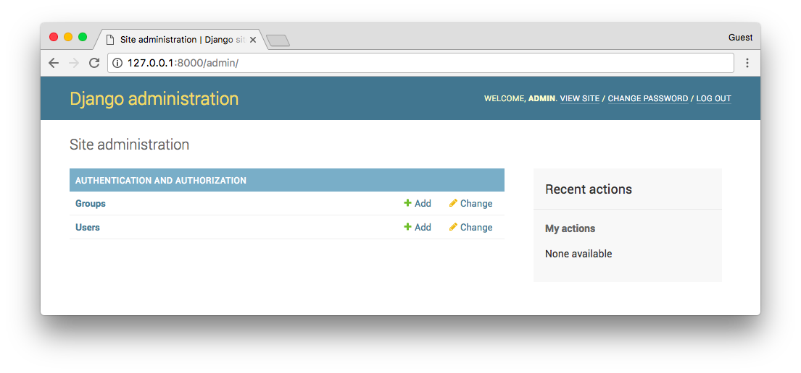
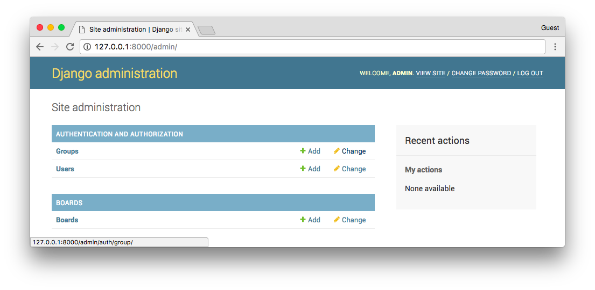
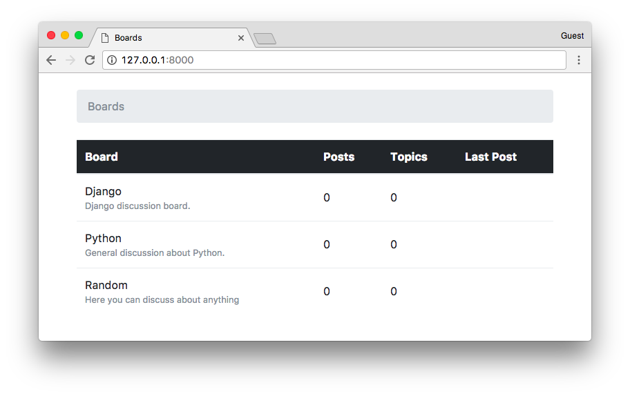

# Django入门指南-第10章：Django Admin 介绍


到目前为止，我们使用交互式控制台（python manage.py shell）添加新的版块。但我们需要一个更好的方式来实现。在这一节中，我们将为网站管理员实现一个管理界面来管理这些数据。

### Django Admin 简介
当我们开始一个新项目时，Django已经配置了Django Admin，这个应用程序列出的INSTALLED_APPS。


使用 Django Admin的一个很好的例子就是用在博客中; 它可以被作者用来编写和发布文章。另一个例子是电子商务网站，工作人员可以创建，编辑，删除产品。

现在，我们将配置 Django Admin 来维护我们应用程序的版块。

我们首先创建一个管理员帐户：

```sh
python manage.py createsuperuser
```
按照说明操作：

```sh
Username (leave blank to use 'vitorfs'): admin
Email address: admin@example.com
Password:
Password (again):
Superuser created successfully.
```
在浏览器中打开该URL：http://127.0.0.1:8000/admin/


输入用户名和密码登录到管理界面：



它已经配置了一些功能。在这里，我们可以添加用户和组的权限管理，这些概念在后面我们将探讨更多。

添加Board模型非常简单。打开boards目录中的admin.py文件，并添加以下代码：

**boards/admin.py**

```python

from django.contrib import admin
from .models import Board

admin.site.register(Board)
```

保存admin.py文件，然后刷新网页浏览器中的页面：



对！它已准备好被使用了。点击Boards链接查看现有版块列表：


我们可以通过点击 Add Board 按钮添加一个新的版块：


点击保存按钮：


我们可以检查一切是否正常，打开URL http://127.0.0.1:8000 



### 总结

在本教程中，我们探讨了许多新概念。我们为项目定义了一些需求，创建了第一个模型，迁移了数据库，开始玩 Models API。我们创建了第一个视图并编写了一些单元测试。同时我们还配置了Django模板引擎，静态文件，并将Bootstrap 4库添加到项目中。最后，我们简要介绍了Django Admin界面。

我希望你喜欢本系列教程的第二部分！下一部分，我们将探索Django的URL路由，表单API，可重用模板以及更多测试。

该项目的源代码在GitHub上可用。本来的代码可以在发布标签v0.2-lw下找到。下面的链接将带你到正确的地方：

https://github.com/sibtc/django-beginners-guide/tree/v0.2-lw