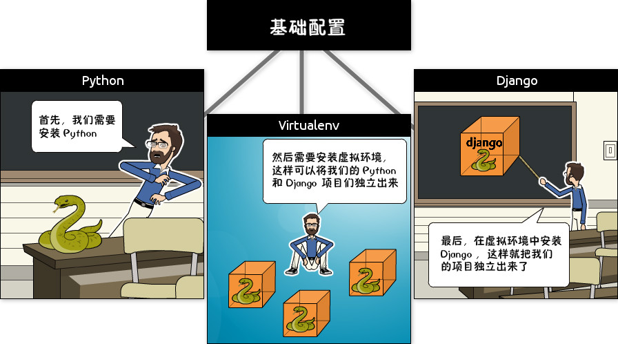
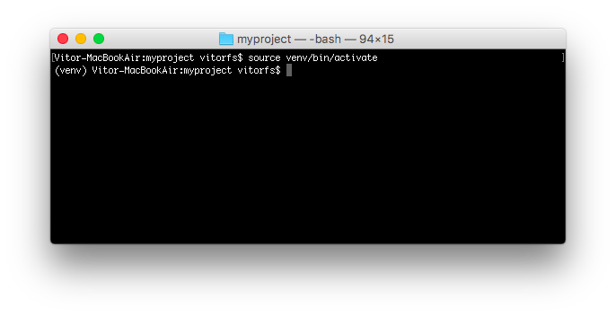
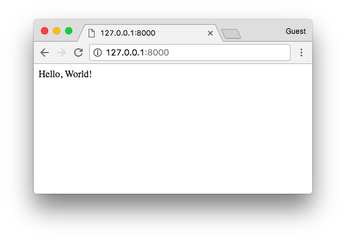

# 一个完整的Django入门指南  - 第1部分

> 译者：[vimiix](https://github.com/vimiix)
> 
> 原文地址：[https://simpleisbetterthancomplex.com/series/2017/09/04/a-complete-beginners-guide-to-django-part-1.html](https://simpleisbetterthancomplex.com/series/2017/09/04/a-complete-beginners-guide-to-django-part-1.html)


----

## 前言


今天我将开始一个关于 Django 基础知识的全新系列教程。这是一个开始学习 Django 的完整入门指南。教程材料一共会被分为七个部分。我们将从安装，开发环境的准备，模型，视图，模板，URL到更高级的主题（如迁移，测试和部署）中详细探讨所有基本概念。

我想做一些不一样的事情。一个容易学习，内容丰富且不失趣味的教程。我的想法是在文章中穿插一些漫画的方式来演示说明相应的概念和场景。我希望大家能够享受这种阅读！

但是在我们开始之前...

当年我在一所大学担任代课教授时，我曾经在计算机科学专业给新来的学生讲授网络开发学科。那时我总是会用下面这个孔夫子的名言开始新的课程：


*(译者注：不确定是孔子讲的，但这句话早在中国古代就有所提到，出自荀子《儒效篇》“不闻不若闻之，闻之不若见之，见之不若知之，知之不若行之；学至于行之而止矣”)*

所以，请动起手来！不要只是阅读教程。我们一起来练习！通过实践和练习你会收获的更多。

---

## 为什么要学习Django?

Django是一个用python编写的Web框架。Web框架是一种软件，基于web框架可以开发动态网站，各种应用程序以及服务。它提供了一系列工具和功能，可以解决许多与Web开发相关的常见问题，比如：安全功能，数据库访问，会话，模板处理，URL路由，国际化，本地化，等等。

使用诸如 Django 之类的网络框架，使我们能够以标准化的方式快速开发安全可靠的Web应用程序，而无需重新发明轮子。

那么，Django有什么特别之处呢？对于初学者来说，它是一个Python Web框架，这意味着你可以受益于各种各样的开源库包。[python软件包资料库（pypi）](https://pypi.python.org/pypi)拥有超过11.6万个软件包（2017年9月6日的数据）。如果当你想要解决一个特定的问题的时候，可能有人已经为它实现了一个库来供你使用。

Django是用python编写的最流行的web框架之一。它绝对是最完整的，提供了各种各样的开箱即用的功能，比如用于开发和测试的独立Web服务器，缓存，中间件系统，ORM，模板引擎，表单处理，基于Python单元测试的工具接口。Django还自带*内部电池*，提供内置应用程序，比如一个认证系统，一个可用于 `CRUD`(增删改查) 操作并且自动生成页面的后台管理界面，生成订阅文档（RSS/Atom）,站点地图等。甚至在django中内建了一个地理信息系统（GIS）框架。

Django的开发得到了[Django软件基金会](https://www.djangoproject.com/foundation/)的支持，并且由jetbrains和instagram等公司赞助。Django现在已经存在了相当长的一段时间了。到现在为止，活跃的项目开发时间已经超过12年，这也证明了它是一个成熟，可靠和安全的网络框架。

### 谁在使用Django?

知道谁在使用Django是很好的，同时也想一想你可以用它来做些什么。在使用Django的大型网站有：[Instagram](https://instagram.com/)，[Disqus](https://disqus.com/)，[Mozilla](https://www.mozilla.org/)，[Bitbucket](https://bitbucket.org/)，[Last.fm](https://www.last.fm/)，[国家地理](http://www.nationalgeographic.com/)。

想知道更多的示例，你可以到[Django Sites](https://www.djangosites.org/)数据库中查看，它提供超过五千个Django驱动的网站列表。

顺便说一下，去年在Django 2016年发布会上，Django核心开发人员，Instagram员工
`carl meyer`，就[Instagram如何大规模使用Django以及它如何支持他们的用户增长](https://www.youtube.com/watch?v=lx5WQjXLlq8)做过一次分享。这是个一小时的演讲，如果你有兴趣学习了解更多的话，这是一次很有趣的演讲。

---

## 安装

我们需要做的第一件事是在我们的电脑上安装一些程序，以便能够开始使用django。基本的设置包括安装**Python**，**Virtualenv**和**Django**。



使用虚拟环境不是强制性的，但是我还是强烈建议大家这样做。如果你是一个初学者，那么最好形成一个良好的开端。

当你在用 Django 开发一个网站或者一个Web项目的时候，不得不安装外部库以支持开发是非常常见的事情。使用虚拟环境，你开发的每个项目都会有其独立的环境。这样的话，包之间的依赖关系不会发生冲突。同时也使得你能在不同Django版本上运行的本地机器的项目。

在后面你会看到使用它是非常简单的！

## 安装 Python 3.6.2

我们想要做的第一件事是安装最新版的Python，那就是**Python 3.6.2**。至少是在我写这篇教程的时候。如果有更新的版本，请使用新版。接下来的步骤也应该保持大致相同的做法。

我们将使用Python 3，因为大部分主要的Python库已经被移植到python 3，并且下一个主要的django版本（2.x）也将不再支持python 2。所以Python 3是正确的选择。

最好的方法是通过[**Homebrew**](https://brew.sh/)安装。 如果你的Mac还没有安装Homebrew的话，在终端中执行下面的命令：

```bash
/usr/bin/ruby -e "$(curl -fsSL https://raw.githubusercontent.com/Homebrew/install/master/install)"
```

如果你没有安装命令行工具（**Command Line Tools**），Homebrew的安装可能需要稍长一点的时间。但它会帮助你处理好一切，所以不用担心。只需要坐下来等到安装完成即可。

当你看到以下消息时，就代表安装完成了：

```
==> Installation successful!

==> Homebrew has enabled anonymous aggregate user behaviour analytics.
Read the analytics documentation (and how to opt-out) here:
  https://docs.brew.sh/Analytics.html

==> Next steps:
- Run `brew help` to get started
- Further documentation:
    https://docs.brew.sh
```

执行下面的命令来安装Python 3:

```bash
brew install python3
```

由于macOS原本已经安装了python 2，所以在安装python 3之后，你将可以同时使用这两个版本。

需要运行Python 2的话，在终端中通过命令 `python` 启动。如果想运行Python 3，则使用`python3` 来启动。

我们可以在终端中测试一下：

```bash
python3 --version
Python 3.6.2
```


很棒，python已经启动并正在运行。下一步：虚拟环境！

## 安装 Virtualenv

接下来这一步，我们将通过**pip**(*一个管理和安装Python包的工具*)来安装**Virtualenv**。

请注意，Homebrew已经为你安装好了**pip**，在python 3.6.2下的名称为 `pip3`。

在终端中，执行下面的命令：

```bash
sudo pip3 install virtualenv
```


到目前为止，我们执行的安装都是在操作系统环境下运行的。从现在开始，我们安装的所有东西，包括django本身，都将安装在虚拟环境中。

这样想一下：对于你开始的每个Django项目，你首先会为它创建一个虚拟环境。这就像每个Django项目都有一个沙盒。所以你随意运行，安装软件包，卸载软件包而不会破坏任何东西。

我习惯在电脑上创建一个名为**Development**的文件夹。然后，我用它来组织我所有的项目和网站。但你也可以按照接下来的步骤创建适合你自己的目录。

通常，我首先在**Development**文件夹中创建一个项目名称的新文件夹。既然这将是我们第一个项目，我们没必要挑选一个独特的名字。现在，我们可以称之为**myproject**。

```bash
mkdir myproject
cd myproject
```


这个文件夹是级别较高的目录，将存储与我们的Django项目相关的所有文件和东西，包括它的虚拟环境。

所以让我们开始创建我们的第一个虚拟环境并安装django。

在**myproject**文件夹中：

```bash
virtualenv venv -p python3
```


这样我们的虚拟环境就创建好了。在开始使用它之前，我们需要先激活一下环境：

```bash
source venv/bin/activate
```

如果你在命令行前面看到 **(venv)**，就代表激活成功了，就像这样：



让我们试着了解一下这里发生了什么。我们创建了一个名为**venv**的特殊文件夹。该文件夹内包含了一个python的副本。在我们激活了**venv**环境之后，当我们运行`Python`命令时，它将使用我们存储在venv里面的本地副本，而不是我们之前在操作系统中安装的那个。

另一个重要的事情是，**pip**程序也已经安装好了，当我们使用它来安装Python的软件包（比如Django）时，它将被安装在**venv**环境中。

请注意，当我们启用venv时，我们将使用命令`python`（而不是`python3`）来调用Python 3.6.2，并且仅使用`pip`（而不是`pip3`）来安装软件包。

顺便说一句，要想退出**venv**环境，运行下面的命令：

```bash
deactivate
```

但是，我们现在先保持激活状态来进行下一步。

## 安装 Django 1.11.4

很简单，现在我们已经启动了**venv**，运行以下命令来安装django：

```bash
pip install django==1.11.4

# 译注：目前django已经升级到2.x版本，这里为了跟后续教程内容保持一直，所以必须指定版本号进行安装
# 除非你有能力 debug，否则不建议你使用django 2.x
```


现在一切就绪！


----

## 启动一个新项目

执行下面的命令来创建一个新的 Django 项目：

```bash
django-admin startproject myproject
```

命令行工具**django-admin**会在安装Django的时候一起自动安装好。

执行了上面的命令以后，系统会为Django项目生成基础文件夹结构。

现在，我们的**myproject**目录结构如下所示：

```
myproject/                  <-- 高级别的文件夹
 |-- myproject/             <-- Django项目文件夹
 |    |-- myproject/
 |    |    |-- __init__.py
 |    |    |-- settings.py
 |    |    |-- urls.py
 |    |    |-- wsgi.py
 |    +-- manage.py
 +-- venv/                  <-- 虚拟环境文件夹
```

我们最初的项目结构由五个文件组成：

* **manage.py**：使用**django-admin**命令行工具的快捷方式。它用于运行与我们项目相关的管理命令。我们将使用它来运行开发服务器，运行测试，创建迁移等等。
* **__init.py**：这个空文件告诉python这个文件夹是一个python包。
* **settings.py**：这个文件包含了所有的项目配置。将来我们会一直提到这个文件！
* **urls.py**：这个文件负责映射我们项目中的路由和路径。例如，如果你想在访问URL `/ about/` 时显示某些内容，则必须先在这里做映射关系。
* **wsgi.py**：该文件是用于部署的简单网关接口。你可以暂且先不用关心她的内容，就先让他在那里就好了。

django自带了一个简单的网络服务器。在开发过程中非常方便，所以我们无需安装任何其他软件即可在本地运行项目。我们可以通过执行命令来测试一下它：

```bash
python manage.py runserver
```

现在，你可以忽略终端中出现的迁移错误;我们将在稍后讨论。

现在在Web浏览器中打开URL：**[http://127.0.0.1:8000](http://127.0.0.1:8000)**，你应该看到下面的页面：


使用组合键 `Control + C`来终止开发服务器。

----


## Django 应用

在Django的哲学中，我们有两个重要的概念：

* **app**：是一个可以做完成某件事情的Web应用程序。一个应用程序通常由一组**models(数据库表)**，**views(视图)**，**templates(模板)**，**tests(测试)** 组成。
* **project**：是配置和应用程序的集合。一个项目可以由多个应用程序或一个应用程序组成。

请注意，如果没有一个**project**，你就无法运行Django应用程序。像博客这样的简单网站可以完全在单个应用程序中编写，例如可以将其命名为**blog**或**weblog**。


这是组织源代码的一种方式。现在刚开始，判断什么是或不是应用程序这些还不太重要。包括如何组织代码等。现在不用担心那些问题！首先让我们对Django的API和基础知识进行梳理一遍。

好的！那么，为了方便说明，我们来创建一个简单的*网络论坛*或*讨论区*。要创建我们的第一个应用程序，请跳转到**manage.py**文件所在的目录并执行以下命令：

```bash
django-admin startapp boards
```

注意!我们这次使用的命令是**startapp**。

通过这条指令，系统会给我们创建以下目录结构：

```
myproject/
 |-- myproject/
 |    |-- boards/                <-- 我们新的Django应用（app）!
 |    |    |-- migrations/
 |    |    |    +-- __init__.py
 |    |    |-- __init__.py
 |    |    |-- admin.py
 |    |    |-- apps.py
 |    |    |-- models.py
 |    |    |-- tests.py
 |    |    +-- views.py
 |    |-- myproject/
 |    |    |-- __init__.py
 |    |    |-- settings.py
 |    |    |-- urls.py
 |    |    |-- wsgi.py
 |    +-- manage.py
 +-- venv/
```

下面，我们来探讨每个文件的作用：

* **migrations/**：在这个文件夹里，Django会存储一些文件以跟踪你在**models.py**文件中创建的变更，用来保持数据库和**models.py**的同步。
* **admin.py**：这个文件为一个django内置的应用程序**Django Admin**的配置文件。
* **apps.py**：这是应用程序本身的配置文件。
* **models.py**：这里是我们定义Web应用程序数据实例的地方。models会由Django自动转换为数据库表。
* **tests.py**：这个文件用来写当前应用程序的单元测试。
* **views.py**：这是我们处理Web应用程序请求(request)/响应(resopnse)周期的文件。

现在我们创建了我们的第一个应用程序，让我们来配置一下项目以便启用这个应用程序。

要做到这一点，打开**settings.py**并尝试找到`INSTALLED_APPS`变量：

**settings.py**

```python
INSTALLED_APPS = [
    'django.contrib.admin',
    'django.contrib.auth',
    'django.contrib.contenttypes',
    'django.contrib.sessions',
    'django.contrib.messages',
    'django.contrib.staticfiles',
]
```

如你所见，Django默认已经安装了6个内置应用程序。它们提供大多数Web应用程序所需的常用功能，如身份验证，会话，静态文件管理（图像，JavaScript，CSS等）等。

我们将会在本系列教程中探索这些应用程序。但现在，先不管它们，只需将我们的应用程序**boards**添加到`INSTALLED_APPS`列表即可：

```python
INSTALLED_APPS = [
    'django.contrib.admin',
    'django.contrib.auth',
    'django.contrib.contenttypes',
    'django.contrib.sessions',
    'django.contrib.messages',
    'django.contrib.staticfiles',

    'boards',  # 译者注：建议和作者一样空一行来区别内置app和自定义的app
]
```

使用前面漫画正方形和圆圈的比喻，黄色的圆圈就是我们的**boards**应用程序，**django.contrib.admin, django.contrib.auth**等就是红色的圆圈。

----

## Hello, World!

现在来写我们的第一个**视图(view)**。我们将在下一篇教程中详细探讨它。但现在，让我们试试看看如何用Django创建一个新页面。

打开**boards**应用程序中的**views.py**文件，并添加以下代码：

**views.py**

```python
from django.http import HttpResponse

def home(request):
    return HttpResponse('Hello, World!')

```

视图是接收`httprequest`对象并返回一个`httpresponse`对象的Python函数。接收 *request* 作为参数并返回 *response* 作为结果。这个流程你必须记住！

我们在这里定义了一个简单的视图，命名为**home**，它只是简单地返回一个信息，一个字符串**hello，world!**。

现在我们必须告诉Django什么时候会调用这个view。这需要在urls.py文件中完成：

**urls.py**

```python
from django.conf.urls import url
from django.contrib import admin

from boards import views

urlpatterns = [
    url(r'^$', views.home, name='home'),
    url(r'^admin/', admin.site.urls),
]
```

如果你将上面的代码片段与你的**urls.py**文件进行比较，你会注意到我添加了以下新代码：`url（r'^ $'，views.home，name ='home'）`并通过`from boards import views`从我们的应用程序**boards**中导入了**views**模块。

和我之前提到的一样，我们将在稍后详细探讨这些概念。

现在，Django使用**正则表达式**来匹配请求的URL。对于我们的**home**视图，我使用`^$` 正则，它将匹配一个空路径，也就是主页（这个URL：[http://127.0.0.1:8000](http://127.0.0.1:8000) ）。如果我想匹配的URL是 **[http://127.0.0.1:8000/homepage/](http://127.0.0.1:8000/homepage/)** ，那么我的URL正则表达式就会是：`url(r'^homepage/$', views.home, name='home')`。

我们来看看会发生什么：

```bash
python manage.py runserver
```

在一个Web浏览器中，打开 **[http://127.0.0.1:8000](http://127.0.0.1:8000)** 这个链接：



就是这样！你刚刚成功创建了你的第一个视图。

----

## 总结

这是本系列教程的第一部分。在本教程中，我们学习了如何安装最新的Python版本以及如何设置开发环境。我们还介绍了虚拟环境，开始了我们的第一个django项目，并已经创建了我们的初始应用程序。

我希望你会喜欢第一部分！第二部分将于2017年9月11日下周发布。它将涉及模型，视图，模板和URLs。我们将一起探索Django所有的基础知识！如果您希望在第二部分发布时收到通知，可以订阅我们的[邮件列表](http://eepurl.com/b0gR51)。

为了让我们能够保持学习过程中页面同步，我在Github上提供了源代码。这个项目的当前状态可以在**release tag v0.1-lw**下找到。下面是直达链接：

[https://github.com/sibtc/django-beginners-guide/tree/v0.1-lw](https://github.com/sibtc/django-beginners-guide/tree/v0.1-lw)